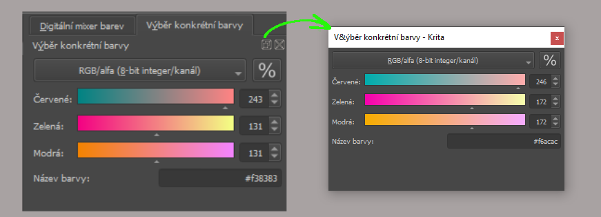
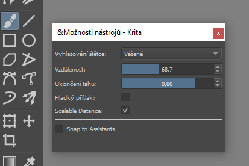

# Krita: Instalace a nastavení

## Stažení a instalace

Najdi aktuální verzi na https://www.krita.org/. Stáhni a spusť soubor.  Po instalaci spusť program Krita. Pokud používáš Package Manager pro Windows, nejnovější stabilní verzi nainstaluješ příkazem

```
winget install krita
```

## Nastavení jazykové verze
Základní nastavení systému a klávesnice.
Jazykovou verzi programu změníš v menu:

import Tabs from '@theme/Tabs';
import TabItem from '@theme/TabItem';

<Tabs
  groupId="jazykova-verze"
  defaultValue="czv"
  values={[
    {label: 'V české verzi', value: 'czv'},
    {label: 'V anglické verzi', value: 'env'},
  ]
}>
<TabItem value="czv">Nastavení ‣ Přepnout jazyk aplikace...</TabItem>
<TabItem value="env">Settings ‣ Switch Application Language...</TabItem>
</Tabs>

## Nastavení grafického tabletu
Zkontroluj funkčnost tabletu. Vytvoř nový soubor. Vyber nástroj štětec <kbd>B</kbd>. Vyber typ štětce. Nakresli čáru s různým přítlakem a zkontroluj, jestli nástroj reaguje. Nastavení tabletu:
<Tabs
  groupId="jazykova-verze"
  defaultValue="czv"
  values={[
    {label: 'V české verzi', value: 'czv'},
    {label: 'V anglické verzi', value: 'env'},
  ]
}>
<TabItem value="czv">Nastavení ‣ Nastavit aplikaci Krita ‣ Nastavení tabletu</TabItem>
<TabItem value="env">Settings ‣ Configure Krita ‣ Tablet settings </TabItem>
</Tabs>

:::note Grafický tablet bez displeje
Nakresli perem čtverec nebo kruh. Je vertikální tah stejný jako horizontální? Pokud používáš více monitorů nebo vertikální displej, budeš muset nastavit u tabletu upravené proporce. Příklad u tabletu Wacom:


:::

## Nastavení pokročilé palety barev
Pokročilá paleta barev (Advanced Color Selector) umožňuje nastavení tvaru výběru barev.


Více si o nastavení palet povíme v lekci o barvách.

## Základní pracovní plocha (Default)


1. Toolbox
2. Okno dokumentu, plátno (*Canvas*)
3. Vyskakovací paleta (pravé tlačítko myši)
4. Doky (*Dockers*)
5. Pokročilá paleta barev
6. Možnosti nástrojů (*Tool Options*)
7. Vrstvy
8. Předvolby štětců podle štítků (*Tags*) ve vyskakovací paletě
8. Předvolby a nastavení štětců <kbd>F5</kbd>


Okna a plovoucí okna můžeš přesouvat a měnit jejich velikosti.

**Jak vrátit pracovní plochu do původního nastavení:**
<Tabs
  groupId="jazykova-verze"
  defaultValue="czv"
  values={[
    {label: 'V české verzi', value: 'czv'},
    {label: 'V anglické verzi', value: 'env'},
  ]
}>
<TabItem value="czv">Okno ‣ Pracovní plocha ‣ Default.</TabItem>
<TabItem value="env">Window ‣ Workspace ‣ Default.</TabItem>
</Tabs>

Vlastní nastavení pracovní plochy uložíš ve stejném menu odkazem **‣ Nová pracovní plocha** (*‣ New Workspace*).
:::note Vyzkoušej
Ulož si pracovní plochu a vyzkoušej si přepínání pracovních ploch.
:::
## Doky a okna
Dok (Docker) je rychlá paleta nástrojů, která se dá přemisťovat buď v oknech, nebo se z ní dá vytvořit plovoucí okno, viz obrázek.



Doky mají mnoho funkcí, zobrazíš je výběrem v menu **Nastavení ‣ Doky** (*Settings ‣ Dockers*).

## Možnosti nástrojů (Tool Options)
Nastav si dok Možnosti nástrojů (po instalaci ho najdeš v bloku nahoře vpravo) jako plovoucí okno a přesuň ho blíže k panelu nástrojů.



Možnosti nástrojů zobrazují aktuální nastavení vybraného nástroje. Na obrázku je nastavení nástroje Štětec <kbd>B</kbd>.

## Pohledy a plátno

Plátno posouváš prostředním tlačítkem myši (MMB). Přiblížení a oddálení je <kbd>Ctrl</kbd>+<kbd>MMB</kbd>, alternativně <kbd>Ctrl</kbd>+<kbd>+</kbd> a <kbd>Ctrl</kbd>+<kbd>-</kbd>, nebo posuvníkem ve vyskakovací paletě.

V menu **Pohled** (*View*) můžeš spustit softwarový color management (Softwarový náhled), nebo ho občas zapínat pro kontrolu <kbd>Ctrl</kbd>+<kbd>Y</kbd>.

Wrap Around Mode slouží k vytváření bezešvých textur nebo vzorů a nastaví mód zobrazení nekonečného plátna.

Prozatím využiješ zkratku <kbd>Tab</kbd> pro zobrazení plátna a <kbd>M</kbd> pro zrcadlení.


## První soubor
### Rozlišení
Jako základní nastavení velikosti plátna pro experimenty s programem Krita doporučuji formát A4 (300dpi), což je 2480×3508 pixelů.

| Rozlišení 300dpi, 8bit RGB | Na disku MB    | V paměti MB    |
| :------------- | :----------: | -----------: |
|  A4 2480×3508 | ~ 20.6   | 33.2    |
|  A3 3508×4960 | ~ 42.3   | 66.4    |
|  FHD 1920×1080 | ~ 5   | 7.9    |
|  4K 3840×2160 | ~ 19.2   | 31.6    |
|  8K 7680×4320 | ~ 76.1   | 126.6    |

Každá další vrstva velikost násobí.

Pro tento kurz a experimenty můžeš použít i nižší rozlišení. Velikost souboru a rychlost zpracování je úměrná rozlišení, barevné hloubce a počtu vrstev.

### Barevný prostor
Pro začátek doporučuji Model RGB/alfa (základní nastavení RGB s kanálem průhlednosti) a 8bit integer kanál.

:::note Rozlišení
16bit integer nastavení je pro práci s velmi plynulými barevnými přechody — výsledek se nakonec převádí do 8bit.
16bit a 32bit float nastavení se používají pro práci s HDR.
Vyšší bitová hloubka by byla vhodná, pokud by se například vytvářela koláž nebo retuš ze zdrojů, které vysokou bitovou hloubku už mají (např. 32bit). V běžných případech je pouze více náročná na zdroje a hardware.
:::

### Pracovní plocha
Doporučuji nastavit Pokročilou paletu barev a Možnosti nástrojů jako plovoucí okna.


Můžeme začít.
