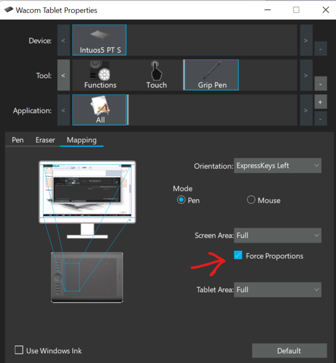
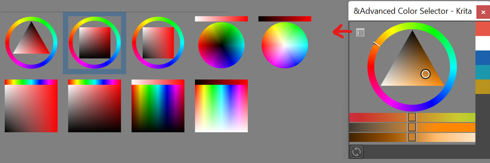
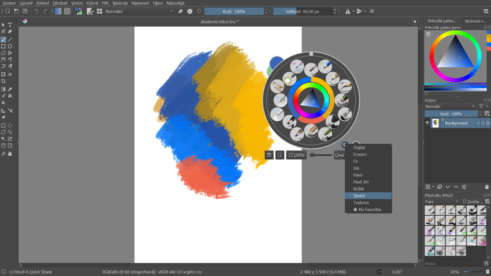

# Krita: Instalace a nastavení

## Stažení a instalace

Najdi aktuální verzi na https://www.krita.org/. Stáhni a spusť soubor.  Po instalaci spusť program Krita. Pokud používáš Package Manager pro Windows, nejnovější stabilní verzi nainstaluješ příkazem

```
winget install krita
```

## Nastavení jazykové verze
Základní nastavení systému a klávesnice.
Jazykovou verzi programu změníš v menu:

import Tabs from '@theme/Tabs';
import TabItem from '@theme/TabItem';

<Tabs
  groupId="jazykova-verze"
  defaultValue="czv"
  values={[
    {label: 'V české verzi', value: 'czv'},
    {label: 'V anglické verzi', value: 'env'},
  ]
}>
<TabItem value="czv">Nastavení ‣ Přepnout jazyk aplikace...</TabItem>
<TabItem value="env">Settings ‣ Switch Application Language...</TabItem>
</Tabs>

## Nastavení grafického tabletu
Zkontroluj funkčnost tabletu. Vytvoř nový soubor. Vyber nástroj štětec <kbd>B</kbd>. Vyber typ štětce. Nakresli čáru s různým přítlakem a zkontroluj, jestli nástroj reaguje. Nastavení tabletu:
<Tabs
  groupId="jazykova-verze"
  defaultValue="czv"
  values={[
    {label: 'V české verzi', value: 'czv'},
    {label: 'V anglické verzi', value: 'env'},
  ]
}>
<TabItem value="czv">Nastavení ‣ Nastavit aplikaci Krita ‣ Nastavení tabletu</TabItem>
<TabItem value="env">Settings ‣ Configure Krita ‣ Tablet settings </TabItem>
</Tabs>

:::note Grafický tablet bez displeje
Nakresli perem čtverec nebo kruh. Je vertikální tah stejný jako horizontální? Pokud používáš více monitorů nebo vertikální displej, budeš muset nastavit u tabletu upravené proporce. Příklad u tabletu Wacom:



:::

## Nastavení pokročilé palety barev
Pokročilá paleta barev (Advanced Color Selector) umožňuje nastavení tvaru výběru barev.



Více si o nastavení palet povíme v lekci o barvách.

## Pracovní plocha




1. Toolbox
2. Okno dokumentu
3. Vyskakovací paleta
4. Doky (Dockers)
5. Pokročilá paleta barev
6. Tool Options


Okna a plovoucí okna můžeš přesouvat a měnit jejich velikosti. Jak vrátit pracovní plochu do původního nastavení:
<Tabs
  groupId="jazykova-verze"
  defaultValue="czv"
  values={[
    {label: 'V české verzi', value: 'czv'},
    {label: 'V anglické verzi', value: 'env'},
  ]
}>
<TabItem value="czv">Okno ‣ Pracovní plocha ‣ Default.</TabItem>
<TabItem value="env">Window ‣ Workspace ‣ Default.</TabItem>
</Tabs>

Vlastní nastavení pracovní plochy uložíš ve stejném menu odkazem **‣ Nová pracovní plocha** (*‣ New Workspace*).
:::note Vyzkoušej
Ulož si pracovní plochu a vyzkoušej si přepínání pracovních ploch.
:::
## Přehled funkcí
Dockery, okna, preference. Nástroje. Rychlé palety nástrojů. Zkratky - Shortcuty.

## Možnosti nástrojů (Tool Options)
Přesunutí okna blíže k panelu nástrojů.

## Pohledy
Nastavení pohledů na stejný soubor. Tonální ČB náhled.
## První soubor
## Rozlišení
A3, A4 formáty. DPI. Barevné prostory a bitová hloubka. Pro tento kurz a experimenty můžeš použít nižší rozlišení. Velikost souboru je úměrná barevné hloubce a počtu vrstev.

Můžeme začít.
