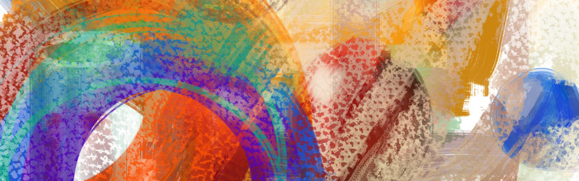

# Kresba a malba: Přehled témat

- Krita: Instalace a nastavení programu.
- Jaké možnosti program nabízí
Témata: Světlo, stín, kontrast, tonalita a barva, textura a materiál. Radiozita, Fresnelův jev, Anisotropie, Okluze. Speciální materiály - sklo, translucence, Světelné zdroje, Perspektiva a efekty atmosféry

- Postup výuky: Proporce, úhly, plochy, tvary, bloky, formy, kompozice a perspektiva
- Stínování a tonalita, barva a harmonie, textury malby, materiály
- Digitální kresba - specifika
- Digitální malba a rozdíl oproti klasickým technikám
- Metody a postupy (Alla prima, práce ve vrstvách, selektivní styl - laso)
- Motivy a témata, skicář
Projekty: (geometrická tělesa, předměty, krajina, architektura, model, skica detailu)
- Digitální malba - portrét case study

Přílohy:

- Model tváře a hlavy (3D plochy), postava zjednodušená, 3D model

- Kresba a malba v programu GIMP a MyPaint

## Software v kurzu

Hlavní program: Krita  
Utility: XnView MP 
Další programy: GIMP, MyPaint

## Poznámky
Kurz podporuje českou a anglickou verzi programu. V textu jsou jazykové varianty označeny takto: **‣ Nová pracovní plocha** (*‣ New Workspace*). Anglické výrazy uvádím někdy i kvůli jasné terminologii. Uvádím i alternativní termíny běžné v oboru a jiných programech. **Zkratky** (*Shortcuts*) jsou označeny klávesami, např. <kbd>M</kbd>, <kbd>B</kbd>, <kbd>Ctrl</kbd>+<kbd>Backspace</kbd>.
