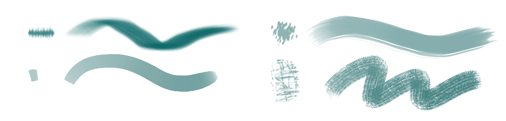
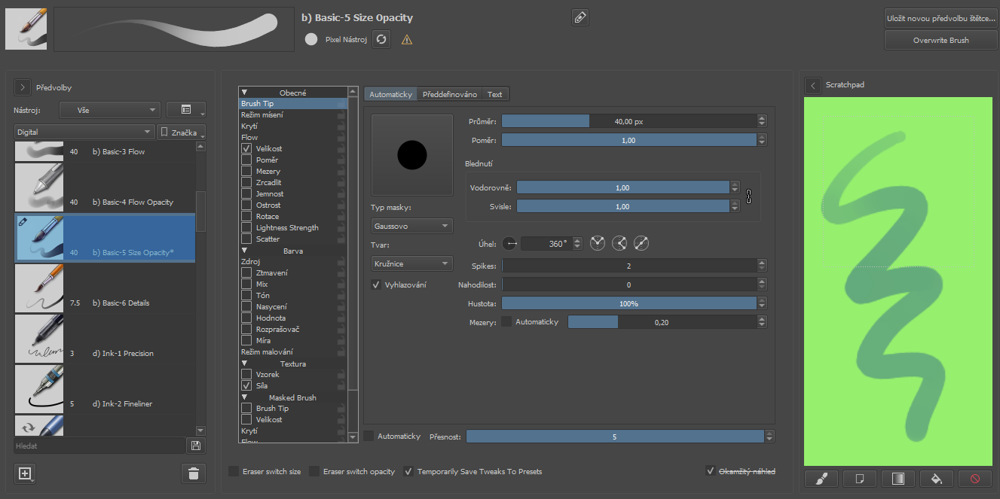
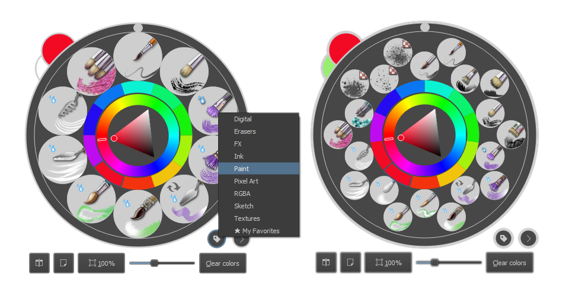
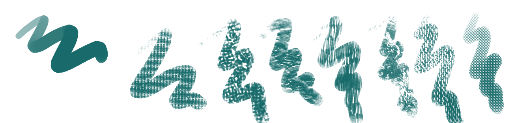
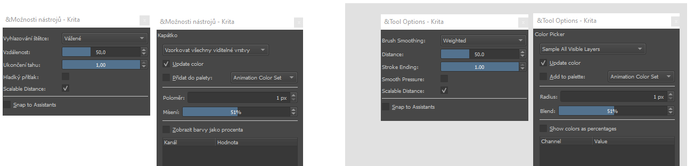
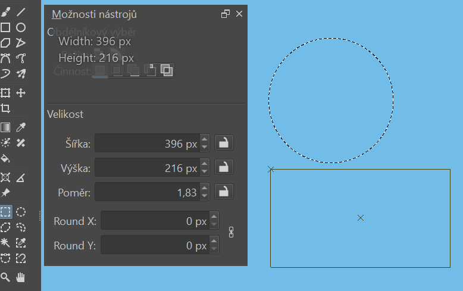
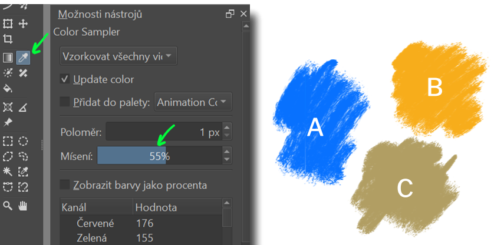

# Štětce, palety a další nástroje
Nejpoužívanější nástroje z doku Panel nástrojů (*Toolbox Docker*) jsou Štětec <kbd>B</kbd> , Pipeta <kbd>P</kbd> , nástroje výběru a transformace.

Doky (*Dockers*) jsou funkční okna, která můžeš přesouvat po pracovní ploše. Panel nástrojů prakticky nebudeš při malování používat příliš často, protože nejčastější nástroje budeš přepínat zkratkami (naštěstí je jich celkem málo). Každý nástroj má možnosti nastavení (*Tool Options*). V základním nastavení je najdeš vpravo nahoře mezi doky.

import Tabs from '@theme/Tabs';
import TabItem from '@theme/TabItem';

<Tabs
  groupId="jazykova-verze"
  defaultValue="czv"
  values={[
    {label: 'CZ verze', value: 'czv'},
    {label: 'EN verze', value: 'env'},
  ]
}>
<TabItem value="czv">Program máš v české verzi</TabItem>
<TabItem value="env">Program máš v anglické verzi</TabItem>
</Tabs>

## Algoritmické štětce
Skutečný štětec je jako razítko, které se pohybuje po médiu a přenáší na něj barvu. Tvar, materiál a rychlost štětce určuje deformace během tahu a charakter stopy. V softwaru se tento efekt simuluje přenášením modifikací tvaru profilu štětce (většinou textura s průhledností) a dynamikou a rychlostí tahů pera grafického tabletu. Program Krita nabízí řadu funkčních algoritmů štětců (*Brush Engines*), které jsou vhodné pro vytváření různých kreslících nástrojů. Každý kreslící nástroj (i tužka nebo pero) je z pohledu programu štětec (*Brush*).

### Předvolby štětců

Okno štětců otevřeš klávesou <kbd>F5</kbd>. Algoritmy použité pro chování nástrojů si prohlédni v seznamu Nástroj (*Engines*). Je to například *Pixel Engine, Bristle, Spray, Sketch* atd. Předvolby můžeš prohledávat také v doku *Brush Presets* a vyskakovací kruhové paletě (*Pop-up Palette*).

**Vyskakovaci paletu**(*Pop-up Palette*) otevřeš pravým tlačítkem myši, pokud máš vybraný kreslící nástroj. Počet zobrazených předvoleb štětců ze seznamu (s daným štítkem - *tagem*, značkou) jde změnit.
:::note tip
Nastavení počtu zobrazených předvoleb štětců na vyskakovací paletě najdeš v hlavním menu:

 <Tabs
  groupId="jazykova-verze"
  defaultValue="czv"
  values={[
    {label: 'CZ verze', value: 'czv'},
    {label: 'EN verze', value: 'env'},
  ]
}>
<TabItem value="czv">Nastavení ‣ Nastavit aplikaci Krita ‣ Obecné ‣ Různé</TabItem>
<TabItem value="env">Settings ‣ Configure Krita ‣ General ‣ Miscellaneous</TabItem>
</Tabs>
:::

### Skupiny štětců
Štětce jsou rozdělené do určených skupin podle štítků (tagů). Základní skupiny si můžeš prohlédnout i ve vyskakovací kruhové paletě (*Pop-up Palette*), kterou zobrazíš pravým tlačítkem, pokud máš vybraný nějaký kreslící nástroj. Vlastní skupiny lze vytvářet. Štětce můžeš upravovat a importovat i exportovat jako sety. Více o vytváření vlastních štětců  a balíčcích zdrojů (*Resource Bundles*) v lekci Vlastní štětce a zdroje.

:::note úkol

Vyzkoušej si různé skupiny štětců.

:::

### Jak nastavit strukturu plátna?

Globální texturu povrchu pro nástroj najdeš v nastavení štětců <kbd>F5</kbd>, v okně Obecné ‣ Textura ‣ Vzorek ‣‣ Textura (*General ‣ Texture ‣ Pattern ‣‣ Texture*).

:::note úkol

Vyzkoušej si úpravu štětce. Vyber štětec **b)_Basic-5_Size_Opacity** (najdeš ho ve štítku Paint, nebo ve vyhledávacím okně doku Předvolby štětců) a v předvolbě štětců nastav texturu vzoru. Potom nastav texturu povrchu. Vyzkoušej štětec. Upravený štětec můžeš uložit tlačítke Save New Brush Preset. Základní nastavení vrátíš tlačítkem **Reload Brush Presets** (ikona recyklace).

:::

### Vyhlazování tahů
Vyber nástroj Štětec <kbd>B</kbd>. V doku *Tool Options* uvidíš typy vyhlazování tahu. Tato nastavení ti umožní zlepšit plynulost kreslení na grafickém tabletu a také různé efekty.

Na obrázku jsou možnosti nástrojů pro štětec a kapátko/pipetu (česká a anglická verze).

## Výběr
Nástroje výběru jsou v dolní části panelu nástrojů. Další možnosti najdeš v doku Možnosti nástrojů a v hlavním menu **Vybrat**(*Select*).

Funkce výběru ti dovoluje malovat pouze do označené části, po inverzi výběru pouze mimo ni. V panelu nástrojů jsou různé tvary výběru určené pro rychlé maskování. Tento nástroj funguje podobně jako v ostatních bitmapových programech. Jenom tady ho budeš používat častěji.

:::info
- Často používané zkratky jsou <kbd>Ctrl</kbd>+<kbd>A</kbd> pro vybrání celé vrstvy, <kbd>Ctrl</kbd>+<kbd>Shift</kbd>+<kbd>A</kbd> pro zrušení výběru a <kbd>Ctrl</kbd>+<kbd>Shift</kbd>+<kbd>I</kbd> pro inverzi výběru.
- K výběru přidáváš se <kbd>Shift</kbd>, odebíráš z něj s <kbd>Alt</kbd>
:::

Vybraná část se upravuje nástrojem Transformace <kbd>Ctrl</kbd>+<kbd>T</kbd> i s vybraným obsahem.

Pokud chceš upravit pouze výběr, klikni pravým tlačítkem na vybranou část (s jakýmkoliv aktivním nástrojem výběru) a z kontextového menu zvol **Upravit výběr** (v tom případě bude úprava probíhat v **Masce Výběru**, která se zobrazí v doku vrstev). Po úpravě klikni zpět na vrstvu malby a výběr bude aktivní.

## Barevný selektor (pipeta)
Pipeta <kbd>P</kbd> umožnuje nejenom nabírat barvu z plátna, ale i interpolovat barvy.

Funkci aktivuješ nastavením procent **Míšení** (*Blend*) v doku **Možnosti nástrojů** (viz obrázek). Jedním kliknutím pak nabereš barvu, druhým kliknutím nabereš druhou. Pipeta pak vytvoří interpolaci barev. Nastavením míšení zpět na 100% tuto funkci zase vypneš.

Vyzkoušej si to:

- vyber nástroj pipety (Colour Selector) <kbd>P</kbd>
- v Možnostech nástrojů nastav Mísení na přibližně na 50% (100% znamená vybrání původní barvy bez mísení, 0% vybrání druhé barvy bez mísení)
- vyber nástroj štětec <kbd>B</kbd>
- udělej dva tahy rozdílnou barvou (A), (B)
- když je štětec stále vybraný, aktivuj pipetu pomocí <kbd>Ctrl</kbd>
- kurzor se změní na pipetu, s klávesou  <kbd>Ctrl</kbd> klikni nejprve na prní barvu, pak na druhou
- pro štětec se automaticky vytvoří přibližný meziodstín (C)

 Barevný selektor je nástroj, který se velice často používá v digitální malbě, pro plynulé barevné přechody i retuše.

## Režimy prolnutí u štětců a nástrojů
Režimy prolnutí (Blending Modes) fungují stejně jako u vrstev, pouze vytvářejí efekt přímo během malby v aktivní vrstvě.

Příklady Overlay, Multiply, Color atd.

:::note úkol

Vystínovat těleso pomocí režimů prolnutí v jedné vrstvě.

:::
