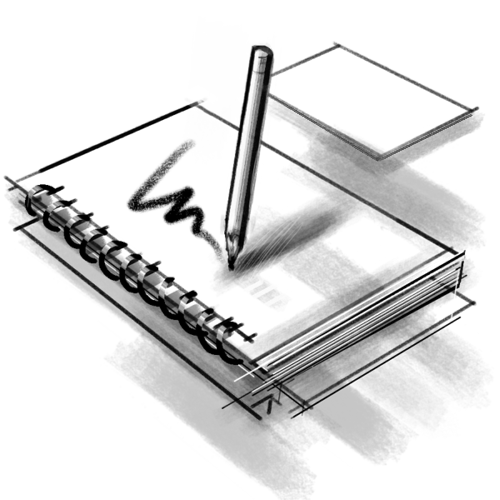

# Digitální kresba: Proporce, objem, perspektiva
Základem dobré kresby jsou správné proporce forem, kompozice a perspektiva, a správné struktury tvarů a kresebné techniky. Pokud budeš mít pevné základy v konstruktivní kresbě, další techniky stínování nebo malby ti usnadní cestu ke kvalitní realistické nebo
stylizované kresbě i malbě.

Pokud ale bude mít tvoje kresba proporcionální chyby a chyby forem, ani sebelepší techniky stínování tvůj obraz nezachrání.

Kreslení je královská disciplína. Je to základ obrazu. Kresbou budeš začínat svůj koncept a zdokonalovat se v ní celý život. Efektivní skica ti pomůže dělat rychlé studie k obrazu. Nemusíš být bravurní technický kreslíř, aby jsi byl dobrý malíř. Kreslení je důležité pro pochopení tvarů a forem.

Na grafickém tabletu se dá kreslit poměrně dobře, i když někdo může postrádat reakci média nebo mu může vadit vzdálenost špičky pera od kreslící plochy. Pokud jsi zvyklý skicovat klasicky, s velkým množstvím detailů, můžeš náčrty naskenovat a použít jako základ pro digitální malbu. To je postup, který se často používá v digitální ilustraci. Dobře kreslit můžeš ale s trochou cviku i na grafickém tabletu (s monitorem i bez).

:::note Poznámka

Grafické tablety s monitorem zpravidla vyžadují ke svojí funkci počítač se softwarem — monitor je pouze zobrazovací zařízení

:::

## Kreslíme na tabletu
Aby byla kresba plynulá, je tu možnost vyvažování a filtrování pohybů pera (obdobné funkce najdeš i v jiných kreslících programech, pod různými názvy).
Nástroje a nastavení pro kresbu na tabletu. Vyhlazování a vyvažování tahů.
obr štětce, tool options, vyskakovací menu

Vyzkoušej si sérii tahů s různým přítlakem.

Pro geometrické nebo perspektivní náčrty můžeš použít nástroj Assistant tool. Jsou to nastavitelná pravítka různých tvarů.

Vyzkoušej si sérii paralelních linií s eliptickým a rovným pravítkem.

## Stínování a techniky kresby
Štětec jako razítko. Typy vyhlazování. Dynamika tahů.
obr. stinovani

## Proporce a objem
Proporce při skicování podle modelu průběžně přeměřuj. Postupně se naučíš proporce a úhly správně odhadovat.

obr. proporční kreslení
## Čitelnost a silueta
Při skicování vyber takový úhel pohledu, aby byl objekt čitelný i jako silueta.
obr. silueta

Více v další lekci.

## Detaily a formy
Každý složitější objekt si rozděl podle úrovně detailů na tři části. Velké formy, které určují velké tvary, budou tvořit polovinu objektu. Střední detaily budou tvořit třicet procent a drobné dvacet procent **plochy** objektu.  
obr. stroj

Pro náčrt používej stabilní zvětšení plochy. Vyhneš se snáz tomu, aby nebyly části kresby disproporčně detailní oproti celku.
## Perspektiva
Typy perspektivy a čitelnost. K perspektivě se ještě vrátím v lekci o kompozici.
obr. persp.

## Skicář

Pořiď si skicák a tužku. Studie můžeš dělat i na přenosném tabletu, ale potřebuješ vytvořit kreslicí návyky. Musíš zrušit rozptýlení, jako je třeba dobíjení baterie. Buď připravený začít kreslit během minuty. Kresli předměty které tě zaujmou, doma nebo na výletě.  Trénuj rychlé skicy, maximálně 10 minut na jednu skicu.
### Témata
Postupuj od jednoduchých forem ke složitějším. Od jednoduchých materiálů ke komplexnějším. Začni předměty s jasně definovaným objemem. Využij jednoduché osvětlení.
ovoce a zelenina, kámen, list, květ

Jednoduché a abstraktní tvary ti umožní zdokonalovat techniku pozorování proporce i formy, i samotnou techniku kresby a malby. Složité tvary, jako architektura, technika, obličej, nebo anatomie postavy odhalí každý tvůj nedostatek v perspektivě, proporcích a formě — nedovolí ti rozvíjet základy a výsledek tě bude demotivovat.
### Živý model a fotografie
Zvykni si skicovat podle skutečných předmětů a modelů. Fotografie používej ze začátku jako referenci, ne jako zdroj. Důvod: tonalita, pochopení tvaru a optické jevy. Tvoje oko vidí lépe než objektiv kamery.

Zajímavá metoda je skicování studií, především figur a portrétů, podle realistických soch. Jenom pamatuj, že každá socha je už hotovým uměleckým ztvárněním reality a vyjádřením stylu autora. Je to dobrý způsob jak studovat **formu** pro kresbu, **proporce** a akademickou **kompozici**.   

Další možností je použití 3D modelu jako reference. V public domain archívech jsou 3D skeny mnoha klasických soch a jiných objektů. Také modely technických zařízení mohou sloužit jako kvalitní reference pro ilustrace. S určitým omezením se také dají 3D modely použít jako předloha pro figurální kompozice (více v lekci Portrét a postava).  

### Konzistence a vzory
Vytvářej série skic stejným postupem a technikou. Tak snadno odhalíš svoje chyby. Také buduješ svojí techniku, styl a formu. Neboj se experimentovat, ale buď konzistentní.

Najdi si malíře, jejichž styl se ti líbí. Studuj jejich techniku a kreativní rozhodnutí. Proč používají tenhle postup? Proč funguje jejich barevná paleta? Otázka PROČ je pro tebe cennější než postup JAK.

Posuzuj svojí tvorbu podle toho, jak se ty sám v čase zlepšuješ. Když se budeš posuzovat podle cizích úspěchů, tak se nic nenaučíš.     
### Studie tvarů a forem, pozorování
Kreslení abstraktních forem a náčrty náhodných tvarů ti pomohou uvolnit vnitřní vidění. Můžeš tak i objevit nové kompozice a inspiraci pro skicu nebo obraz.
obr random shapes

## Blokování
Blokování je obecně platný koncept pro kresbu, malbu, modelování, grafiku, fotografii i film. Je to stylistické zjednodušení tvaru objektu nebo části scény. Důvodem je čitelnost. Blokování a silueta.

## Správná tonalita
Barvy pro tisk a obrazovku. Gamut.
## Vnímání tvaru
Zrcadlení plochy M pro rychlou kontrolu.
## Plynulá kresba a malba
Otáčení plátna

:::note úkol

Nakresli sérii studií. Nakresli sérii kresebnou technikou.

:::
