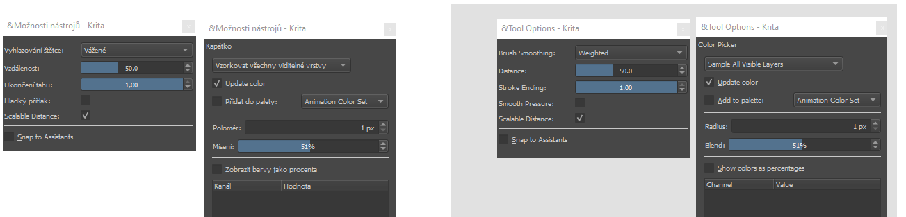

# Základní techniky digitální malby
simulace, přiznana dig. m. a komb t
Tyto postupy jsou zajímavé buď organizací, nebo technikou malby.

import Tabs from '@theme/Tabs';
import TabItem from '@theme/TabItem';

<Tabs
  groupId="jazykova-verze"
  defaultValue="czv"
  values={[
    {label: 'CZ verze', value: 'czv'},
    {label: 'EN verze', value: 'env'},
  ]
}>
<TabItem value="czv">Program máš v české verzi</TabItem>
<TabItem value="env">Program máš v anglické verzi</TabItem>
</Tabs>

### Alla prima
*Alla prima* ("napoprvé") je technika, kdy pracuješ v jedné vrstvě. Barvy nanášíš přímo a glazury také. Tento způsob je vhodný pro studium tonality a barev. Je to oblíbený způsob, a koncept *Alla prima* se používá v i klasické malbě, kdy se maluje do ještě vlhkých barev, na jedno sezení. Výsledek je dynamický obraz se zvláštní energií.

### Malování ve vrstvách
Tento způsob odpovídá technice **podmalby** (*underpainting*) v klasických technikách. Barvy se nanášejí na monochromatickou tonální podmalbu. Tak se snáze udrží tonalita a plastičnost malby. Použití komplementárních odstínů pro barevnou podmalbu (červená-zelená,modrá-oranžová) se někdy používá v případě glazur.

Vrstva světla - Overlay
Vrstva stínu - Multiply
Pozadí středová hodnota

### Systém pěti vrstev
Vrstva světla - Overlay
Vrstva stínu - Multiply
Vrstva barvy - Color
Vrstva tonality - Values
Vrstva náčrtu - Background

### Maskování
Připomíná techniku maskování části plátna, která se používá například v airbrushi.

### Malování v blocích
Nanášení tvarů.

### Kombinované techniky
<kbd>T</kbd> Posun aktivní vrstvy, <kbd>Ctrl</kbd>+<kbd>T</kbd> Transformace.
Štětec jako razítko. Typy vyhlazování. Dynamika tahů.
## Barevné modely
Barvy pro tisk a obrazovku. Gamut.
## Barva a palety

:::note tip
Nastavení počtu zobrazených předvoleb štětců na vyskakovací paletě najdeš v hlavním menu:

 <Tabs
  groupId="jazykova-verze"
  defaultValue="czv"
  values={[
    {label: 'CZ verze', value: 'czv'},
    {label: 'EN verze', value: 'env'},
  ]
}>
<TabItem value="czv">Nastavení ‣ Nastavit aplikaci Krita ‣ Obecné ‣ Různé</TabItem>
<TabItem value="env">Settings ‣ Configure Krita ‣ General ‣ Miscellaneous</TabItem>
</Tabs>
:::

## Vnímání tvaru
Zrcadlení plochy <kbd>M</kbd> pro rychlou kontrolu.
## Plynulá kresba a malba
Otáčení plátna
## Rozlišení a detaily
Rozlišení plátna se dá přidávat po krocích, jak budeš pracovat na detailech. Někteří malíři tento postup používají pro větší efektivitu. Začínají malovat plochami,velkými tvary a blokováním na plátně 2000x2000px, pro střední detaily zvětší rozlišení (pomocí funkce upscale) na 3000x3000px, a finální detailní malbu provedou na znovu zvětšeném plátně například na 4500x4500px. Tato metoda také využívá pevného rozlišení a velikostí razítek digitálních štětců.

## Stínování
Šrafury a dynamika, airbrush. Vyzkoušej si Barevné stínování <kbd>K</kbd>, <kbd>L</kbd>. Více v lekci Malujeme barvu.
## Vrstvy
Přesun mezi vrstvami, hide etc.
## Kresba
Základní technika. Import kresby ze skicáře.

:::note úkol

Vystínovat těleso tonální technikou.

:::
