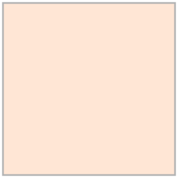

# Tvar a forma: světlo, stín a vlastnosti materiálů

--- obr. tělesa tužkou
## Teorie tvaru a formy
Formy vnímáme podle způsobu, jak reagují na světlo. Podobně jako barvy, formy jsou určené *fyzikálně* (jaký je tvar tělesa, materiál a vlastnosti prostředí kolem něj), *fyziologicky* (jak je vidí naše oko) a *psychologicky* (jak tvar dokážeme rozeznávat na základě zkušenosti a chápat jeho význam). Tvary  jsou v malířském smyslu ohraničené oblasti, které tvoří formu.

Tvary a formy jsou jako slova ve vizuální řeči. Pokud je nemůžeme jasně přečíst, sdělení nebude dávat smysl.

### Vnitřní a vnější vidění
Tvoje představa o objektu ovlivňuje to, jak objekt vidíš. Pro realistickou malbu je třeba trénovat pozorovací schopnosti a rovnováhu mezi tím, jak objekt skutečně vidíš a jak vnímáš jeho kontext. Proto je dobré začít se studiemi poměrně abstraktních nebo naopak geometrických předmětů (kámen, drapérie, zmačkaný papír, ovoce nebo tělesa s jednoduchým tvarem).  

Malíř obraz občas otočí hlavou dolů. To je trik, který ti umožní vidět tvary bez únavy a předsudku. Další trik v digitální malbě je také rychlé zrcadlové otočení obrazu během malby. V programu Krita je zkratkou klávesa <kbd>M</kbd>. Snáz tak poznáš chyby v definici tvarů a forem.  
### Světlo, stín, kontrast
Velkou část informací o objektech dokážeme sdělit kontrastem mezi světlem a stínem nebo konturou. To je důvod, proč dobře funguje stylizovaná kresba a piktogramy.
### Pozorování siluety a kontury
Pozoruj jak čitelnost předmětu ovlivnňuje kontura. Naskicuj si deset předmětů, které máš v dosahu. Nejprve s pozitivní, potom negativní konturou. Za nějakou dobu se na skicy podívej — poznáš všechny předměty?
--- obr. pozitivní a negativní kontura

### Blokování světlých a tmavých ploch
Blokování znamená zjednodušení viděných objektů na ohraničené tvary. Důvodem je čitelnost. Blokování a silueta.
--- obr. svetla a stiny bloky

### Tonalita
Pro dobrou čitelnost obrazu je nutná správná tonalita. Je to jas barev. Ten určuje nejenom tvar objektu, ale také jak objekty komunikují ve scéně mezi sebou. Tonalita je tvořená tóny, polotóny, stíny a světly. Správná rozhodnutí rozvržení tonality pomůže srozumitelnosti obrazu. Tonalitu při práci s barvami můžeš průběžně kontrolovat.

-- tonalita převod na čb

## Světelné vlastnosti objektů
Realistické ztvárnění fyzikálních vlastnosti povrchů a materiálů ovlivňuje, jestli tvůj obraz bude věrohodný nebo ne. Mnoho těchto efektů se využívá i v extrémně stylizované tvorbě!    
### Terminátor
Technická hranice mezi světlem a stínem na povrchu předmětu. Za touto hranicí je efekt stínu výrazný. Často se používá spolu s okluzí pro zjednodušenou definici tvaru ve stylizované kresbě, například v komiksu a ilustraci.

Dá se říci, že spolu s okluzí, stínem a konturou může definovat celý tvar.

### Radiozita

Vzájemné ovlivnění těles odraženým světlem a barvou a také celkový efekt prostředí. Často tvoří barevné posuny ve stínech.

### Fresnelův jev a anizotropie

Všechny materiály mění svojí světelnou odrazivost s úhlem pohledu. U některých je to více znatelné (voda a sklo), u některých méně (pálená hlína, papír). Tento jev se nazývá Fresnelův (čti frenelův) efekt.

Anizotropie se projevuje deformací odrazu světla pod různým úhlem na lesklém povrchu určitých materiálů. Tento efekt se hodně používá ve stylizované kresbě pro zvýraznění charakteru povrchu (dřevo, vlákna, vlasy). V některých programech a textech se tyto dva termíny používají zástupně.
### Okluze

Okluze je rozptýlený stín, který objekt vrhá sám na sebe a blízké objekty. Zvýrazňuje místa skrytá přímému světlu. Je to efekt viditelný v členitém povrchu a dutinách, a mezi objekty které se dotýkají nebo jsou blízko u sebe. Okluze také prakticky ovlivňuje i ostatní vlastnosti povrchu — je to často místo s rozdílnou teplotou, vlhkostí, je jinak vystavené povětrnostním vlivům a proto má trochu jinou barvu, tonalitu, strukturu i tvárnost. Pozoruj, jak místa okluze mění barvy soch, fasád domú, střešních tašek a jak se projevuje v přírodě. Efekt okluze je stále přítomný i s rozptýleným osvětlením, proto se někdy používá výraz **ambientní okluze**.
### Průsvitnost/Translucence

Translucence  je průsvitnost objektů. Většinou (pokud nemaluješ tenké materiály nebo medůzy) se setkáváme s komplexnějším případem průsvitnosti — podpovrchovým rozptylem světla (tzv. *Subsurface Scattering*). Živé organismy, krystaly a polymerové materiály jsou takto částečně průsvitné a barva vnitřní struktury pak ovlivňuje barvu a tonalitu povrchu. Efekt je velice znatelný pokud je světelný zdroj přímo za objektem a často se používá pro realistické a atmosférické scény.    
### Tonalita a barva

Barva je daná strukturou materiálu objektu, barvou světla a ovlivňuje ji součet odražených barev okolního prostředí. Tonalitu ovlivňuje dopadající světlo a stín. Zajímavé je, že rozpoznáváme barvu pouze na základě malé barevné plochy objektu — většinou se jedná o část středového světla. I v případě ambientního osvětlení máme tendenci definovat barvu objektu podle nejosvětlenější části. V realistické  malbě se tento efekt projevuje tak, že pouze překvapivě nepatrná část objektu má jeho "čistou" barvu.

Mapy tonality a jejich konstrukce.

### Textura a materiál

Pravidelná a chaotická struktura materiálu, barevné textury. Látky a povrchy.

:::note úkol

Vystínuj sérii těles kresebnou technikou.

:::
