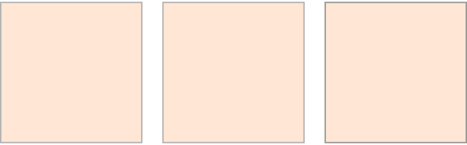
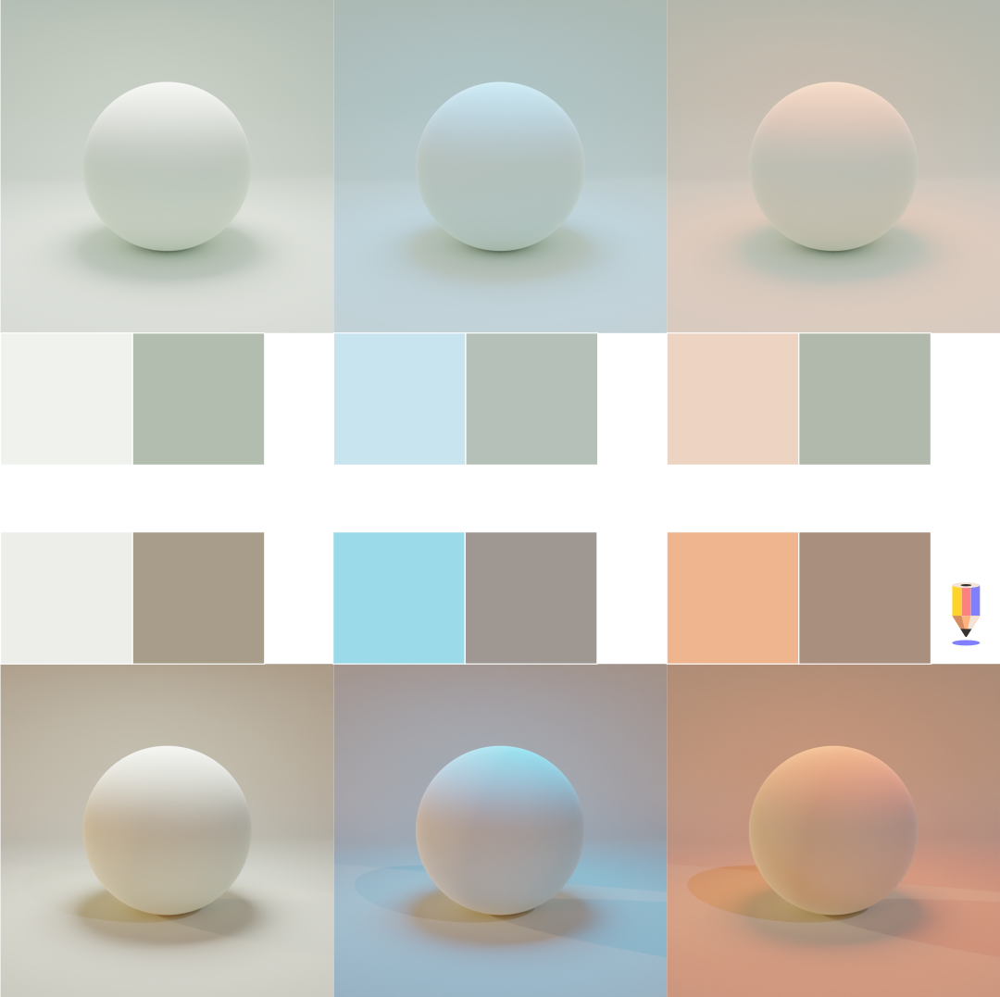
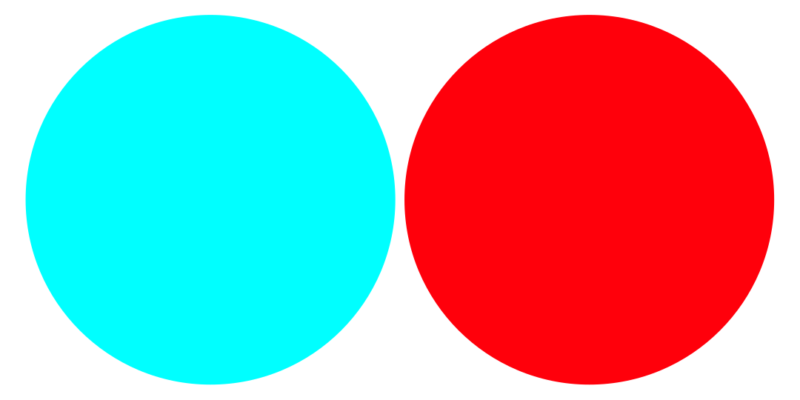

# Malujeme barvu
Jak jsme si ukázali na světelných vlastnostech objektů a na formách, to co vidíme není vždy to, co vnímáme. Vizuální umění pracuje v oblasti optických a kognitivních triků a iluzí. Aby byl obraz dostatečně čitelný — a aby byl dostatečně realistický — malíř realitu zákeřně zjednoduší a podstatně převypráví. To platí i o práci s barvami.

Lidské oko vnímá barvu jako odražené světlo určité vlnové délky. Buňky na sítnici oka přijímají informaci o barvě, nebo spíše tonalitě a kontrastu, a mozek vytváří obraz ze tří složek — červené, zelené a modré (proto tento text taky čteš na RGB monitoru). To je fyziologie specifická pro člověka, jiné živočišné druhy mohou skládat obraz z více nebo méně složek.

## Základní barevné modely a barevné prostory
Barevný model
### RGB
Doporučený model pro digitální malbu. Barevný model s primárními barvami Červená, Zelená, Modrá (*Red, Green, Blue*).

### CMYK

Barevný model s primárními barvami Azurová, Purpurová, Žlutá, Černá (*Cyan, Magenta, Yellow, Key*).

Model používaný pro tisk. Konverze digitální malby do CMYK modelu se doporučuje dělat až nakonec, případně ve specializovaném studiu, které malbu bude tisknout. Důvodem je specifické nastavení ovladačů moderních tiskáren, které mnohdy pracují s rozložením do více inkoustů. Ve CMYKU můžeš pracovat s nastavenou gamut paletou, ale vzhledem k barevným posunům a větší výpočetní náročnosti to obvykle nepřináší žádné výhody.

## Komplementární barvy a teorie barev
Teorie barev sestává z praktických barevných modelů k vytváření barevných harmonií. Modely se liší podle způsobu mísení barev a předpokládaného média. Unifikovaná teorie barev v kontextu umění a designu neexistuje.

Nejčastější používané modely:

Míšení barev v klasické malbě

Míšení barev v digitální malbě

Míšení barev v digitální malbě pro tisk.

Bodové harmonie. Primární a komplementární barvy.

Žádný barevný model neobsahuje všechny barvy. Malíř dosáhne iluze velkého barevného rozsahu tím, že barvy umisťuje do vzájemného kontextu ve scéně.

Výzkumem vnímání rozsahů barev se zabývá **kolorimetrie** (*colorimetry*). Krita umožňuje nastavení několika kolorimetrických modelů.

## Viditelný rozsah a gamut
Každý člověk vidí trochu jiný rozsah barev. Rozsah barev, které nevidíme, nebo jsou danou technologií nepřenositelné, nazýváme gamut.
Používáme různé sjednocené barevné modely. Modely se liší podle toho, za jakým účelem se využívají.    

modely a gamuty vyber

## Teplé a studené barvy
Přestože název vzbuzuje dojem, že popisuje jak barvy působí psychologicky, má základ spíše ve fenomenologii. Modrobílou barvu si spojujeme s chladem, a rudooranžovou s ohněm. Fyzikální realita je taková, že čím vyšší je teplota, tím je kratší vlnová délka vyzařovaného světla (jinými slovy, světlo je "studenější" čím vyšší je teplota).

V malířství používáme modely, které jsou ukotvené více v tradici a konkrétní metodologii, než ve specifických vědních oborech. Umění také kvůli čitelnosti často využívá zobecňování a fenomenologický přístup ke zkoumání přírodních jevů.

:::warning Pozor

Relativní teplota barev, tedy to, jestli je jedna barva teplejší nebo studenější, se posuzuje vždy jenom v kontextu ostatních barev.

:::

### Barva světla a stínu
Pro účely malby můžeme vycházet ze základního pravidla, že pokud je scéna osvětlená barvou v teplé části spektra, barvy ve stínu se budou posouvat do části studené, **a naopak**.

Objekty jsou totiž osvětleny nejenom jedním zdrojem, ale i odraženým světlem okolního prostředí. Ve 3D programech se tento jev simuluje enviromentální mapou, což je vlastně panoramatická fotografie scény s vysokou barevnou a tonální dynamikou. Složky tohoto světla (vlastně množiny všech světel ve scéně) pak tvoří protipól hlavnímu zdroji. Proto je tento jev více znatelný v případech extrémního osvětlení (například noční scény), kde jsou snáze rozpoznatelné různé teploty zdrojů světla v prostředí.

Okolní prostředí také ovlivňuje naše vnímání barvy, což tento jev ještě zesiluje.

## Fyzika, fyziologie a psychologie barev.
Jak vyniká barva, jak ji vnímáme a jak na nás působí. Kontext a energie barev.
Také budou různé barvy psychologicky působit na každého trochu jinak. Například fialovou nemusí každý považovat za studenou barvu. V porovnání s rudooranžovou však jako studenější bude působit.

Oko má extrémně velkou citlivost na jas (dokáže na sítnici detekovat světlo v řádech jednotlivých fotonů) a velkou dynamiku. Oko má ale zároveň určitou setrvačnost.  Dívej se na tento obrázek půl minuty a pak se podívej na bílou stěnu.

Velice pravděpodobně obrázek uvidíš na stěně, ale v **komplementárních** barvách. Pokud se naopak podíváš na černou plochu, uvidíš obrázek v tónech původní barvy.

## Sjednocení tonality
Typy vyhlazování. ohlazení. trik jak sjednotit barvy.
## Plánování harmonické palety
Vytvoření harmonií a akcentů. Harmonie jsou závislé na kontextu. Ve výtvarném umění neexistuje jediné správné řešení pro všechny případy, je ale dobré vědět čeho se při tvorbě palety vyvarovat.

Typy harmonií a palety

## Malování s paletou
Shortcuty a modely. Krita a vytváření palet.

## Blokování barev a gradienty
Zjednodušená bloková malba a přidávání tónů.
## Gamut a Harmonie
Gamutové palety.

## Harmonie a disharmonie
## Akcenty
Poměr primárních, sekundárních barev a akcentů.

Akcenty

:::note úkol

Vytvoř si harmonickou paletu. Vytvoř náhodnou disharmonickou paletu a sjednoť tonalitu.

:::

## Minimalismus - organizace tvorby
omezený počet nástrojů a přepínání pomocí zkratek. Omezená paleta v klasické malbě přirozeně nutí malíře k míchání barev a konzistentnějšímu výsledku.

## Malujeme tonálně

Ukázka tonální malby s jednoduchou skicou.

