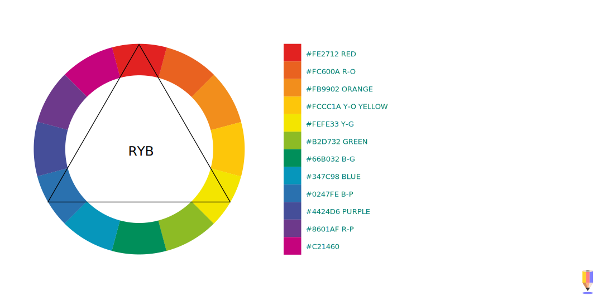

# Malujeme barvu
Jak jsme si ukázali na světelných vlastnostech objektů a na formách, to co vidíme není vždy to, co vnímáme. Vizuální umění pracuje v oblasti optických iluzí a kognitivních triků. Aby byl obraz čitelný — a aby byl dostatečně realistický — malíř realitu zjednoduší a podstatně převypráví. To platí i o práci s barvami.

Lidské oko vnímá barvu jako odražené světlo určité vlnové délky. Barvu určuje struktura materiálu, který světlo odráží nebo láme. Barvu přímého světelného zdroje určuje jeho teplota, nebo chemické složení materiálu.

Buňky na sítnici oka přijímají informaci o barvě, nebo spíše tonalitě a kontrastu, a mozek vytváří obraz ze tří složek — červené, zelené a modré (proto tento text taky čteš na RGB monitoru). To je fyziologie specifická pro člověka, jiné živočišné druhy mohou skládat obraz z více nebo méně složek.

V barevné teorii se překrývají koncepty z psychologie, kolorimetrie, spektroskopie — i filozofie a lingvistiky.
V této souvislosti používáme termín **chromatické pole**, což je specifické označení barev pro danou řeč (zvláště u variant barev modrozelená, šedomodrá — které nemusí mít ve všech jazycích ekvivalenty). Starořečtina měla pro modrou a zelenou barvu stejné slovo, podobně jako jiné starověké kultury, které neměly praktickou potřebu konkrétní barvu rozlišovat.

Proto jsou důležité barevné modely a mezinárodní typizované vzorníky.

Na tomto obrázku jsou barvy, odvozené z rozkladu viditelného světelného spektra Isaacem Newtonem. Myšlenka harmonizace barev vycházela z ambice přizpůsobit barevnou teorii konceptům používaným v hudbě. Tak vznikl v 17. století výraz barevný tón (ve smyslu základní čisté barvy).

## Tón, světlost a sytost barev

### Tón, odstín a barevnost
**Tón** je základní charakteristika barvy. Termín vychází z představy barevného tónu, který doplňuje celek podobně jako tóny v hudbě. Červená, zelená, nebo modrá jsou barevné tóny.

V češtině se pro barevný tón používá termín **odstín**.

V různých oborech se termín tón a odstín používají v jiném kontextu. V kresbě v podstatě pro světlost, v grafickém průmyslu pro jakoukoliv spojitou barvu.

Na obrázku vidíme, že určitá psychologická příbuznost krajních barev spektra přímo svádí k vytvoření barevného kruhu. Barvy v paletě vnímáme jako přirozené (pravděpodobně díky přibližně stejnému rozdílu frekvence spektra), i když tonalita je nesourodá.

### Světlost, jas barvy

**Světlost** (*Lightness, Value*) určuje jas barvy. Jas určuje tonalitu v kresbě.

### Sytost, saturace

**Sytost** (*Saturation*) je relativní intenzita barvy, tónu, a určuje jeho čistotu. Někdy se používá výraz chromatičnost (*Chroma*), která ale popisuje poměr k absolutní barevnosti tónu.

Saturace barev nevytváří dostatečný rozdíl tonality pro plastickou, realistickou malbu.  

Přestože můžeme pomocí tónu, světlosti a jasu definovat barvu, existuje mnoho barevných modelů, a pro různé barevné prostory.

## Základní barevné modely a barevné prostory
Barevný prostor je množina barev, které můžeme vyjádřit v daném médiu. Jiný barevný prostor má laserová tiskárna, jiný monitor z tranzistorových tekutých krystalů. Barevné prostory jsou samozřejmě omezeny rozsahem barev, které vnímá naše oko.

Barevný profil by měl být nastavený tak, aby odpovídal možnostem monitoru.

:::note poznámka

Barevné prostory které podporuje program Krita si můžeš prohlédnout a měnit v menu **Obrázek > Převést barevný prostor obrázku > Prohlížeč barevného prostoru** (*Image > Convert Image Color Space > Color Space Browser*). Další barevné profily můžeš doinstalovat ve formátech **.icc** a **.icm.**

:::

Barevný model je systém míchání komponentů barev.

Aditivní a subtraktivní syntéza barev. Psychologický a kolorimetrický přístup.

### RGB
Doporučený model pro digitální malbu. Aditivní světelný barevný model s primárními barvami **Červená, Zelená, Modrá** (*Red, Green, Blue*).

### CMY, CMY(K)

Subtraktivní barevný model s primárními barvami **Azurová, Purpurová, Žlutá, Černá** (*Cyan, Magenta, Yellow, Key*).

Model používaný pro tisk. Konverze digitální malby do CMYK modelu se doporučuje dělat až nakonec, případně ve specializovaném studiu, které malbu bude tisknout. Důvodem je specifické nastavení ovladačů moderních tiskáren, které mnohdy pracují s rozložením do více inkoustů. Ve CMYKU můžeš pracovat s nastavenou gamut paletou, ale vzhledem k barevným posunům a větší výpočetní náročnosti to obvykle nepřináší žádné výhody.

Převodem barevných modelů může dojít k nežádoucímu posunu barev — viz paleta vpravo.

Pro tisk se CMYK barvy definují poměrem jednotlivých složek, C0M0Y100K0 tedy znamená 100% pokrytí žluté složky. Tiskové barvy se kromě skládání ze složek také dodávají jako hotové pigmenty podle vzorníků pro různé použití v aplikovaném designu (Pantone, RAL, NCS), více v kurzu Grafika a typografie, zaměřeném na grafický design.  

### RYB
Pigmentový barevný model s primárními barvami **Červená, Žlutá, Modrá** (*Red, Yellow, Blue*).

Model používaný tradičně ve výtvarném umění a designu. Je to subtraktivní model míchání barviv — pigmentů.

Tento barevný model se také používal pro vytváření chromatických škál, dodnes se úspěšně používá v malování s omezenou paletou. Dá se říci, že se z něj vyvinul tiskový barevný model CMY(K).

## Komplementární barvy a teorie barev

Primární a komplementární barvy.

Teorie barev sestává z praktických barevných modelů k vytváření barevných harmonií. Modely se liší podle způsobu mísení barev a předpokládaného média. Unifikovaná teorie barev v kontextu umění a designu neexistuje.

Jak jsme si ukázali v úvodu, podobně jako tóny v hudbě také barevné tóny vytvářejí harmonie podle toho, v jaké frekvenční vzdálenosti se od sebe nacházejí. Ponechme stranou, nakolik se jedná o vědecký fakt a nakolik o kognitivní iluzi, harmonických modelů je mnoho a je užitečné znát konstrukční principy harmonických palet.

### Barevné harmonie
Harmonie se vytváří kontrastem v kompozici barevného modelu.
Nejčastější používané modely barevných harmonií:

- A) Komplementární (*Complementary*)
- B) Analogické (*Analogous*)
- C) Triadické (*Triadic*)
- D) Tetradické (*Tetradic*)
- E) Čtvercové (*Square*)
- F) Rozdělené komplementární (*Split-Complementary*)

Další možnosti jsou odvozené ze stejných principů.

Jak si můžeš všimnout, tento typ harmonií se vytváří z barev, které jsou vždy v rovnoměrných vzdálenostech od sebe. Ne všechny takové barevné kombinace jsou ale vždy funkční. Komplexní harmonie využívají tón, sytost i jas.

Barvy se také harmonizují společným tónováním, nebo maskou gamutu.

Žádný barevný model neobsahuje všechny barvy. Malíř dosáhne iluze velkého barevného rozsahu tím, že barvy umisťuje do vzájemného kontextu ve scéně.

Výzkumem vnímání rozsahů barev se zabývá **kolorimetrie** (*colorimetry*). Krita umožňuje nastavení několika kolorimetrických modelů.

## Viditelný rozsah a gamut

Každý člověk vidí trochu jiný rozsah barev. Rozsah barev, které nevidíme, nebo jsou danou technologií tisku nebo jiné reprodukce nepřenositelné, nazýváme gamut.

:::note poznámka

Standard gamutu pro displeje, který by měl v blízké budoucnosti na monitorech reprezentovat téměř všechny barvy v přírodě, se nazývá  Rec. 2020.

:::

Na obrázku je gamut pro standardní profil sRGB monitoru a pro tisk ve CMYKu (Krita).

## Omezená paleta a maska gamutu
Zatím jsme mluvili o gamutu v souvislosti s omezením zobrazovacích zařízení. Omezení palety, gamut, se také používá při malbě z důvodů udržení barevné strategie a **barevných harmonií**.

Krita umožňuje malbu s maskou gamutu. Aktivuj doky **Nastavení ‣ Doky ‣ Umělecká paleta** (*Settings ‣ Dockers ‣ Artistic Palette*) a
**Nastavení ‣ Doky ‣ Masky Gamutu** (*Settings ‣ Dockers ‣ Gamut Masks*).

Výběr barvy z **Umělecké palety barev** bude omezen maskou.

## Teplé a studené barvy
Přestože název vzbuzuje dojem, že popisuje fyzikální vlastnosti, má základ spíše ve fenomenologii. Modrobílou barvu si spojujeme s chladem, a rudooranžovou s ohněm. Fyzikální realita je taková, že čím vyšší je teplota, tím je vyšší je frekvence (a kratší měřená vlnová délka) vyzařovaného světla. Jinými slovy, světlo je "studenější" čím vyšší je teplota.

Na obrázku je kontinuální termální spektrum s přibližnými hodnotami (~) v Kelvinech (K). Podobné modely se používají například  v designu osvětlení, kde se s údaji barevné teploty také můžeš setkat. 6500 K se udává jako barva denní oblohy, 2900 K jako barva 100W žárovky, kolem 1000 K může vydávat elektrický toustovač a blesk má barevnou teplotu až 30000 K.

Spodní obrázek ukazuje barevné změny například při tavení kovů. Sinusoida schematicky zobrazuje posun frekvencí (a vlnové délky) světla v závislosti na uvolněné energii.

## Teplota barev ve výtvarném umění

V malířství používáme modely, které jsou ukotvené více v tradici a konkrétní metodologii, než ve specifických vědních oborech. Umění také kvůli čitelnosti často využívá zobecňování a fenomenologický přístup ke zkoumání přírodních jevů.

:::warning Pozor

Relativní teplota barev, tedy to, jestli je jedna barva teplejší nebo studenější, se posuzuje vždy jenom v kontextu ostatních barev.

:::

### Barva světla a stínu
Pro účely malby můžeme vycházet ze základního pravidla, že pokud je scéna osvětlená barvou v teplé části spektra, barvy ve stínu se budou posouvat do části studené, **a naopak**.

Objekty jsou totiž osvětleny nejenom jedním zdrojem, ale i odraženým světlem okolního prostředí. Ve 3D programech se tento jev simuluje enviromentální mapou, což je vlastně panoramatická fotografie scény s vysokou barevnou a tonální dynamikou. Složky tohoto světla (vlastně množiny všech světel ve scéně) pak tvoří protipól hlavnímu zdroji. Proto je tento jev více znatelný v případech extrémního osvětlení (například noční scény), kde jsou snáze rozpoznatelné různé teploty zdrojů světla v prostředí.

Okolní prostředí také ovlivňuje naše vnímání barvy, což tento jev ještě zesiluje.

## Fyzika, fyziologie a psychologie barev.
Jak vyniká barva, jak ji vnímáme a jak na nás působí. Kontext a energie barev.
Také budou různé barvy psychologicky působit na každého trochu jinak. Například fialovou nemusí každý považovat za studenou barvu. V porovnání s rudooranžovou však jako studenější bude působit.

Oko má extrémně velkou citlivost na jas (dokáže na sítnici detekovat světlo v řádech jednotlivých fotonů) a velkou dynamiku. Oko má ale zároveň určitou setrvačnost.  Dívej se na tento obrázek půl minuty a pak se podívej na bílou stěnu.

Velice pravděpodobně obrázek uvidíš na stěně, ale v **komplementárních** barvách. Pokud se naopak podíváš na černou plochu, uvidíš obrázek v tónech původní barvy.

## Sjednocení tonality
Typy vyhlazování. ohlazení. trik jak sjednotit barvy.
## Plánování harmonické palety
Vytvoření harmonií a akcentů. Harmonie jsou závislé na kontextu. Ve výtvarném umění neexistuje jediné správné řešení pro všechny případy, je ale dobré vědět čeho se při tvorbě palety vyvarovat.

Typy harmonií a palety

## Malování s paletou
Shortcuty a modely. Krita a vytváření palet.

Míšení barev v klasické malbě

Míšení barev v digitální malbě

Míšení barev v digitální malbě pro tisk.

## Blokování barev a gradienty
Zjednodušená bloková malba a přidávání tónů.
## Gamut a Harmonie
Gamutové palety.

## Barevná kompozice, harmonie a kontrast
Harmonie a disharmonie
## Akcenty
Poměr primárních, sekundárních barev a akcentů.

Akcenty

:::note úkol

Vytvoř si harmonickou paletu. Vytvoř náhodnou disharmonickou paletu a sjednoť tonalitu.

:::

## Minimalismus - organizace tvorby
omezený počet nástrojů a přepínání pomocí zkratek. Omezená paleta v klasické malbě přirozeně nutí malíře k míchání barev a konzistentnějšímu výsledku.

## Malujeme tonálně

Ukázka tonální malby s jednoduchou skicou.

