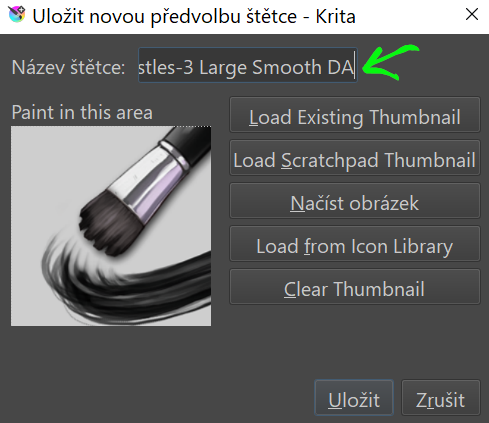

# Vlastní štětce a zdroje
## Balíčky štětců a jiných zdrojů - Resource Bundles

V kurzu jsme zatím používali základní předinstalované zdroje. Můžeš si ale vytvářet vlastní štětce, palety, přechody, vzorky atp.

Vytvořené balíčky zdrojů (*Resource Bundles*) se dají importovat, exportovat a sdílet.

## Vytvoření a úprava vlastních štětců a jiných zdrojů

- otevři editor štětců <kbd>F5</kbd> a seznam předvolených štětců (a)
- vyber engine pro štětec z dropdown menu (b)
- vyber základní typ štětce k úpravě (c)
- každý engine má trochu jiné  nastavitelné možnosti (d)
- po úpravě štětce ulož předvolbu (e)

- pojmenuj štětec a nahraj nebo vytvoř ikonu pro štětec
- kliknutím pravým tlačítkem na ikonu štětce v seznamu vyber z menu volbu přiřazení značky (tagu). Můžeš i vytvořit vlastní značky, kolekce štětců.

## Vektorové knihovny a používání knihoven symbolů

- vektorové symboly se používají jako razítka pro blokování kompozice a pro skicování textury detailů
- Instalace v menu *Settúngs/Manage Resources/Import Resources*. Importované symboly najdeš v dockeru *Symbol Libraries*

- pro změnu barvy u symbolů je nutné nejprve provést funkci Ungroup

## Export zdrojů

Správu zdrojů najdeš v menu **Nastavení ‣ Spravovat Zdroje** (*Settings ‣ Manage Resources*). Ze stejného menu zdroje exportuješ i importuješ.

- Pro vytvoření balíčku zdrojů vyber Create a Bundle

- vyplň informace o balíčku a vyber položky ze seznamu dostupných zdrojů (jsou řazené podle typu)
- balíček ulož  
- vytvoří se soubor typu **.bundle**
- knihovny .bundle se importují z menu **Nastavení ‣ Manage Resources Libraries** (*Settings ‣ Manage Resources Libraries*)

:::note úkol

Vytvoř dynamický RGBA štětec s alfa kanálem.

:::
