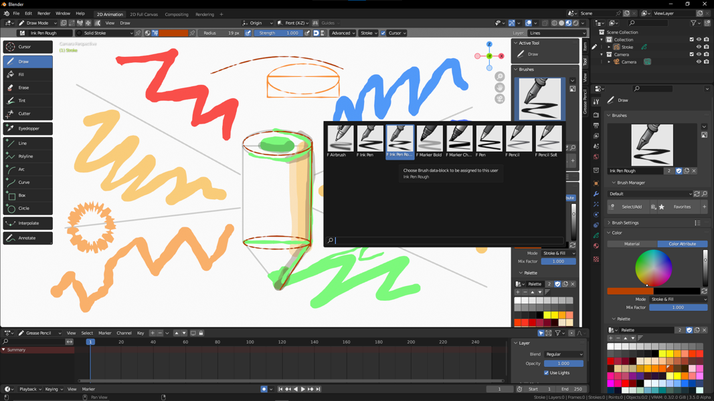
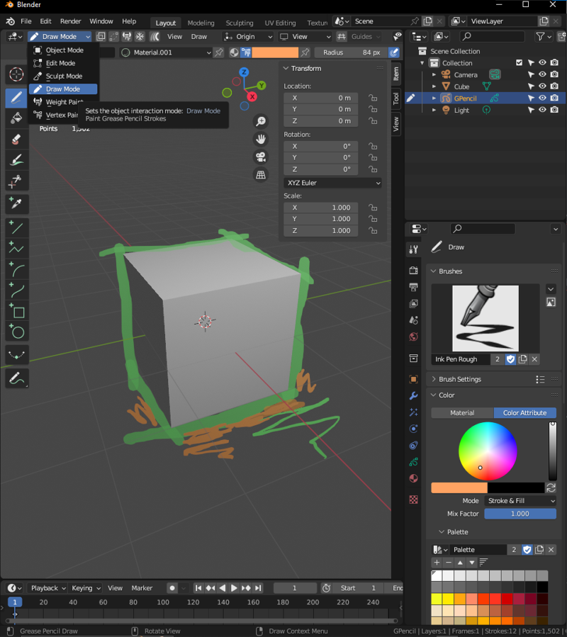

# Příloha: Malování v Blenderu

:::note poznámka na začátek
Skicovací tužka Grease Pencil je 3D nástroj, užitečný pro 2D malbu, animaci a náčrty. Umožňuje vektorovou malbu a použití různých sad štětců.
:::

:::info Addon Grease Pencil Tools
Pro tuto lekci aktivuj addon **Grease Pencil Tools**, který je součástí instalace.
:::

Jak využít nástroje Blenderu 3D pro kreslení a malování.
Blender má nástroje na skicování, je možné vytvářet 2D malby přímo v Blenderu. Umožňuje pracovat ve vrstvách.

```
winget install blenderfoundation.blender
```

## Grease Pencil



- nastavení pro kresbu naješ v aplikačním templatu 2D Animation (*File/New/2D Animation*)
- template obsahuje nastavení kamery, štětců i palet
- kreslení probíhá v módu Grease Pencil Draw
- Grease Pencil lze přidat jako objekt do scény, **poté** lze vybrat Draw mód z menu




## Štětce a nástroje

:::note Tipy pro začátek
1. Barvu štětce změníš přepnutím barvy na mód *Color/Color Atribute* (v N-panelu/Tool nebo v *Active tool and object settings* v panelu vlastností)
2. Rychlé nastavení velikosti štětce <kbd>F</kbd>
3. Rychlé nastavení vlastností štětce <kbd>RMB</kbd>
:::

- Brushes

## 2D animace

- onion skin

## Nastavení pro malbu a principy práce

- Štětce
- 3D scéna

- Blender lze použít pro ala prima digitální techniky. Síla programu je v rychlém skicování, využití 3D scény a unikátních štětcích.
- Grease Pencil Tools

## Malování v Texture Paint módu

## Štětce a import

Další štětce a nástroje je možné získat zde https://github.com/mypaint/mypaint/wiki/Brush-Packages.


## Barvy, palety, barevné modely


## Vrstvy


:::note Cvičení

Vytvoř sérii skic v programu Blender.

:::
