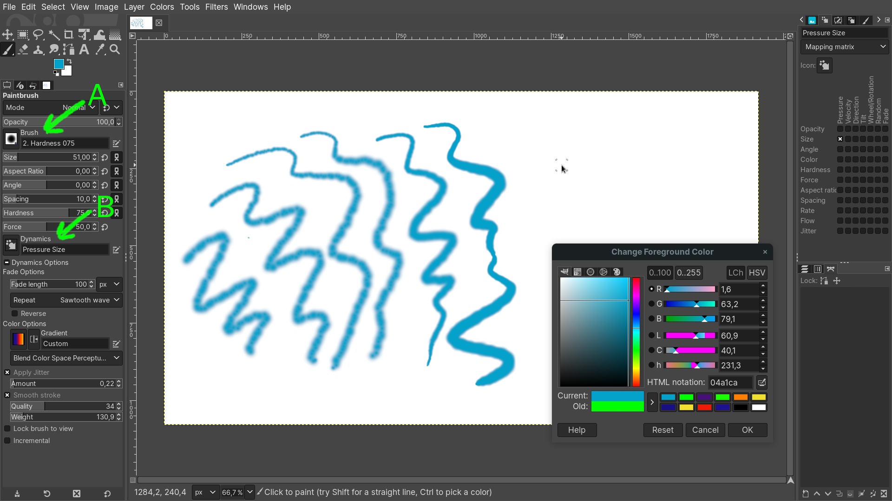
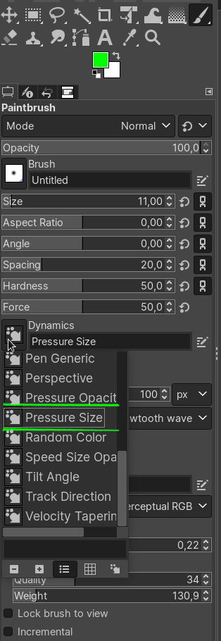
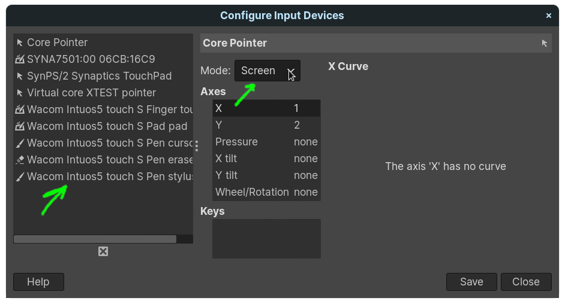
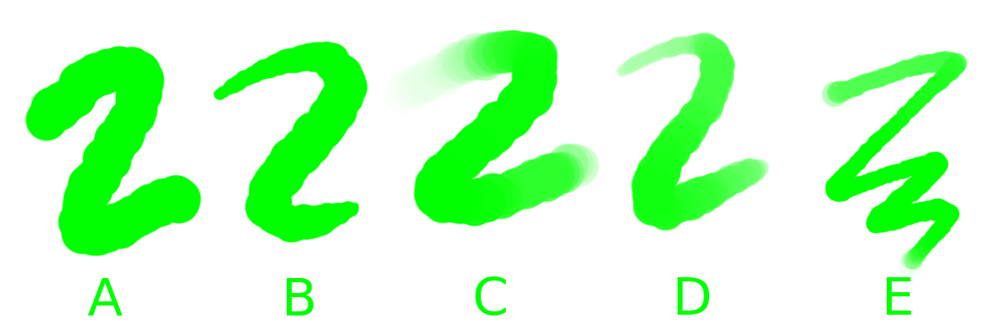
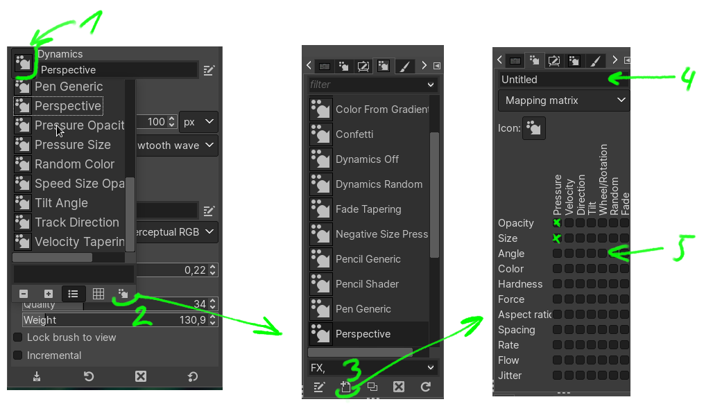
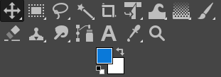
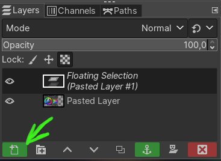
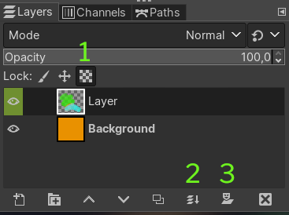
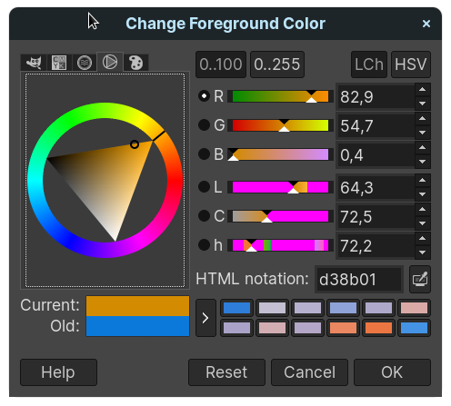
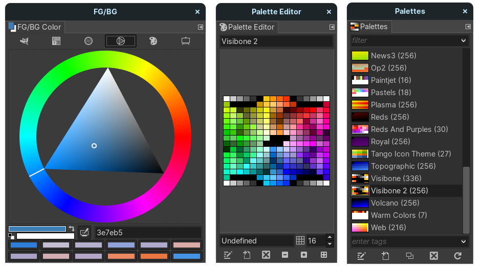

# Příloha: Malování v GIMPu

Jedním z nejznámějších open source grafických bitmapových editorů je GIMP (GNU Image Manipulation Program). Přestože není tak specializovaný na malbu jako Krita, má mnoho funkcí, které mohou být zajímavé pro digitální tvorbu.

Ovládání programu je komplikovanější — nebo spíše nezvyklejší — pro uživatele jiných grafických programů. V této lekci si ukážeme základní nastavení a ovládání pro malbu (a některé zvláštnosti programu).

:::note poznámka na začátek
Ovládání programu GIMP je pro pokročilejší uživatele.
:::

GIMP se ti bude hodit i pro kurzy grafiky a fotografie, a obecně pro všechny aplikace, kde se upravuje bitmapová grafika. Sada experimentálních filtrů G'MIC (GREYC's Magic for Image Computing), která je dostupná i pro další grafické programy, bývá zpravidla pro GIMP nejdříve v nejnovější verzi.

## Instalace a nastavení tabletu

Aktuální verzi programu GIMP najdeš na https://www.gimp.org/downloads/ (i s pokyny pro instalaci v Linuxu), nebo ji ve Windows nainstaluješ pomocí

```
winget gimp  
```

Nainstaluj a spusť program GIMP.

Jazyk aplikace změníš v menu *Edit ‣ Preferences ‣ Interface ‣ Language*.

Vytvoř nový dokument a vyzkoušej štětec Paintbrush z nástrojového menu nebo zkratkou <kbd>P</kbd>. Aby fungoval přítlak tabletu, musíš u štětce nastavit tvar **(A)** a dynamiku **(B)**.



Dynamiku nastav buď na průhlednost (*Pressure Opacity*) nebo šířku tahu (*Pressure Size*). Toto nastavení ovládá přítlak. Citlivostí pera grafického tabletu je možné ovládat jak průhlednost, tak šířku tahu najednou, je ale **nutné vlastní nastavení dynamiky** (viz dále).



Pokud přítlak stále nefunguje, najdi v menu *Edit ‣ Input Devices* svůj tablet (stylus) v seznamu, a změň stav z *Disabled* na **Screen**. Ulož nastavení (*Save*).




## Štětce
GIMP nemá tak specializované algoritmické štětce, jako například Krita, ale přesto stojí za vyzkoušení. Štětec se skládá z textury (Brush), dynamiky (Dynamics) a modifikátorů obou.

:::caution Upozornění
Pokročilá nastavení **dynamiky** (*Dynamics*) NELZE měnit u zabudovaných (Default) nastavení pomocí mapovacího matrixu! Libovolný typ štětce a dynamiky si ale můžeš vytvořit. Vytvořenou dynamiku můžeš pak používat pro libovolný štětec.
:::

### Typ štětce
Předdefinované (Default) štětce. Kolekce.

- obrázek

### Dynamika

Dynamika je charakteristika tahu štětce. Může být určena rychlostí tahu, přítlakem nebo modifikátory.



Na obrázku (A) je tah štětce bez dynamiky (Dynamics Off), (B) je dynamika přítlaku šířky (Pressure Size), (C) je dynamika průhlednosti, (D) je uživatelsky definovaná dynamika šířky tahu a průhlednosti, (E) je kombinovaná dynamika (Speed Size Opacity).



Vlastní dynamiku nastavíš takto:

- vyber nástroj štětec <kbd>P</kbd>
- klikni na ikonu dynamiky (1)
- v otevřeném menu seznamu vyber ikonu (2)
- z menu, které se otevře v doku vpravo, vyber ikonu (3)
- pojmenuj nastavení dynamiky (4)
- (5) v mapovací mřížce (Mapping Matrix) zaškrtni efekty, které má dynamika využívat.
- pro vybraný štětec pak vyber tvojí dynamiku podle názvu v seznamu (1)

:::note Poznámka

Vytvoř si vlastní dynamiku štětce. Experimentuj s nastavením různých typů dynamiky v mapovacím matrixu (Mapping Matrix).

:::

Nastavení dynamiky štětců v GIMPu je komplikovanější, umožňuje ale vytvářet zajímavé nástroje (například v kombinacích s dynamikou rychlosti), a to jak realistické, tak experimentální.

### Vlastní štětce

Vytvoření textury.
Export.
Přiřazení dynamiky.

:::note Poznámka

Management vlastních štětců.

:::

### Instalace štětců
Instalace stažených balíků štětců probíhá překopírováním rozbalených archívů do podadresáře Brushes v adresáři instalace GIMPu a v okně štětců stisknout obnovovací (Refresh) tlačítko.

- Štětce jsou v adresáři Brushes
- Dynamiky jsou v adresáři Dynamics

:::note Poznámka

Ve Windows bude GIMP v základní lokaci /Program Files/GIMP/"číslo verze". V Linuxu bude cesta /home/.config/GIMP/"číslo verze" (pokud byl program GIMP instalován přes Snap, bude v aresáři /home/snap/GIMP/"číslo verze" ).

:::

## Ostatní nástroje



Často používané funkce:

- Paintbrush <kbd>P</kbd>
- Výběr obdélníkový <kbd>R</kbd> a eliptický <kbd>E</kbd>
- Transformace <kbd>Shift</kbd>+<kbd>T</kbd>
- Gradient <kbd>G</kbd>
- Posun <kbd>M</kbd>
- Clone <kbd>C</kbd> a Heal <kbd>H</kbd> pro retuše

Zajímavé funkce:

- Align <kbd>Q</kbd> zarovná vybrané objekty
- Foreground Select (najdeš jako další volbu pod ikonou lasa) pro rychlé výběry a maskování
- Inkoust, Airbrush a MyPaint Brush (najdeš jako další volby pod ikonou Paintbrush)

### Pipeta
Rychlý výběr barvy s klávesou <kbd>Ctrl</kbd>, jako v programu Krita. Při přímé volbě nástroje <kbd>O</kbd> je možné nastavit zprůměrování vybraných barev.


## Vrstvy
Zvláštností GIMPU je to, že se po vložení objektu do vrstvy nejprve vytvoří plovoucí výběr (Floating Selection), který se musí potvrdit:



Pokud je někdo zvyklý na jiné editory, může trvat chvíli než tuto funkci objeví.

Další podobnou zvláštností pro někoho, kdo je zvyklý přetahovat soubory přímo do programů: v GIMPU to funguje pouze přetažením na panel nástrojů, nebo jako novou vrstvu přímo do otevřeného aktivního dokumentu (tentokrát bez mezifáze s plovoucí vrstvou).

Jinak mají vrstvy obvyklé režimy matematických překryvů a prolínání (Multiply, Overlay, Screen, Linear Light atp.).



Užitečné funkce vrstev jsou pro digitální malbu například (1) Lock Alpha (umožňuje malovat pouze do částí vrstvy bez alfakanálu, funguje tak jako rychlá maska). Spojení všech viditelných vrstev je možné stisknutím ikony Merge Layer (2) s klávesou <kbd>Ctrl</kbd>. Maska vrstvy se přidá ikonou s maskou (3).

## Palety
GIMP používá vlastní sRGB barevný profil. Další profily lze přiřadit přes *Image ‣ Color Management ‣ Assign Color Profile ‣ Assign ‣ Select color profile from disk*.



Výběr barevných palet je přístupný přes ikonu barvy popředí a pozadí v panelu nástrojů, nebo jako dok přes menu *Windows ‣ Dockable Dialogs*. Z ukotvených doků se dá přetažením směrem do dokumentu vytvořit plovoucí okno.



:::note Cvičení

Vytvoř sérii skic pomocí techniky vrstev v programu GIMP.

:::
