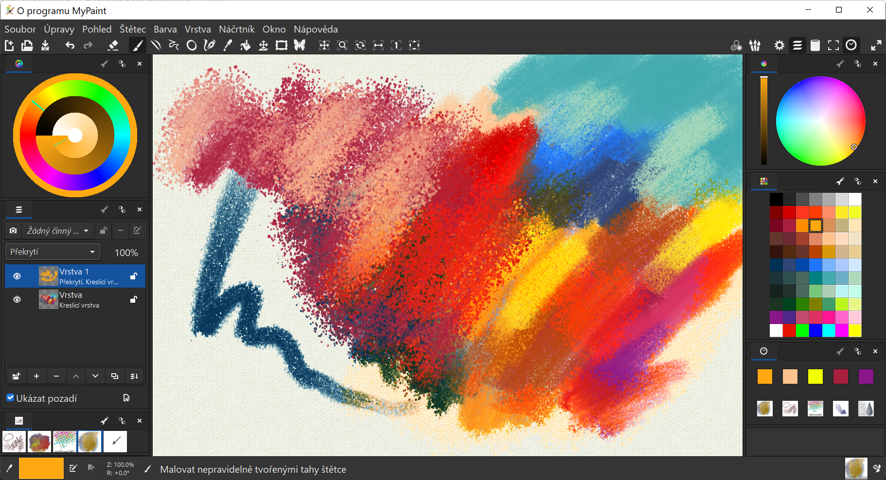
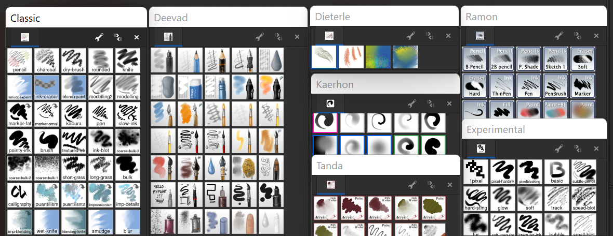
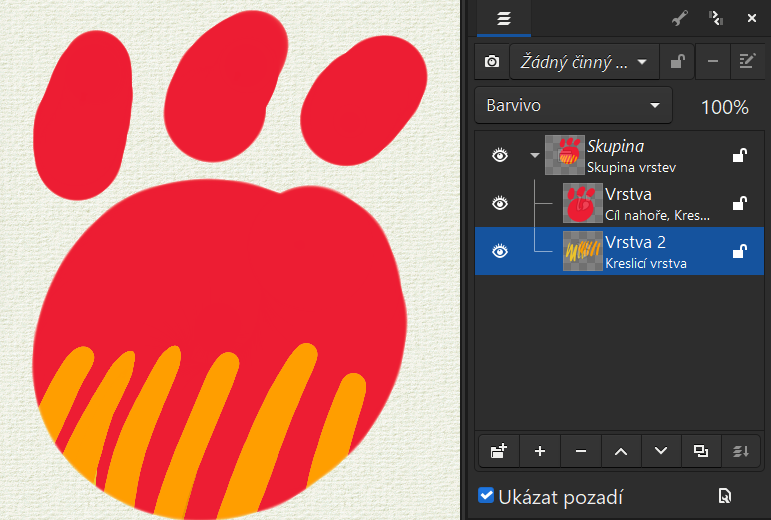

# Příloha: Malování v MyPaint

Jak Krita, tak GIMP podporují MyPaint štětce. Mypaint je open source program na malování se zajímavou sadou nástrojů a možností. Je vynikající na skicování a blokování forem. Umožňuje pracovat ve vrstvách.

Aktuální verzi programu MyPaint najdeš na https://github.com/mypaint/mypaint/releases/ (instalátor i standalone verze pro Windows a AppImage pro Linux), nebo ji ve Windows nainstaluješ pomocí

```
winget install mypaint
```

:::note poznámka na začátek
Program MyPaint je ve stálém vývoji, na některých systémech může být pomalejší.
:::



## Nastavení a principy programu

- Jazyk aplikace MyPaint změníš v menu **Úpravy ‣ Nastavení ‣ Pohled** (*Edit ‣ Settings ‣ View*). Ve stejném menu je i nastavení tabletu.

- Program ukládá jako .png, .jpg a .ora (OpenRaster).

- PNG s transparencí lze vyexportovat pouze volbou typu souboru v rolovacím menu ukládacího formátu při ukládání (RGBA). Standardní export je v základním nastavení s pozadím textury plátna. Pozadí se dá změnit v menu **Vrstva ‣ Volič pozadí** (*Layer ‣ Background*)

- Plátno na malování je neomezené, dá se limitovat rámečkem **Soubor ‣ Povolit rámeček** (*File ‣ Allow Frame*) a nastavit ikonou rámu v horní liště. V programu MyPaint tedy není dané rozlišení, jak je obvyklé v jiných programech — obrázek je prostě tak velký, jak velké je pomalované plátno. Rozměry rámečku se ale dají určit ikonou rámu (a) v nastavení rámečku (b) zadáním rozměru v pixelech (c).

- MyPaint je určený spíše pro ala prima digitální techniky, nemá nástroje výběru ani maskování. Síla programu je v rychlém skicování a unikátních štětcích.


## Štětce
Zkratka <kbd>W</kbd> vybere nástroj štětec a vrstvu. Štětce je možné vybírat v sadách přes ikonu tří štětců v pravé horní liště. Sady a štětce se dají upravovat (kliknutím na ikonu nástroje štětce pravým tlačítkem), importovat a exportovat.



Další štětce a nástroje je možné získat zde https://github.com/mypaint/mypaint/wiki/Brush-Packages. Balíky se instalují z menu **Štětec ‣ Zavést štětce** (*Brush ‣ Import Brushes*), kde vybereš stažený .zip archiv.

## Pipeta
Zkratka <kbd>R</kbd>. Kombinací se speciální klávesou lze vybrat JAS  <kbd>Alt</kbd>, ODSTÍN  <kbd>Ctrl</kbd> a SYTOST  <kbd>Shift</kbd>.

## Barvy, palety, barevné modely
Maskování gamutu je možné v barevném modelu. MyPaint nabízí řadu typů barevných kol vycházející z RGB. RYB a R-G B-Y aproximací, nastavitelné v **Úpravy ‣ Nastavení ‣ Barva** (*Edit ‣ Settings ‣ Colour*). Menu **Barva** (*Colour*) nabízí řadu variant zobrazení barevných modelů.  


Do režimu celé obrazovky bez rušivých oken se dostaneš z menu pravého tlačítka nebo klávesou <kbd>F11</kbd> a dvojím stisknutím <kbd>Tab</kbd>.

## Vrstvy

Vrstvy umožňují standardní překrývací režimy (Překrytí, Znásobení, Měkké světlo atd.). Práce s vrstvami je obvyklá jako v jiných programech, postrádá však rychlé maskování vrstev a podobné pokročilé funkce. Vrstvy je ale možné maskovat ve skupinách pomocí režimů (*Mode*) vrstvy, např. **Cíl nahoře** (*Destination Atop*):




:::note Cvičení

Vytvoř sérii skic pomocí techniky vrstev v programu MyPaint.

:::
