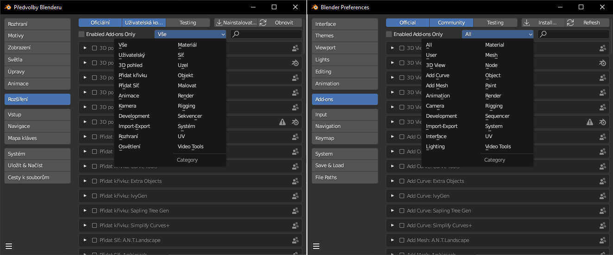
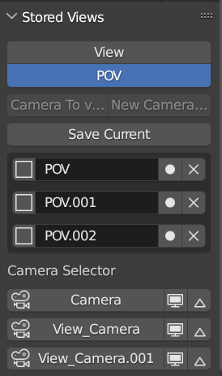
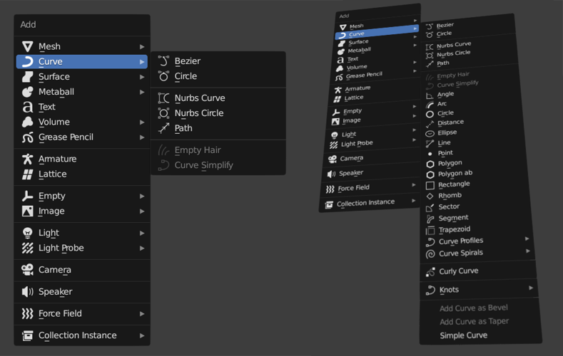
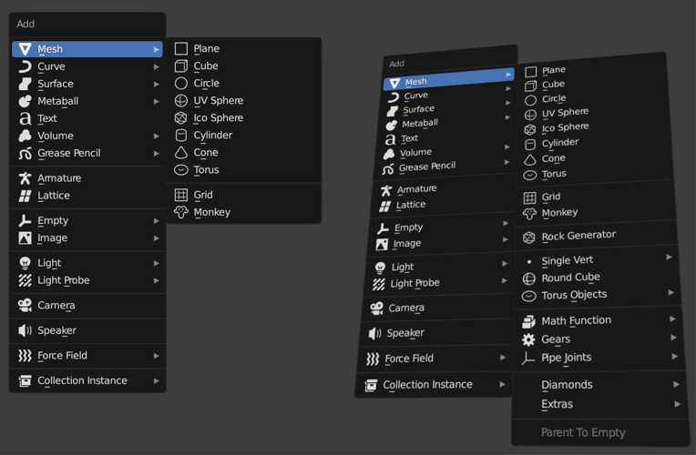
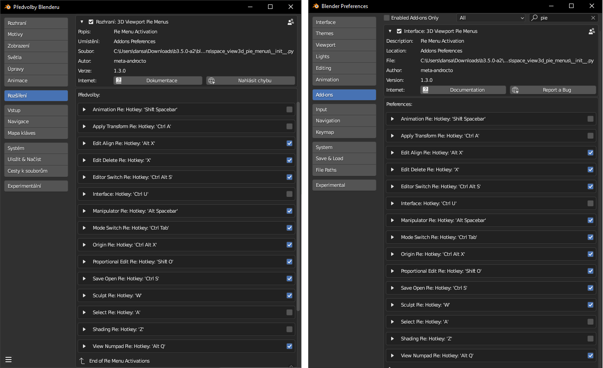
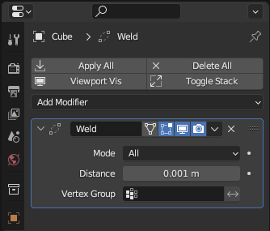
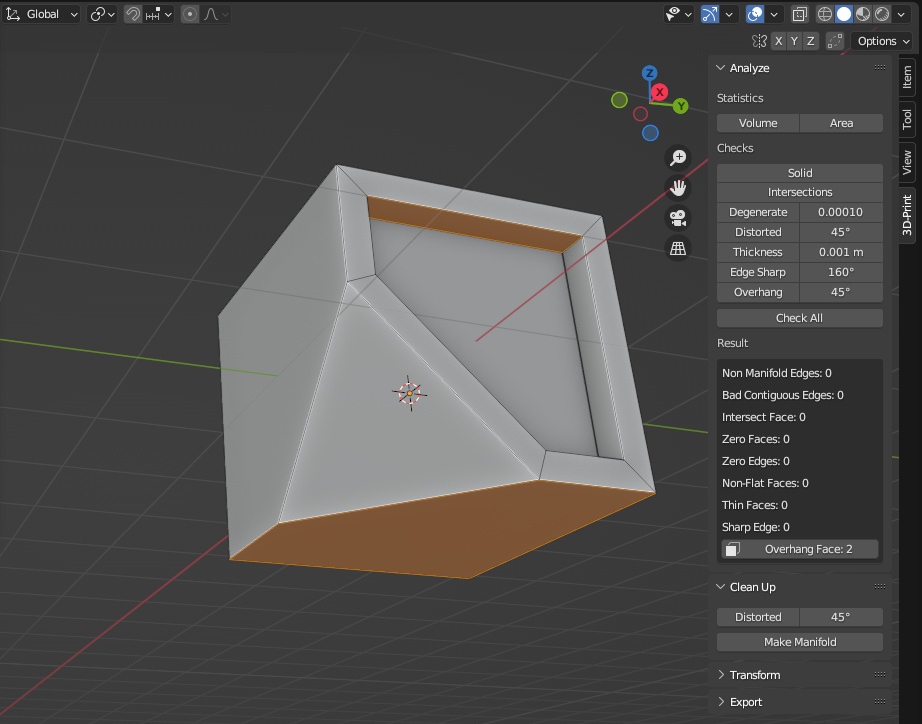
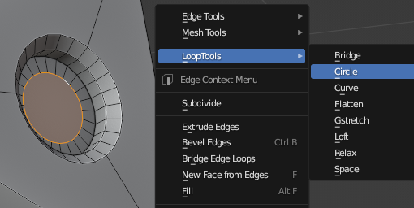
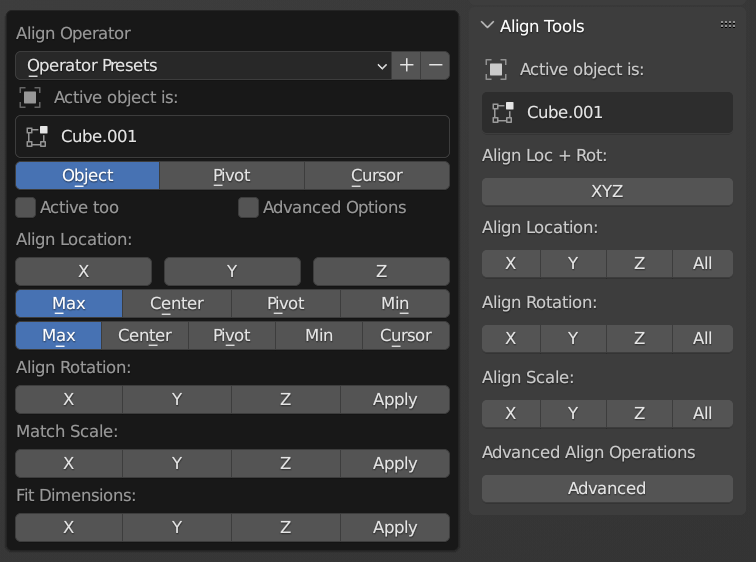
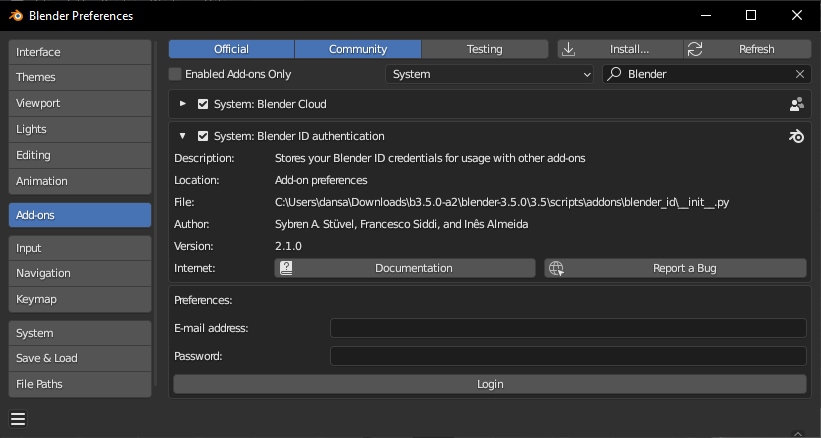

# Blender: Doporučená rozšíření - Add-ons
Addony (*Add-ons*) jsou aplikace — pluginy — rozšiřující možnosti Blenderu. Jedná se o python scripty, distribuované jako .zip nebo .py soubory.

## Addony předinstalované v Blenderu

:::note Add-ons
Addony aktivuješ v menu Nastavení (Preferences) zaškrtnutím checkboxu u jejich názvu. Seznam rozšíření je doporučené základní nastavení, které ti usnadní modelování. V následujících lekcích si ukážeme další užitečné addony, které lze volně doinstalovat. Existuje i mnoho komerčních addonů, zvyšujících produktivitu nebo nabízejících unikátní funkce, nedostupné v základní instalaci Blenderu.

:::

Aktuální doporučené nastavení na videu.

Otevři sekci Rozšíření (Add-ons). Seznam addonů, které aktivuješ je podle pořadí v tématických podmenu:

  
Seznam doporučených addonů

  

    
3DView/Stored Views

    
Add Curve/Curve Tools

    
Add Curve/Extra Object

    
Add Curve/Simplify Curves

    
Add Mesh/Extra Objects

    
Import-Export/Import Images as Planes

    
Interface/3D Viewport Pie Menus

    
Interface/Copy Attributes Menu

    
Interface/Modifiers Tool

    
Mesh/3D-Print Toolbox

    
Mesh/Automirror

    
Mesh/F2

    
Mesh/Loop Tools

    
Node/Node Wrangler

    
Object/Align Tools

    
Object/Bool Tool

    
Object/Carver

  

### Stored Views
- podmenu 3D View

 

- rychlé nastavení pohledů a kamer (video), rychlé přepínání pomocí ikon
- přesouvání mezi kamerami pomocí šipek (nastavení časové linky, funguje v náhledu kamery)
- nepřepíná vlastnosti kamer, musí se vybrat ve scéně nebo v Outlineru manuálné

### Curve Tools
- podmenu Add Curve
- přidání dalších funkcí úpravy křivek (např. zaoblení rohů)
### Add Curve: Extra Objects

- přidává křivkové základní objekty

 

### Simplify Curves+

- změna rozlišení a tvaru křivky

### Add Mesh: Extra Objects
- podmenu Add Mesh

### Add Mesh: Import Images as Planes
- podmenu Import-Export
- importování obrázků jako objektů do scény

### 3D Viewport Pie Menus
- podmenu Interface

:::tip Tip pro nastavení 3D Vievport Pie Menus

 

:::

### Copy Attributes Menu
- kopírování atributů objektů pomocí <kbd>Ctrl</kbd>+<kbd>C</kbd> (kopíruje z aktivního objektu na vybraný)
- umožňuje kopírovat pouze vybrané modifikátory, narozdíl od příkazu <kbd>Ctrl</kbd>+<kbd>L</kbd>

### Modifiers Tool
- zjednodušení práce s modfikátory

### 3D-Print Toolbox
- podmenu Mesh, najdeš v N-panelu
- kontrola a oprava objektů, v Edit módu vybere problematické části
- funkce *Make Manifold* se pokusí opravit chyby ("vodotěsnost")

### Automirror
- automatické nastavení modifikátoru *Mirror*
### F2
- vylepšení vyplňování ploch

### Loop Tools
- užitečné nástroje pro úpravu polygonů, najdeš v kontextovém menu v editačním módu

### Node Wrangler
- podmenu Node
- **důležitý** nástroj pro práci s uzly

### Align Tools
- podmenu Object
- zarovnání objektů

 

### Bool Tool
- zjednodušení práce s boolean operacemi
- Odečíst <kbd>Ctrl</kbd>+<kbd>-</kbd>, Přičíst <kbd>Ctrl</kbd>+<kbd>+</kbd>, Slice <kbd>Ctrl</kbd>+<kbd>/</kbd>, Rozdíl <kbd>Ctrl</kbd>+<kbd>*</kbd>
### Carver
- nástroj pro ořezávíní objektů pomocí boolean operací
- aktivace <kbd>Ctrl</kbd>+<kbd>Shift</kbd>+<kbd>X</kbd>

:::tip Blender ID a Blender Sync

 V podmenu System najdeš add-on **Blender ID authentication**. Ve spojení s addonem **Blender Cloud**, který najdeš zde https://cloud.blender.org/services , umožňuje ukládání nastavení Blenderu podle verzí zdarma v cloudu (Blender Sync).

 

1. Aktivuj Blender ID addon a stáhni, nainstaluj a aktivuj Blender Cloud addon (nutný pro službu Blender Sync)
2. Zaregistruj Blender ID na  https://id.blender.org/register/
3. Naloguj se v Blender ID
4. Ulož Předvolby (*Save Preferences*)
5. V okně Předvolby/Rozšíření/System:Blender Cloud (*Preferences/Addons/System:Blender Cloud*) teď můžeš ukládat a nahrávat nastavení Blenderu
6. Služba Blender Sync je zdarma, placené jsou pouze další možnosti Blender Cloud
7. Synchronizace aktivuje i addony, ale pouze ty, které jsou součástí Blenderu! Uživatelské nebo komerční addony musíš instalovat manuálně.

:::

:::note Poznámka

 Více se dozvíš v kapitole o rozšířeních.

:::
