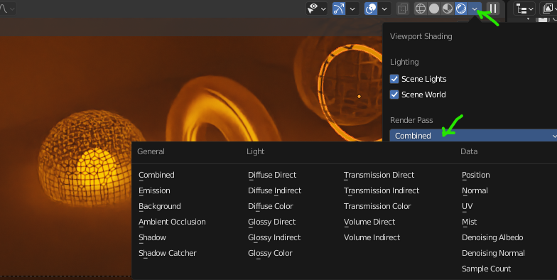
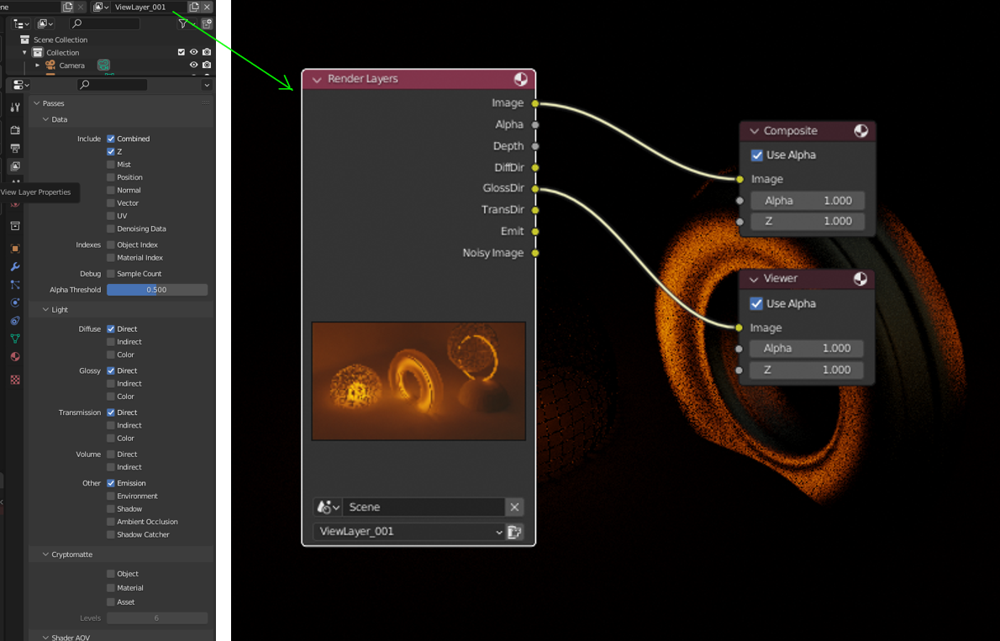

# Blender Compositor a vrstvy
Kompozitor je modul pro import snímků a sekvencí, aplikaci efektů a následný export. Funkce kompozitoru se dá využít i na právě vyrendrované snímky v bufferu Image Viever (Render Result).

## Vrstvy a Render Passes
Renderovaný obrázek je složený z jednotlivých komponentů, např. vrstvy barvy, lesku, průhlednosti, odrazu apod. Jednotlivé objekty a skupiny také mohou být separovány do vrstev pro postprodukci.

- definované pro objekty, skupiny (i skupiny světel)
- Render Passes a postprodukce
- **OpenEXRMultilayer** formát ukládá snímek i s vrstvami (např. i s obrázkem před aplikací šumu)
- přidané vrstvy se renderují zvlášť

Vybraný Render Pass aktivuješ v tabu Vrstvy, a platí pro **aktivní vrstvu** (v horním menu). Pak bude dostupný i pro uzel Render Layers v Compositoru. Kliknutím na lištu uzlu s názvem Render Layers pomocí <kbd>Ctrl</kbd>+<kbd>Shift</kbd> můžeš prohlížet jednotlivé vrstvy (*Passes*). Vrstvy se míchají pomocí uzlu Mix a modifikují ostatními uzly Compositoru.

### Přiřazení objektů do vrstvy

:::note Postup pro render separátních vrstev s rozdílnými objekty

1. Vytvořit vrstvu
2. V Outlineru vybrat objekty, které do vrstvy nechceme
3. Vytvořit skupinu a objekty do ní přidat
4. Skupinu pro vrstvu vypneme pomocí checkboxu u skupiny
5. Objekty také vypneme pro vrstvu pomocí ikony šipky Indirect Only u skupiny v Outlineru (pokud není zobrazená aktivuješ jí ve filtru Outlineru se symbolem trychtýře)

:::

## Krita: Editace vrstev OpenEXRMultilayer
- rozdělení skupiny vrstev Quick Ungroup <kbd>Ctrl</kbd>+<kbd>Alt</kbd>+<kbd>G</kbd>
- aplikace módu prolnutí u vybraných vrstev pod ikonou Layer Properties dole
- nastavení typů prolnutí (viz tutorial)
- vhodné pro menší úpravy

## Postprodukce v Blender Compositoru

- kombinace snímků
- export
- selektivní odstranění šumu (*Denoising*) podle vrstev
- další efekty

Základy technik v kompozitoru pro animace i statické snímky.

## Práce s uzly

- nodes
- input, image (vyber z bufferu nebo z disku)
- mix (vyber operaci, např. Multiply)
- render do souboru

:::note Poznámka

Kompoziční postupy lze použít pro jednotlivé snímky i animace

:::

## Střih videa

- funkce střihu
- import a export
- zvuk
- workflow efektů v reálném čase
