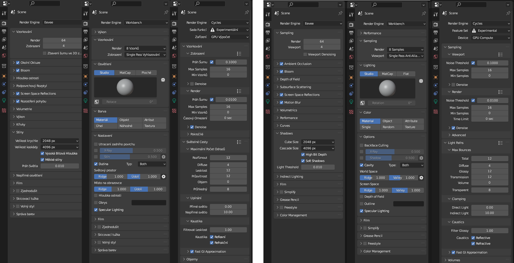
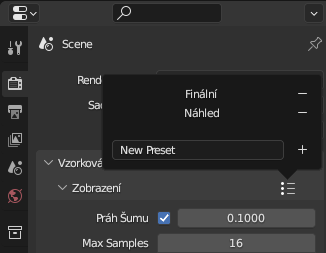
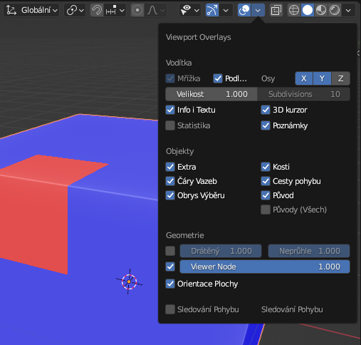
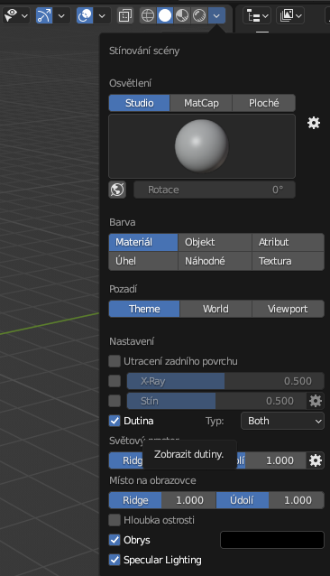
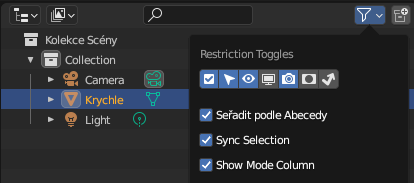

# Blender: Doporučené nastavení předvoleb a spouštěcího souboru

## Předvolby a spouštěcí soubor
Předvolby a spouštěcí soubor najdeš v adresáři config. Doporučené nastavení pro začátečníky a mírně pokročilé. Do souborů se ukládá nastavení programu, nastavení základního souboru. Nastavení addonů.

:::note Vývojové verze
Nastavení pro Blender v Roaming. Pokud adresář nevidíš, zapni zobrazování systémových souborů.

:::

Aktuální doporučené nastavení na videu.

## Nastavení spouštěcího souboru
Nastavení pracovních ploch a renderování se ukládají do základního spouštěcího souboru (Default File), který má příponu .blend a je v konfiguračním adresáři.

### Nastavení pro Evee, Workbench a Cycles

:::note Poznámka

 Pro výsledný render lye nastavení změnit. Jednotlivá nastavení lze ukládat v minimenu. Změněná nastavení renderu se ukládají do .blend souborů.

 

:::

### Zobrazení v pracovním okně

- nastavení (*Face Orientation*) umožňuje snadno vidět převrácené normály

- nastavení stínování dutin (*Cavity*) vylepšuje vidění tvaru objektu při modelování v režimu Solid

### Nastavení Outlineru

- zobrazení ikony ikona zámku vybrání objektu

:::info Uložení změn
Nastavení uložíš pro základní soubor tady:
<Tabs
  groupId="jazykova-verze"
  defaultValue="czv"
  values={[
    {label: 'V české verzi', value: 'czv'},
    {label: 'V anglické verzi', value: 'env'},
  ]
}>
<TabItem value="czv">Soubor ‣ Výchozí ‣ Uložit Spouštěcí Soubor</TabItem>
<TabItem value="env">File ‣ Defaults ‣ Save Startup File</TabItem>
</Tabs>

:::

## Nastavení předvoleb (Preferences)
Předvolby změníš v menu:

import Tabs from '@theme/Tabs';
import TabItem from '@theme/TabItem';

<Tabs
  groupId="jazykova-verze"
  defaultValue="czv"
  values={[
    {label: 'V české verzi', value: 'czv'},
    {label: 'V anglické verzi', value: 'env'},
  ]
}>
<TabItem value="czv">Upravit ‣ Předvolby</TabItem>
<TabItem value="env">Edit ‣ Preferences</TabItem>
</Tabs>

### Interface
- Display
- Editors/Status Bar
### Themes
- 3D Viewport, nastavení overlay alpha pro flipped normals
- větší velikost vertexů
### Navigation
- Orbit Around Selection
- Perspective, Depth
- Zoom to Mouse Position
### Keymap
- Spacebar Action na Tools
- Alt Click Tool, Alt Tool, Select All
- Pie Menu on Drag, Extra Shading Pie Menu
### Keymap
- nastavení grafické karty
- Undo steps 64+

**Uložíme nastavení** v hamburger menu vlevo dole (Save Preferences).Nastavení základního rozšíření add-on si ukážeme v další lekci.
