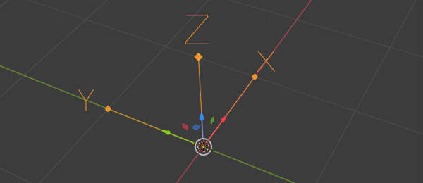
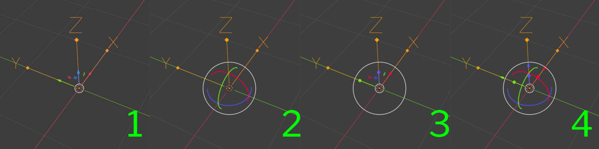
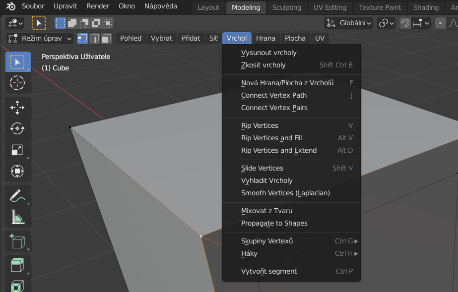

# Blender: Instalace, nastavení

## Stažení a instalace
Najdi aktuální verzi na https://www.blender.org/

:::note Vývojové verze
Alfa verze Blenderu https://builder.blender.org/download/daily/
Tyto verze jsou pro vyzkoušení novinek a stability, nejsou vhodné pro tvorbu kritických projektů!

:::

Stáhni a spusť instalační soubor.
Po instalaci spusť program Blender.

Aktuální stabilní verzi můžeš nainstalovat také [pomocí terminálu](/docs/pokyny).

## Nastavení jazykové verze
Jazykovou verzi programu změníš v menu:

import Tabs from '@theme/Tabs';
import TabItem from '@theme/TabItem';

<Tabs
  groupId="jazykova-verze"
  defaultValue="czv"
  values={[
    {label: 'V české verzi', value: 'czv'},
    {label: 'V anglické verzi', value: 'env'},
  ]
}>
<TabItem value="czv">Upravit ‣ Předvolby ‣ Rozhraní ‣ Překlad</TabItem>
<TabItem value="env">Edit ‣ Preferences ‣ Interface ‣ Translation</TabItem>
</Tabs>

## Nastavení grafického tabletu a klávesnice pro Blender
:::note Poznámka

 Pokud používáš dvoutlačítkovou myš se skrolovacím kolečkem a numerickou klávesnici, můžeš tuto sekci přeskočit.

:::

Zkontroluj funkčnost tabletu. Podle typu pera nastav tlačítka, Right Click, Middle Click. **Vypni Windows Ink.** Protože nemáš skrolovací tlačítko, funkčnost ovládáš na **numerických** klávesách <kbd>Num +</kbd> a <kbd>Num -</kbd>. Pokud jsou na tvém tabletu programovací tlačítka nebo touch ring, doporučuji si nastavit tyto shortcuty (viz obrázek). Příklad nastavení u tabletu Wacom:

Možnosti klávesnice nastavíš v Blenderu tady:
<Tabs
  groupId="jazykova-verze"
  defaultValue="czv"
  values={[
    {label: 'V české verzi', value: 'czv'},
    {label: 'V anglické verzi', value: 'env'},
  ]
}>
<TabItem value="czv">Upravit ‣ Předvolby ‣ Vstup</TabItem>
<TabItem value="env">Edit ‣ Preferences ‣ Input</TabItem>
</Tabs>

Tady také nastavíš emulaci numerické klávesnice a v polních podmínkách ovládání pomocí touchpadu.

:::warning Poznámka

 Doporučuji zrušit ALT+SHIFT a SHIFT+CTRL na přepínání klávesnic ve Windows.  Minitutorial jak na to:

 Start>Nastavení>Čas a jazyk>Jazyk>Klávesnice>Klávesové zkratky pro jazyk zadávání>Otevře se okno Jazyky a služby pro zpracování textu, zvolte Změnit kombinaci kláves>>Oba sloupce nastavit na Nepřiřazeno. Použít.

 (Anglická verze Win10: Start>Settings>Time & Language>Language>Keyboard>Input Language Hotkeys, otevře se dialogové okno Text Services and Input Languages, v něm vyberte Change Key Sequence a nastavte všechny Key Sequence na Not Assigned.)
 Aplikujte.

 **Shorcut na přepínání klávesnic <kbd>Windows</kbd> + <kbd>SPACEBAR</kbd> bude dále funkční.**

:::

## Nastavení grafické karty

:::info Grafická karta a Cycles

Pro použití akceleračních schopností grafické karty nastav pro renderovací engine Cycles zvolenou kartu a procesor v **Upravit ‣ Předvolby ‣ Systém** (*Edit ‣ Preferences ‣ System*).

:::

## Blender pro úplné začátečníky

Po spuštění a výběru nastavení pracovního prostředí Obecné (General) Blender otevře základní scénu v pracovní ploše Layout. Přesuň kurzor do pracovního okna a stiskni <kbd>N</kbd>. Vysune se postranní panel.

Stiskni opakovaně <kbd>T</kbd>. Funkce zobrazuje **Nástroje** (*Toolbox*) a je aktuální pro danou pracovní plochu a režim.

### Pohyb ve scéně a pohledy

Pohled na scénu měníš s myší nebo perem pohybem s prostředním tlačítkem <kbd>MMB</kbd> pro rotaci, <kbd>Ctrl</kbd>+<kbd>MMB</kbd> pro zvětšení a <kbd>Shift</kbd>+<kbd>MMB</kbd> pro zvětšení.

### Základní transformace
Objekt vybereš kliknutím levým tlačítkem. Vyber kostku uprostřed scény. Obrysy vybraného objektu se zvýrazní. U vybraného objektu můžeš měnit pozici (1), natočení (2), velikost (3), nebo všechny transformace společně (4)  nástrojem v menu **Nástroje** (*Toolbox*) s ikonami vlevo. Změny se ovládají tažením v barevných osách (X, Y, Z) widgetu, který se zobrazí.

Stisknutím tlačítek <kbd>X</kbd>, <kbd>Y</kbd>, nebo <kbd>Z</kbd> když je nástroj transformace aktivní omezíš funkci transformace pro danou osu.

:::note tip

Vyzkoušej si transformace pomocí widgetů na kostce ve scéně.

:::

Efektivnější způsob transformace pomocí zkratek si ukážeme v příští lekci.  

### Pracovní plochy
Okna můžeš přesouvat a měnit jejich obsah a velikost podle potřeby.

**Jak vrátit pracovní plochu do původního nastavení:** Nastavení plochy se ukládá do souboru. Ulož projekt. V dialogu  otevření souboru <kbd>Ctrl</kbd> + <kbd>O</kbd> otevřete Settings (ikona kolečka vpravo nahoře) a odškrtněte Načíst UI (*Load UI* v anglické verzi).

Tvůj projekt se načte se základním nastavením plochy (UI).

### Přidání a mazání pracovních ploch v menu.

Ulož si pracovní plochu a vyzkoušej si přepínání pracovních ploch.

## Přehled funkcí Blenderu

Základní typy pracovních ploch jsou připravené jako template při vytváření nového dokumentu (Obecné, VFX, Sculpting atd.). Jedná se o specifické nastavení pracovních ploch a oken, funkce programu jsou stejné.

Funkce programu Blender se rozšiřují pomocí Rozšíření (Add-ons). Některá rozšíření jsou součástí programu, a aktivují se v menu **Upravit ‣ Předvolby Rozšíření** (*Edit ‣ Preferences ‣ Add-ons*). Další se instalují ze staženého archívu .zip ve stejném menu. Některé dostupné moduly jsou volně dostupné, některé jsou komerční.

Nejužitečnější volně dostupná rozšíření najdeš v lekci Pluginy a materiálové uzly.

## Co jde v Blenderu dělat?
Kompletní projekt od modelování po render nebo animaci. Střih a vizuální efekty. Modelování a digitální sochařství. Digitální kresba a malba. Motion design a animace. Přípravy pro 3D tisk.

Kurz se zaměřuje na základní ovládání programu a modelování a digitální sochařství (a spolupráci s ostatními programy).

## Jaký je nejefektivnější způsob ovládnutí programu?

V kurzech se soustředíme se hlavně na pracovní plochy Layout a editační mód.

Cílem je pochopení základů polygonového modelování.

:::note tip

Nejrychleji se postupy naučíš vlastními experimenty (všímej si například změn možností v **menu režimu** při změně pracovní plochy).

Nové funkce a postupy se dají také rychle objevit prozkoumáním seznamů zkratek — a Blender jich má opravdu hodně!

:::

Můžeme začít.
