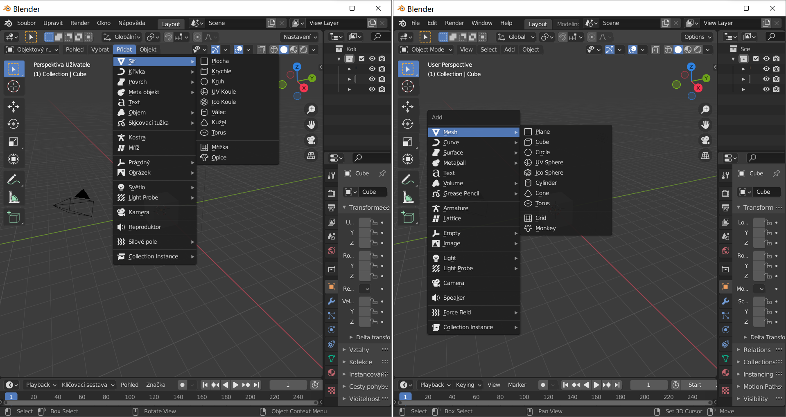
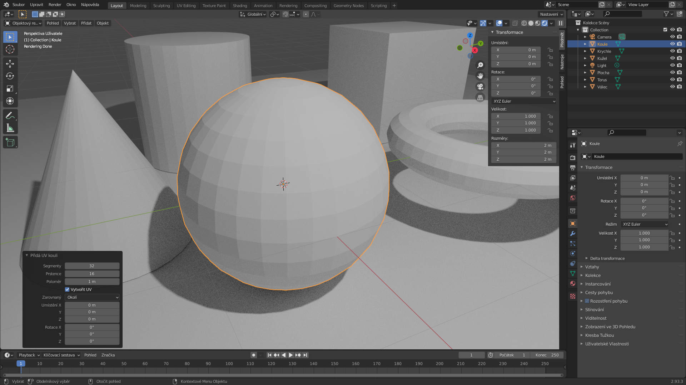
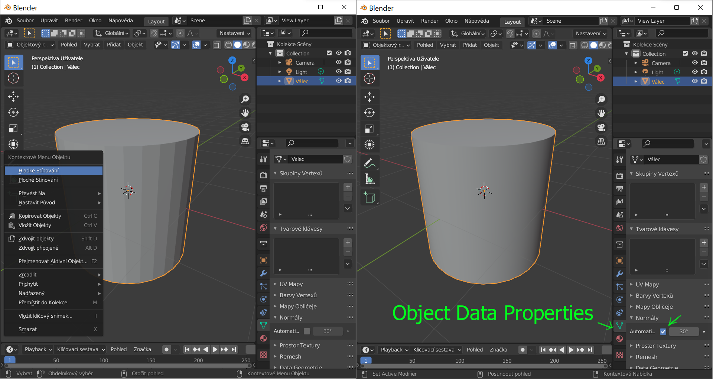
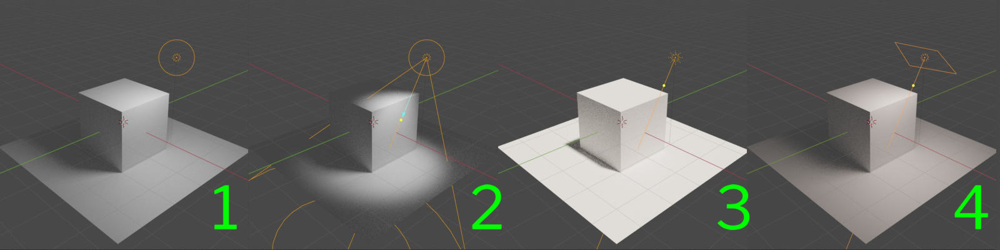
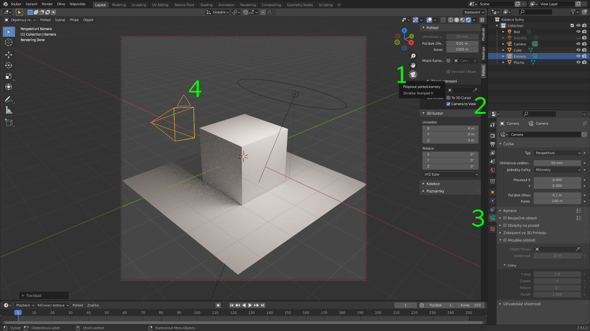

# Lekce 01: Objekty ve scéně
V této lekci si zopakujeme základní ovládání a ukážeme si objekty, které mohou tvořit 3D scénu.

:::note úkol

- Vytvoř nový dokument z menu **Soubor ‣ Nový ‣ Obecné**. (*File ‣ New ‣ General*).

:::

Po stisknutí <kbd>N</kbd> se vysune postranní panel a pracovní plocha by měla na všech systémech vypadat přibližně tak, jako na obrázku.

## První projekt

## Vytvoření a typy objektů

Objekty do vložíš do scény v pracovní ploše **Layout** přes **menu režimu Přidat**, nebo zkratkou <kbd>Shift</kbd>+<kbd>A</kbd> a vybráním objektu z rychlého menu.

Při přidání objektu do scény je možné měnit parametry geometrie tvořeného objektu otevřením menu vlevo dole — po vložení objektu do scény menu zmizí, a objekt je pak možné editovat pouze jako síť (mesh) v editačním módu.

### Sítě (Meshes)
Polygonová tělesa a geometrické tvary. Jedná se o objekty tvořené plochami, s editovatelnými vrcholy a hranami. To, jak budou polygonové objekty ztvárněny, určuje nastavení normál a stínování.

### Hladké a ploché stínování
Stínování nastavíš z menu pravého tlačítka (nebo z menu režimu Objekt) na vybraném objektu.
Pro lepší funkci vyhlazování normál je nutné zaškrtnout **Automatické vyhlazení** v Object Data Properties v nastavení Normály.

Toto nastavení použiješ pro kužele, válce a komplexní objekty.

### Světla

Typy světel:

- (1) **Bod** (Point)
- (2) **Směrové** (Spot)
- (3) **Slunce** (Sun) je intenzívní světelný zdroj a je určené i pro osvětlování pomocí radiozity v interiéru. Na rozdíl od ostaních zdrojů není důležité, kde ve scéně se nachází ikona objektu.
- (4) **Oblast** (Area) má nastavení tvaru (čtverec, obdélník, disk, elipsa). Tvar zdroje je důležitý pro modelování stínů a odráží se na lesklých plochách.

Intenzitu světla a parametry lze upravit interaktivně přes rychlé menu (označit světlo, pravé tlačítko, vybrat položku, táhnout myší) a vlastnosti objektu (Object Data Properties).

Dalším způsobem osvětlení scény je **mapa prostředí** (Environment Map), o které si povíme víc v lekci "Efektivní osvětlení a render".

### Kamery
Scéna může obsahovat jednu nebo více kamer. Pohled aktivní kamery (který se bude renderovat) zobrazíš klávesou <kbd>Numpad 0</kbd> nebo ikonou kamery (1).

Další kamery můžeš přidat jako objekt do scény. Aktivní kameru změníš v menu režimu **Pohled ‣ Kamery ‣ Nastavit aktivní objekt jako kameru** (*View ‣ Cameras ‣ Set Active Object as Camera*), nebo zkratkou  <kbd>Ctrl</kbd>+<kbd>Numpad 0</kbd> — kamera musí být označená.

:::note klávesnice na laptopech

Na laptopech nebo systémech **bez numerické klávesnice** musíš pro používání těchto zkratek zapnout emulaci numerické klávesnice v **Upravit ‣ Předvolby ‣ Vstup ‣ Klávesnice ‣ Emulovat Numpad**.

:::

Nastavení aktuálního pohledu jako pohledu kamery <kbd>Ctrl</kbd>+<kbd>Numpad 0</kbd>, změní nastavení aktivní kamery tak, aby odpovídalo aktuálnímu pohledu.

Pohyb pohledu kamery v okně je umožněný zaškrtnutím **Camera to View** (2) v tabu Pohled v postranním panelu. Ovládání je stejné jako ovládání pohledu (aktivní kamera musí být označená:

-  <kbd>R</kbd> pro rotaci (rolování)
- vertikální posun (Panning, Pitching) <kbd>R</kbd>, potom <kbd>X</kbd> a <kbd>X</kbd>, a pohyb myší
- horizontální posun <kbd>R</kbd>, potom <kbd>Y</kbd> a <kbd>Y</kbd>
- přiblížení (Dolly) <kbd>G</kbd>, potom <kbd>Z</kbd> a <kbd>Z</kbd>
- nebo interaktivně s myší nebo perem s prostředním tlačítkem <kbd>MMB</kbd>, <kbd>Ctrl</kbd>+<kbd>MMB</kbd>.

Vlastnosti a nastavení kamery měníš v doku vlastností objektu (3).

Orientace kamery je ve scéně znázorněna trojůhelníkem (4).

Poměr stran kamery nastavíš v doku **Vlastnosti výstupu** (*Output Properties*).

### Ostatní objekty
Dalším typům objektů se budeme více věnovat v kurzu Modelování pro pokročilé. Zatím je dobré vědět, že v Blenderu můžeme pracovat i s:

- Povrchy (Nurbs) a Křivkami
- Meta objekty pro tvorbu organických těles
- Objemy (Volumes) OpenVDB pro speciální volumetrické efekty
- Silovými poli pro animace a simulace
- Skicovací tužkou (Grease Pencil)
- Prázdnými objekty, používanými pro ovládání ostatních objektů a efektů ve scéně
- Kostrami pro armatury animací
- Referenčními obrázky
- Textem

## Vlastnosti
**Vlastnosti** (*Properties*) jsou oblast v pravé dolní části okna Blenderu s doky pro nastavení vlastností objektů, renderování, materiálů atp.

## Transformace
Aplikování transformace. Omezení pohybu v osách.

## Skupiny
V Blenderu se skupiny tvoří spojením objektů, přiřazením objektu vrstvě nebo kolekci.

## Renderování scény a výstupu

Render engines a nastavení výstupu.

## Základní zkratky
G S R x,y,z, GG

Shift A

:::note úkol

Vyzkoušejte tvorbu objektů a transformace.

:::
