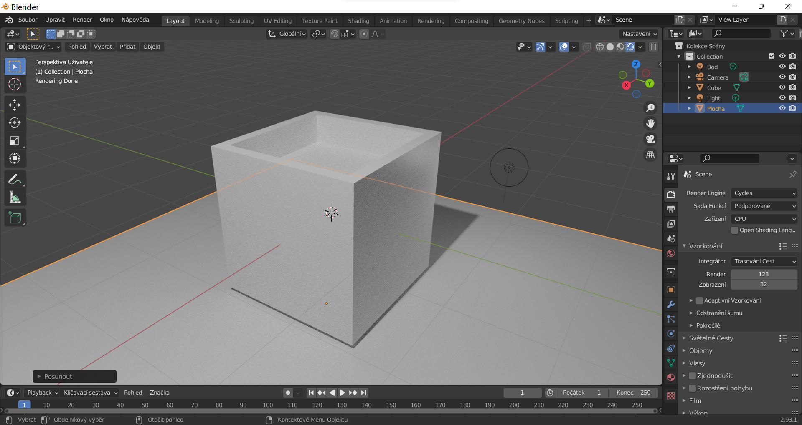

# Lekce 01: Objekty ve scéně

## Vytvoření a typy objektů

### Polygonové objekty

## Sítě

### Světla
### Ostatní objekty

## Vlastnosti
### Hladké a ploché stínování
Nastavení z menu pravého tlačítka.
Pro lepší funkci vyhlazování normál je nutné zaškrtnout Automatické vyhlazování v Object Data Properties.

- obrázek

## Pohyb a pohledy scény

## Transformace

## Základní zkratky

:::note úkol

Vyzkoušejte tvorbu objektů a transformace.

:::
