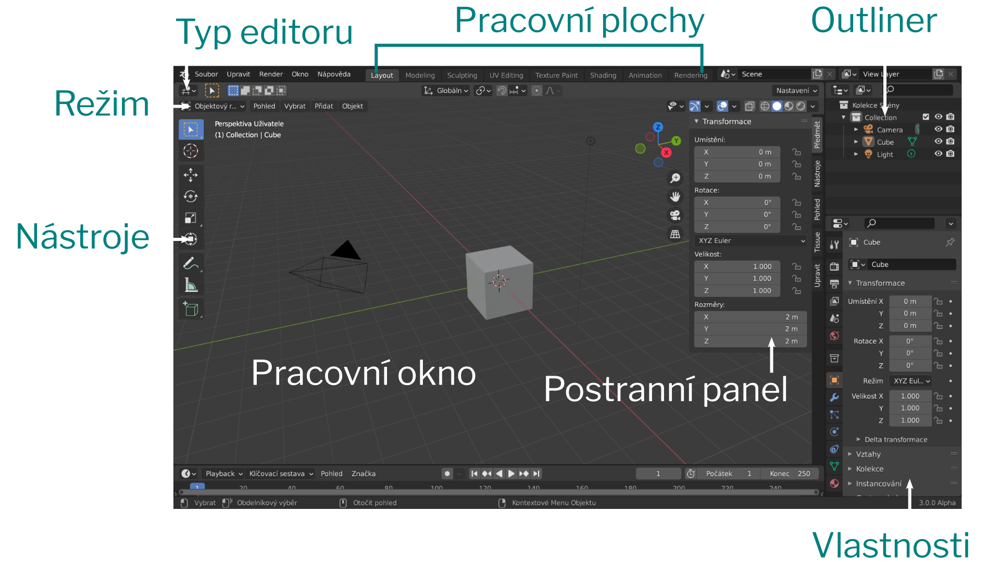

# Lekce 01: Objekty ve scéně
V této lekci si zopakujeme základní ovládání a ukážeme si objekty, které mohou tvořit 3D scénu.

:::note úkol

- Vytvoř nový dokument z menu **Soubor ‣ Nový ‣ Obecné**. (*File ‣ New ‣ General*).

:::

Po stisknutí <kbd>N</kbd> se vysune postranní panel a pracovní plocha by měla na všech systémech vypadat přibližně tak, jako na obrázku.

## První projekt

## Vytvoření a typy objektů

Objekty do vložíš do scény v pracovní ploše **Layout** přes **menu režimu Přidat**, nebo zkratkou <kbd>Shift</kbd>+<kbd>A</kbd> a vybráním objektu z rychlého menu.

### Polygonové objekty

### Sítě
Polygonová tělesa a geometrické tvary.
### Světla
Typy světel.
Upravení síly světla a parametrů přes rychlé menu a vlastnosti objektu.
### Kamery
Nastavení pohledu kamery. Nastavení aktuálního pohledu jako pohledu kamery. Pohyb kamery (Camera to View).
### Ostatní objekty
Dalším typům objektů se budeme více věnovat v kurzu Modelování pro pokročilé. Zatím je dobré vědět, že v Blenderu můžeme pracovat i s:

- Povrchy (Nurbs) a Křivkami
- Meta objekty pro tvorbu organických těles
- Objemy (Volumes) OpenVDB pro speciální volumetrické efekty
- Silovými poli pro animace a simulace
- Skicovací tužkou (Grease Pencil)
- Prázdnými objekty, používanými pro ovládání ostatních objektů a efektů ve scéně
- Kostrami pro armatury animací
- Referenčními obrázky
- Textem

## Vlastnosti
### Hladké a ploché stínování
Stínování nastavíš z menu pravého tlačítka (nebo z menu režimu Objekt).
Pro lepší funkci vyhlazování normál je nutné zaškrtnout **Automatické vyhlazení** v Object Data Properties v nastavení Normály.

Toto nastavení použiješ pro kužele, válce a komplexní objekty.

## Pohyb a pohledy scény

## Transformace
Aplikování transformace.

## Základní zkratky

:::note úkol

Vyzkoušejte tvorbu objektů a transformace.

:::
