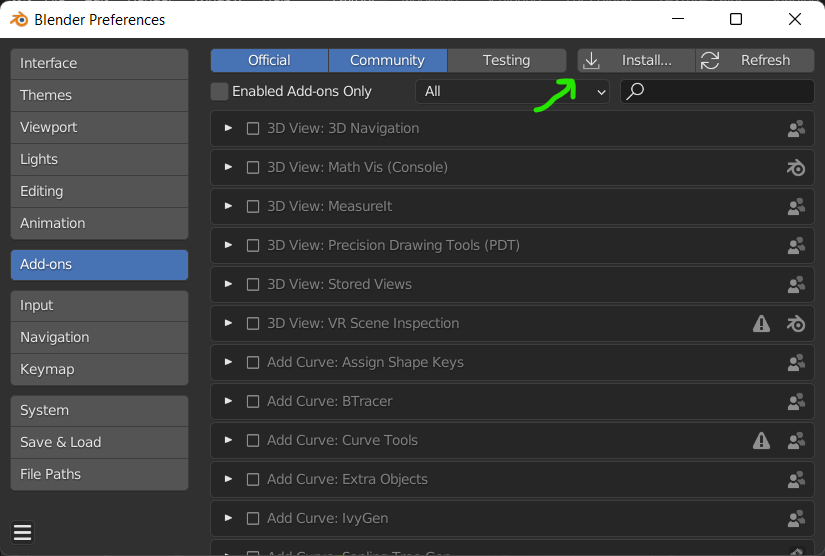

# Add-ons: Pluginy rozšiřující funkce Blenderu

Plugin (Add-on) je program přidávající nebo rozšiřující funkci nástrojů v Blenderu. Komplexní pluginy (např. *Node Wrangler*) jsou pro pokročilé uživatele nezbytné.

## Instalace pluginů

Add-ony se instalují z okna preferencí (Edit ‣ Preferences ‣ Add-ons) . Stažený plugin je zpravidla .py soubor nebo soubory archívu .zip — soubor vybereš a zaškrtnutím políčka vlevo aktivuješ. Pokud se má plugin aktivovat i při dalším spuštění, ulož si nastavení (hamburger menu vlevo dole).

## Základní pluginy, které jsou součástí Blenderu

Instalace Blenderu obsahuje mnoho pluginů, které jsou součástí instalace, ale nejsou aktivované. Je to proto, že nejsou nutné pro běh programu a uživatel si zapne ty funkce, které potřebuje.

### Node Wrangler
- základní pro práci s materiálovými uzly

### Node Arrange
- automaticky přehledně rozloží uzly na desce (po aktivaci ho nalezneš v postranním panelu v uzlových editorech)

### 3D Print Toolbox
- kontrola sítě a geometrie pro 3D tisk, hodí se i pro opravy sítí
- tab Add-ons/Official

### Modifier Tools
- zjednodušuje aplikaci modifikátorů na objekt

### Copy Attributes Menu
- umožňuje kopírovat atributy

### Bool Tool
Práce s CSG, po aktivaci shortcuty s Ctrl
- modelování pomocí operací se zdrojovými objekty

### F2
- add-on pro editační mód, po vybrání okrajových hran nebo vrcholů a stisknutí <kbd>F</kbd> vytvoří překlenovací plochu

### 3D Navigation
- umožňuje přepínat pohledy z postranního panelu (po aktivaci se do oddílu View přidá 3D Navigation)

### Stored Views
- uložené pohledy na scénu a objekty, mimo systém kamer (najdeš v postranním panelu View jako Stored Views)
- lze snadno přepínat mezi uloženými kamerami a vytvářet z pohledů nové kamery

### Amaranth Toolset
- kolekce nástrojů produktivity, dokumentaci najdeš v odkazu v rozbalovací liště add-onu
- v kontextovém menu ve scéně (Righ Click) přibude možnost Camera as Render Border, které šetří zdroje v režimu Cycles
- zobrazuje wireframe u vybraného modelu, nastavení v N-panelu View (postranní panel)

### Precision Drawing Tools (PDT) a MeasureIt
- utility pro přesné modelování
- přibližuje modelování v Blenderu CAD postupům

### Cell Fracture

- vytváří parametrické praskliny modelu pro speciální efekty a motion design
- po aktivaci pluginu nutná aktivace Developers Extra (v preferencích pod Interface)
- používá se přes menu *Edit ‣ Operator Search*, spustit **Cell fracture selected mesh**

### A. N. T. (Another Noise Tool) Landscape
- vytváří rychlou síťovou krajinu na základě generátoru šumu (v N-panelu se objeví v záložce Create)

### Extra Objects
- dva add-ony pro křivky a pro sítě, rozšiřující základní objekty
- add-on Extra Objects pro sítě přidává např. generátor matematických funkcí nebo jednotlivý vertex
- možnosti přidá do menu  Add ‣ Curve a Add ‣ Mesh (pod zkratkou <kbd>Shift</kbd>+<kbd>A</kbd>).

## Pluginy, které jsou volně ke stažení

Kvalitní pluginy, které se vyplatí doinstalovat a jsou volně zdarma ke stažení. Některé jsou součástí instalace Blenderu (Tissue), ale je lepší stáhnout nejaktuálnější verzi.

### Tissue
- modelování pomocí aplikovaných sítí
- umožňuje vytvářet komplexní modely z komponentů

https://github.com/alessandro-zomparelli/tissue

### Modifier List Add-on
- zjednodušuje práci s modifikátory

https://github.com/Symstract/modifier_list

### Easy HDRI
- usnadňuje orientaci v knihovně HDRI a instalaci materiálů HDRI pozadí a osvětlení do scény

https://codeofart.gumroad.com/l/EasyHDRI

### fSpy

- plugin zjednodušuje synchronizaci kamery a pozadí pomocí nastavení tříbodové perspektivy
- vhodné pro rendery umístěné do reálných fotografií pro architektonickou vizualizaci

https://github.com/stuffmatic/fSpy-Blender

### UVPacker
- efektivní skládání UV do mapy textury

https://github.com/3d-io/uvpacker-blender-addon/releases

### MACHIN3tools
- soubor mnoha utilit pro produktivitu, umožňuje např. vytvářet **skupiny** (po zapnutí funkce **Group** se skupina vytvoří vybráním objektů a zkratkou <kbd>Ctrl</kbd>+<kbd>G</kbd>, skupinu vybereš <kbd>Shift</kbd>+<kbd>LMB</kbd>
- jednotlivá rozšíření se zapínají v aktivovaném pluginu
- má i placenou rozšířenou verzi

https://github.com/machin3io/MACHIN3tools

## Komerční pluginy

Pluginy které zjednodušují práci s nástroji nebo rozšiřují funkce Blenderu. Výběr v tomto oddílu je omezený na nejčastěji používané v profesionální práci.

:::info Poznámka
Komerční pluginy pro Blender najdeš většinou na stránkách online tržišť Blendermarket.com nebo Gumroad.com.
:::

### HardOps a Boxcutter
- utility pro hard surface modeling

### Fluent Power Trip a Materializer
- utility pro hard surface modeling a parametrické textury

### UVPackmaster
- utilita pro aplikaci a optimalizaci UV map

### Serpent
- práce s uzly modelování geometrie

### Chris Holt Plugins
- BY-GEN je skript pro generování objektů podle základní sítě

### Pluginy a materiály Nathana Ducka (Ducky3D)
- kvalitní parametrické materiály, kurzy a jiné utility

### MACHIN3tools DeusEx, Meshmachine, Decalmachine
- utility pro modelování a hard surface modeling

## Další zdroje
Zdroje pro HDRI, textury, materiály atd.

###  HDRI Haven / Polyhaven
Známé stránky nabízející HDRI osvětlení pro scény, textury a modely.

https://polyhaven.com/hdris

###  Poliigon
Knihovna profesionálních textur pro vizualizace (Andrew Price/Blender Guru).

https://www.poliigon.com/textures/free

###  AmbientCG
Kvalitní PBR materiály a textury s public domain licencí.

https://ambientcg.com/

###  CGBookcase
PBR textury volně ke stažení.

https://www.cgbookcase.com/textures

###  Další zdroje
Další, převážně placené profesionální knihovny jsou
https://www.textures.com, https://www.archinspirations.com
