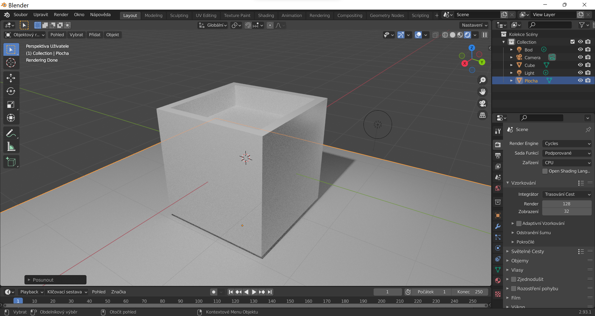

# Lekce 02: Modelujeme
## Polygonové objekty
Polygonové objekty jsou v Blenderu označované jako Sítě (Meshes).
Do Editačního módu označeného objektu vstoupíš stisknutím <kbd>Tab</kbd> nebo změnou pracovní plochy na **Modeling**.

Základní části polygonových objektů:

Výběr vrcholů, hran nebo ploch přepínáš klávesami <kbd>1</kbd>, <kbd>2</kbd> a <kbd>3</kbd>.

### Vrchol

### Hrana

### Plocha

### Trojúhelníky a čtverce v síti (Tris, Quads)
N-gony
### Normály

### Proč je důležitá topologie?
Topologie je rozložení geometrie objektu. Pro další použití modelu pro aplikace ve 3D enginech, modelování a texturování je důležitá správná topologie.

Pro modelovací techniky subdivize je zásadní.

## Transformace
## Vytváření osově souměrných modelů
Modifikátory - Mirror Tool
Mesh > Symmetrize

## Základní zkratky

## Editační mód a ostatní módy!

## Export a import
Nejčastější úpravy po importu 3D formátů se týkají orientace objektu, orientace normál, velikosti objektu, případně materiálů a textur (UV).

### Změna velikosti a otáčení
Velikost importovaného objektu a rotace se změní buď označením objektu a použitím okna Transformace postranního panelu <kbd>N</kbd> — kde se dají nastavit přesné rozměry nebo násobek — nebo v doku vlastností ve Vlastnostech objektu (Object Properties), kde se dá určit násobek velikosti.

### Orientace normál
Orientaci normál můžeš vizuálně zkontrolovat v pracovní ploše Modeling (nebo v editačním módu <kbd>Tab</kbd>):

- z ikonového menu otevři okno Viewport Overlays (1)
- barevné rozlišení orientace normál zapneš volbou **Orientace Plochy** (*Face Orientation*), obrácené normály budou zvýrazněny červeně (2)
- z malého menu Normály (3) můžeš zobrazit vektory normál
- směr normál obrátíš z menu režimu (4) **Síť** (*Mesh*)

### Nekompatibilní materiál
Při importu (např. .dae) se může stát, že je objektu přiřazen materiál, který se zobrazuje jako barevná tmavá plocha. Není to chyba geometrie, odstraní se smazáním přiřazeného materiálu v doku vlastností ve Vlastnostech materálu (Material Properties).

:::note úkol

Vyzkoušejte tvorbu objektů a transformace.

:::
