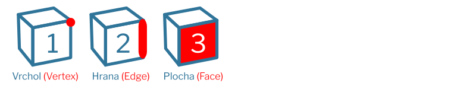

# Lekce 02: Modelujeme
## Postupy modelování
Při modelování objektů se setkáme s několika strategiemi, které se podstatně liší postupem a aplikací. Destruktivní postupy mění geometrii objektu, nedestruktivní umožňují modifikace v průběhu práce. Zcela parametrické modelování pomocí geometrických uzlů pak umožňuje tvorbu objektu automatizovat. V praxi používáme kombinaci všech těchto přístupů.

- Modelování pomocí CSG (*Boolean* operací mezi objekty), často nazývané *Hard Surface Modeling*, dovoluje rychlé vytváření komplexních tvarů sčítáním, odčítáním a průnikem objektů ve scéně.

- *Subdivision Modeling* je způsob modelování kontrolních sítí objektu, u kterého předpokládáme zvýšení rozlišení. Je vhodné pro modelování organických, plynulých tvarů.

- Modelování pomocí parametrů **modifikátorů** částečně nahrazuje výhodu parametrického modelování. Parametry lze měnit, dokud se neaplikují na geometrii.

- Modelování pomocí **NURBS křivek a ploch** je možné v Blenderu také využívat jako doplněk pro tvorbu plynulých organických objektů (nebo pro efekty křivek), které lze převést na sítě pro další úpravy. Pro úplné NURBS modelování (např. s použitím addonu exportu do IGES formátu) ale zatím doporučuji jiné programy.

- Generativní nebo parametrické modelování je programové modelování pomocí vlastních skriptů, addonů (např. Extra Objects nabízí i matematické funkce) nebo geometrických uzlů (*Geometric Nodes, Geonodes*).

- **Polygonové modelování** je základní typ modelování v Blenderu, objekt vytváříme přidáváním, odebíráním nebo změnou polohy vrcholů, stran nebo ploch. Polygonovým modelováním začneme.

## Polygonové objekty
Polygonové objekty jsou v Blenderu označované jako Sítě (Meshes).
Do **Editačního módu** označeného objektu vstoupíš stisknutím <kbd>Tab</kbd> nebo změnou pracovní plochy na **Modeling**.

Základní části polygonových objektů:

Výběr vrcholů, hran nebo ploch přepínáš klávesami <kbd>1</kbd>, <kbd>2</kbd> a <kbd>3</kbd>.

### Vrchol, Hrana, Plocha
Jednotlivé komponenty mají různé možnosti úprav, dostupné zkratkami nebo z editorového menu nahoře (často používaná funkce zkosení hrany <kbd>Ctrl</kbd>+<kbd>B</kbd> je i ve variantě pro vrcholy, <kbd>Ctrl</kbd>+<kbd>Shift</kbd>+<kbd>B</kbd>).

### Trojúhelníky a čtverce v síti (Tris, Quads)
- N-gony, výhody a nevýhody
### Normály

### Proč je důležitá topologie?
Topologie je rozložení geometrie objektu. Pro další použití modelu pro aplikace ve 3D enginech, modelování a texturování je důležitá správná topologie.

Pro modelovací techniky subdivize a pro animace je správná topologie zásadní.

## Křivky
Beziérovy a NURBS křivky jsou vhodné pro tvorbu rotačních a tažených objektů, jejich rozlišení lze po vytvoření měnit.

- pro úpravu kontrolních bodů křivek přímo jako v kreslicích programech použij nástroj Tweak (v panelu nástrojů v paletě výběru, <kbd>W</kbd>)
- import křivek .svg
- postupy CAD
- změna typu řídítek <kbd>V</kbd> v editor módu křivky, použij pro vyhlazování křivek (nastavení Automatic)nebo pro ostré hrany (Vector)
- pokročilé kreslení pomocí *Curve Pen*
## Transformace
- je možné použít widgety z panelu nástrojů, nebo zkratky

:::note Zkratky pro transformace

- Move <kbd>G</kbd>
- Scale <kbd>S</kbd>
- Rotate <kbd>R</kbd>
- následné stisknutí <kbd>X</kbd>, <kbd>Y</kbd> nebo <kbd>Z</kbd> zamkne transformaci v dané ose
- další kombinace zkratek najdeš na spodní liště

:::

- po změně velikosti, polohy nebo natočení je často nutné aplikovat transformace v pro správnou funkci modifikátorů a efektů (<kbd>Ctrl</kbd>+<kbd>A</kbd>)
## Vytváření osově souměrných modelů
1. Modifikátory - Mirror Tool
2. Mesh > Symmetrize

## Základní zkratky

- Smazat nebo rozpustit (v editačním módu) <kbd>X</kbd>
- Zoom na objekt <kbd>Num ,</kbd>

## Editační mód a ostatní módy!

## Export a import
Nejčastější úpravy po importu 3D formátů se týkají orientace objektu, orientace normál, velikosti objektu, případně materiálů a textur (UV).

### Změna velikosti a otáčení
Velikost importovaného objektu a rotace se změní buď označením objektu a použitím okna Transformace postranního panelu <kbd>N</kbd> — kde se dají nastavit přesné rozměry nebo násobek — nebo v doku vlastností ve Vlastnostech objektu (Object Properties), kde se dá určit násobek velikosti.

### Orientace normál
Orientaci normál můžeš vizuálně zkontrolovat v pracovní ploše Modeling (nebo v editačním módu <kbd>Tab</kbd>):

- z ikonového menu otevři okno Viewport Overlays (1)
- barevné rozlišení orientace normál zapneš volbou **Orientace Plochy** (*Face Orientation*), obrácené normály budou zvýrazněny červeně (2)
- z malého menu Normály (3) můžeš zobrazit vektory normál
- směr normál obrátíš z menu režimu (4) **Síť** (*Mesh*)

### Nekompatibilní materiál
Při importu (např. .dae) se může stát, že je objektu přiřazen materiál, který se zobrazuje jako barevná tmavá plocha. Není to chyba geometrie, odstraní se smazáním přiřazeného materiálu v doku vlastností ve Vlastnostech materálu (Material Properties).

:::note úkol

Vyzkoušejte tvorbu objektů a transformace.

:::
