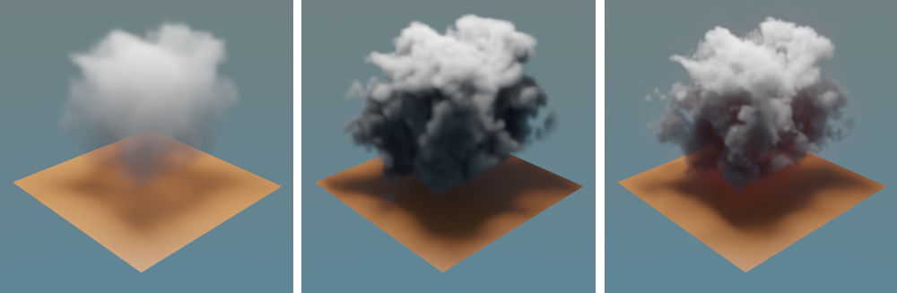

# Lekce 03: Efektivní osvětlení, kamera a render
## Render Engines
Render Engine je software, který umožňuje algoritmický výpočet scény do digitálního obrazu nebo animace, také se často stará o zobrazení v reálném čase.
Blender v základní instalaci umožňuje přepínat mezi:
- Workbench
- Evee
- Cycles

Další je možné doinstalovat, například:

*Volně dostupné:*
- Cycles-X
https://builder.blender.org/download/experimental/
- LuxCoreRender
https://luxcorerender.org/download/
- Appleseed
https://appleseedhq.net/download.html

*Komerční projekty:*
- Vray
- Renderman
- Corona
- OTOY Octane Render (Trial)
https://home.otoy.com/render/octane-render/demo/
- Radeon Pro Render (Zdarma)
 https://www.amd.com/en/technologies/radeon-prorender-downloads
- NVIDIA Omniverse (ve vývoji)

V kurzech budeme používat Workbench (pro konstrukci a modelování), Evee a Cycles/Cycles-X (pro render).

:::note Poznámka

Nastavení materiálů a světel je většinou specifické pro renderovací modul (*Render Engine*). Některé moduly mají vlastní materiálové uzly a nastavení.
Některé efekty materiálů, světel a stínování jsou správně zobrazitelné pouze v daném modulu.

:::
## Workbench (Režim zobrazení Solid)
Viewport Workbench je určený pro modelování a přehledné zobrazení geometrie. Nastavení možností je v liště vpravo nahoře.
- nastavení stínu a kavity zlepšuje přehlednost
- zaškrtnutí Depth of Field zobrazuje hloubku ostrosti aktivní kamery (v kamerovém náhledu), je to rychlejší způsob nastavení DoF pro jednotlivou scénu a animace

Render náhledu je v menu v pracovním 3D okně ‣ View ‣ Viewport Render Image.

## Kamera
- kamerová sestava (*Camera Rig*) umožňuje snadnější ovládání kamery ve scéně
- zamčení pohledu kamery na objekt pomocí Object Constraint Properties (*Track to*)
- hloubka ostrosti a parametry kamery
- camera tracking data
## Světelné zdroje a vrstvy
Osvětlení scény je kombinací různých světelných zdrojů i odrazů či vyzařování objektů ve scéně.
- typy světel, nastavení pro různé render enginy
- tracking a rigging světel
- práce se skupinami světel ve vrstvách (*Layers*) umožňuje úpravu osvětlení i po vyrenderování

### Studiové osvětlení
- kreativní osvětlení, gradienty (textury), odrazové plochy, zatmívací plochy, nastavení viditelnosti pro kameru (Ray Visibility)
- tříbodové osvětlení
- jednobodové osvětlení a ostatní typy

### Světelné objekty
Objekty mohou osvětlovat scénu materiálem přiřazeným celému povrchu nebo skupině ploch. Osvětlování pomocí objektů s emisivním materiálem může zcela nahradit základní světla a má mnoho výhod.

- vhodné pro produktové fotografie
- práce s texturou světla

### IES světla pro Cycles

Přiřazením IES profilu vytvoříme realistická světla podle specifikací výrobce lampy. IES profily získáš na stránkách výrobce, nebo z online databází.
- IES profil přiřadíme k bodovému zdroji (aktivuj **Use Nodes** v Object Data Properties světla a vyber soubor z disku volbou Strength/IES Texture, Source : External)
- aby nastavení Blender světla nekolidovalo s IES profilem, nastavíme **intenzitu (Power) na 0,1-0,5W a rádius světla na 0**.
- online databáze simulovaných světel např. https://ieslibrary.com/en/home
- teplotu světla nastavíš podle dokumentace ke svítidlu, v kolonce Color nastav Blackbody (výběr kliknutím na žlutý puntík), a správnou teplotu v Kelvinech (najdeš v databázi nebo v katalogu, zpravidla v rozmezí kolem 1500-5500K)

### Environmentální osvětlení
Realistické osvětlení pomocí materiálu scény, zpravidla fotografickou HDRi texturou.
- nejrychlejší nastavení v tabu World, v položce color (žlutá tečka) vybrat Environmental texture

#### Instalace Studio Lights, Matcaps a HDRi

#### HDR
HDRi lze používat v materiálovém náhledu i bez nastavení uzlů.
#### Matcaps
Materiál Matcap pro náhledy a modelování můžeš vytvořit v Blenderu nebo importovat.

Jedná se o osvětlenou sféru s materiálem (v grafickém formátu .exr nebo .png). Zobrazuje se ve stínování náhledu *Solid*.

## Atmosférické efekty

#### Sky Texture
Textura generovaná parametricky v Blenderu jako model atmosférického osvětlení.

#### Volumetrická mlha
- lze nastavit pro celou scénu nebo pro její část, může být texturovaná
- tvar ovládá se pomocí řídícího objektu, modifikátorů a materiálu (textury)

#### Oblaka z volumetrických objektů

- volumetrické modely s aplikovanou maskou
- volumetrická tělesa

1. Přidat model, který bude tvořit volumetrickou geometrii do scény
2. Přidat objekt Volume Empty do scény
3. Přiřadit Mesh to Volume (k Volume Empty), vybrat geometrii
4. Vytvořit materiál **Principled Volume**
5. Průhlednost materiálu lze upravit pomocí Density

## Render

### Evee
Tento engine má skvělou rychlost a vytváří vynikající stylizované rendery. Nedokáže ale dobře realistická skla a optické efekty. Občas také vznikají obrazové artefakty.

:::note Prosvítání objektem

Chyby stínování v Evee se dají odstranit v sekci Render Properties ‣ Shadows (Zvýšit Cube Size na 2048 a zaškrtnout High Bit Depth).

Nedoléhající stíny se dají opravit v nastavení **světla** v Object Data Properties ‣ Shadow ‣ zaškrtnout Contact Shadows

:::

### Cycles
Realističtější a podstatně pomalejší engine. Některé efekty fungují pouze s Cycles.

### Zrychlení renderování pro Cycles

Optimalizace. Správné nastavení pro Path Tracing.

- pro náhledy v pracovním okně stačí nastavit Max Samples 16
- pro finální render záleží na typu scény a použití Denoiseru, často stačí maximálně 32-256 samplů. Pro scény s velkým šumem je třeba experimentovat
- v Advanced a Light Paths experimentuj s nastavením

## Render skla

Pro realistické znázornění skla je vhodný engine Cycles.
- použij shader materiálu Glass nebo Principled BSDF, pro průhledné sklo s Transmission 1 a Roughness 0 (určuje matnost skla)
- pro efektní zobrazení skla je vhodné studiové osvětlení
- zkontroluj správný směr normál modelu
- pomocí funkce Weld optimalizuj model
- pro render skla nastav hodnoty Light Paths v Render Properties pro Cycles:

a) základní nastavení Total Bounces 12, Glossy 4, b) Total Bounces 32, Glossy 32 (odstraní tmavá místa)

:::note úkol

Vyzkoušejte render sklenice podle technického výkresu.

:::
