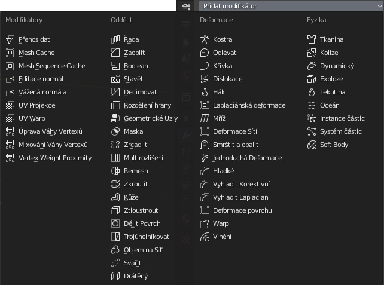

# Blender: Modifikátory pro parametrický styl modelování a modelování s uzly
Výhodou je nedestruktivní styl modelování. Modifikátory nemění základní geometrii objektu a dají se dále upravovat. Pořadí, jak jsou umístěny za sebou, ovlivňuje výsledek.

Modifikátory mění stávající geometrii. Dalším krokem je přímé modelování pomocí uzlů — pomocí editoru Geometric Nodes nebo add-onu jako je Sverchok.

:::note práce s modifikátory

Modifikátory se aplikují v řadě za sebou (*Stack*), pořadí je důležité a lze měnit přesouváním modifikátoru myší. Transformace by se měly pro správnou funkci aplikovat na objekt.

Jednotlivý modifikátor aplikuješ pomocí  <kbd>Ctrl</kbd>+<kbd>A</kbd> vpokud je myš na tabu modifikátoru, nebo z menu <kbd>Ctrl</kbd>+<kbd>A</kbd> v okně, ve vysouvacím menu se šipkou u názvu modifikátoru — a další možnost je addon **Modifier Tools**.

:::

## Seznam modifikátorů
Česká verze

Anglická verze

## Otestuj nejčastěji používané modifikátory

:::tip

 Modifikátor **Subdivision** přímo zapneš pomocí <kbd>Ctrl</kbd>+<kbd>1...</kbd>. Příklad: Subdivision level 2 aktivuješ pomocí <kbd>Ctrl</kbd>+<kbd>2</kbd>. Úrovně tak můžeš rychle přepínat.

:::

- Subdivision
- Bevel
- Array
- Mirror

:::tip

Modifikátory lze aplikovat na uložené množiny vrcholů (Vertex Groups) a je to velice efektivní způsob modelování.

:::

## Geometrické uzly: Geonodes
Práce s geometrickými uzly umožnujě vytvářet a podifikovat objekty. Využijeme add-on Node Wrangler, podobně jako u ostatních uzlových systému v Blenderu.

### Začínáme s geometrickými uzly
### Moduly

## Sverchok a geonodes
Sverchok je generativní uzlový systém, který nainstaluješ jako add-on ze staženého zip souboru.

### Sverchok instalace

https://github.com/nortikin/sverchok/

Nejnovější verzi stáhneš kliknutím na butón Code / Download ZIP. Soubor se bude jmenovat sverchok-master.zip. Naistaluješ v nastavení add-ons a aktivuješ Node: Sverchok. Systém bude nyní dostupný ve výběru editorů jako Sverchok Nodes.

### Sverchok základy
- generování geometrie
- parametrické kopírování

## CAD Sketcher
Nejpokročilejším opensource add-on projektem, který nabízí CAD funkce a parametrické modelování pro Blender, je CAD Sketcher. Tento add-on využívá geonodes a postupy, známé např. z programu FreeCAD.

- stažení zde https://github.com/hlorus/CAD-Sketcher/archive/refs/heads/main.zip
- další informace https://makertales.gumroad.com/l/CADsketcher
- vyžaduje doinstalaci Python modulu Solvespace https://pypi.org/project/py-slvs/ (lze instalovat z .whl souboru uvnitř okna add-onu, nebo volbou Install from PIP). **Nutno restartovat Blender**.
- doporučuji aktivovat také add-ony **Booltool** a **3D-Print Toolbox**, první pro vyváření "vodotěsných" objektů a druhý pro jejich kontrolu

- <kbd>Shift</kbd>+<kbd>M</kbd> Midpoint constraint
- <kbd>Alt</kbd>+<kbd>D</kbd> Dimension

:::tip

Parametrické objekty lze vytvářet jako sítě (extrudují se modifikátorem Solidify) nebo jako křivky (extrudují se v nastavení Geometry v Object Data Properties pro **křivky**).

:::

## Postup modelování v CAD Sketcheru pro tisk

- vybrání pracovní plochy
- vytvoření skicy
- vytažení a bevel
- boolean operace
- vyčištění, modifikátor Weld 0.1, v edit módu zkratka X, Limited Dissolve 0.1
- export STL
