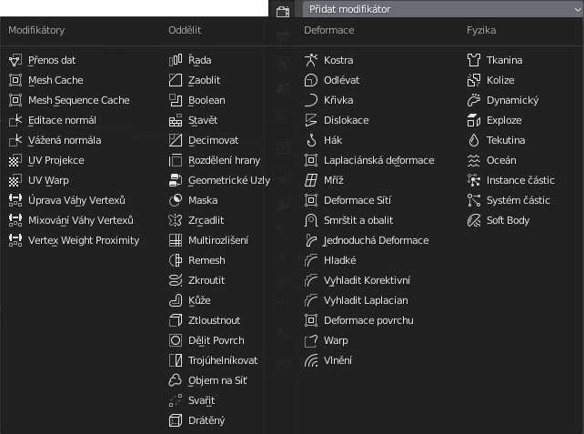
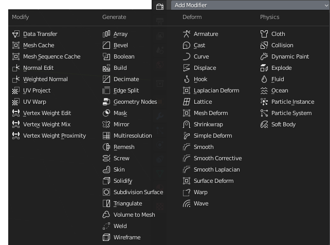

# Blender: Pluginy a materiálové uzly
Výhody.

## Instalace a aktivace pluginů
### Node Wrangler
## Jak pracovat s uzly
Česká verze

Anglická verze

## Otestuj nejčastěji používané
:::note Poznámka

 Pokud používáš dvoutlačítkovou myš se skrolovacím kolečkem a numerickou klávesnici, můžeš tuto sekci přeskočit.

:::

Zkontroluj funkčnost tabletu. Podle typu pera, nastav tlačítka, right click, middle button. Vypni Windows link. Protože nemáš skrolovací tlačítko, funkčnost ovládáš na klávesnici. Příklad nastavení u tabletu Wacom.
<Tabs
  groupId="jazykova-verze"
  defaultValue="czv"
  values={[
    {label: 'V české verzi', value: 'czv'},
    {label: 'V anglické verzi', value: 'env'},
  ]
}>
<TabItem value="czv">Upravit ‣ Předvolby ‣ Rozhraní ‣ Vstup</TabItem>
<TabItem value="env">Edit ‣ Preferences ‣ Interface ‣ Input</TabItem>
</Tabs>
Tady také nastavíš emulaci numerické klávesnice a v polních podmínkách ovládání pomocí touchpadu.

## Moduly {.tabset}
### Moduly 1 {.tabset}
### Moduly 2 

## Pracovní plocha
Okna můžeš přesouvat a měnit jejich obsah podle potřeby.

Jak vrátit pracovní plochu do původního nastavení: Nastavení plochy se ukládá do souboru. V dialogu  otevření souboru otevřete Settings (ikona kolečka) a odškrtněte Načíst UI (Load UI v anglické verzi).

Ulož si pracovní plochu a vyzkoušej si přepínání pracovních ploch.

## Přehled funkcí Blenderu
Moduly. Layout a editační mód. Nastavení materiálů a uzlový mód v sekci shader.
Co jde v Blenderu dělat.

Můžeme začít.
