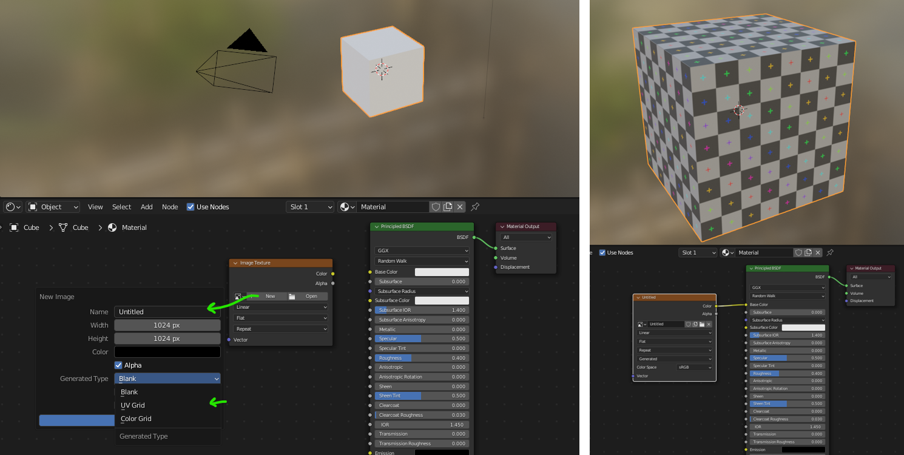
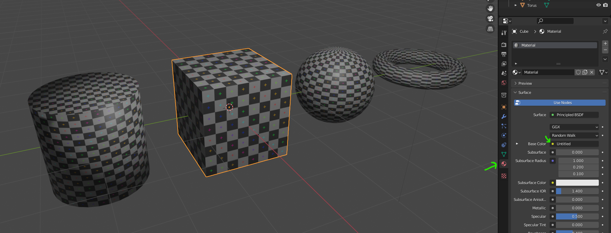
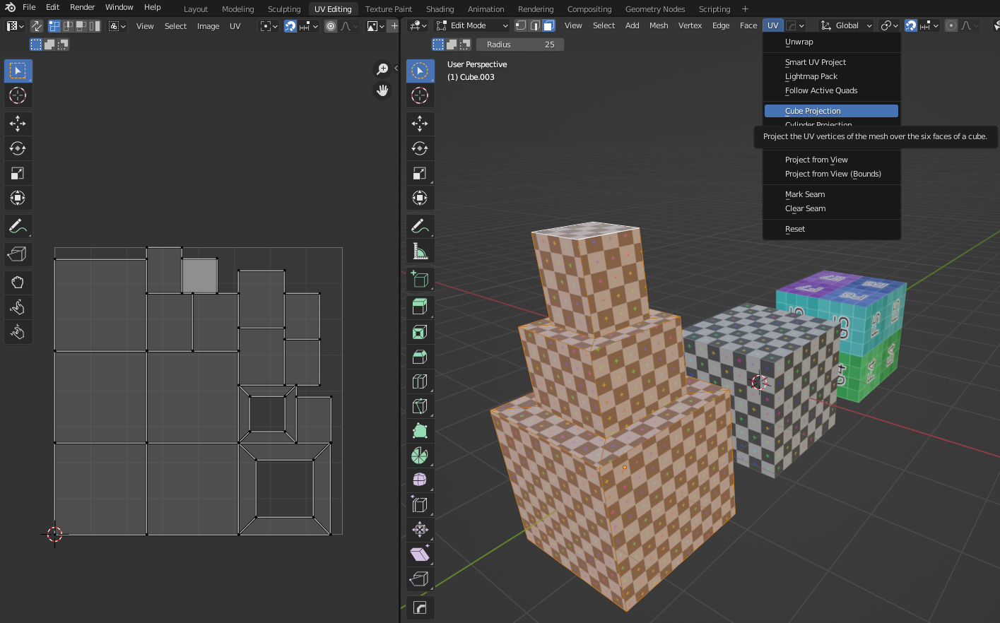

# Materiály, textury a UV mapování

## Jak efektivně mapovat textury
- plynulé rozložení mapování
- škálování podle detailů na modelu
- optimalizace

## UV Mapping
Abychom mohli správně nanést texturu na model, musíme správně přiřadit místo na textuře k místu (ploše) na modelu. Čím je model složitější, tím představuje více možných potíží k řešení. Správné přiřazení UV mapy je důležité také pro další texturování, malbu na objekt nebo použití efektů.
U jednoduchých objektů je možné použít základní mapování geometrických těles, u složitější geometrie máme k dispozici řadu nástrojů, které nám rozbalení (unwrap) geometrie na mapu usnadní.

:::note Poznámka

 U parametrických textur není vždy nutné UV mapování. Při exportu nebo renderování textur (baking) na objekt se optimalizaci UV map nevyhneme.

:::
### Jak vytvořit přehlednou texturu pro UV-Mapping?
Pro náhledy a experimenty s mapováním je vhodná testovací mapa. Materiál s texturou testovací mapy vytvoříme v Shader editoru:
1. Vytvoříme základní materiál
2. Přidáme uzel Image Texture, vytvoříme novou texturu (tlačítko New)
3. Vybereme typ (UV Grid nebo Color Grid)
4. Propojíme s uzlem Barva (Color) na základním materiálu

:::info Tipy pro zobrazení textur a solid mode
**Solid mode** je vhodný pro základní modelování, protože je rychlý, nenáročný na hardware a přehledný při práci s topologií modelu. Pro práci s materiály a texturami ale doporučuji módy zobrazení **Material Preview** nebo **Rendered**.

Solid mode neaktualizuje materiály a textury vždy a automaticky, jako ostatní módy. Tipy pro solid mode:  
- Aby se vygenerovaná textura zobrazila aktualizovaná i v *solid mode* zobrazení, zkus materiál po změně znovu přiřadit v Material Properties.
- <kbd>Alt</kbd>+<kbd>R</kbd> Refresh textur v Shader Editoru
- pokud se změna materiálu neaktualizuje správně, změň Render Engine z Workbench na Eevee nebo Cycles

:::

Stejný materiál lze vytvořit i v okně Material Properties.

1. Vytvoříme nový materiál
2. Kliknutím na tečku u položky barvy materiálu (Base Color) otevřeme menu a vybereme Imaage Texture
3. Vybereme typ (UV Grid nebo Color Grid), stejně jako v předchozím případě

## Jednoduché mapování
V editačním módu (Edit Mode, aktivuješ u vybraného objektu klávesou <kbd>Tab</kbd>) vyber v menu oddíl UV, kde jsou základní funkce UV mapování. Vyzkoušej si jednoduché typy projekce mapování u různých objektů (Cube, Cylinder a Sphere Projection).

:::info Test
1. Vytvoř základní krychli a inset a extruzi některé její plochy (aplikuj UV materiál z předchozí kapitoly)
1. S vybraným objektem otevři plochu UV Editing
2. Klávesou <kbd>A</kbd> vyber všechny plochy a všimni si, jak se zobrazují na mapě UV Editor vlevo. kliknutím mimo objekt zrušíš výběr.
3. Vybrané plochy, hrany nebo body na modelu zobrazují ekvivalentní místa na textuře.

:::

### Follow Active Quads
- výsledek je závislý na aktivní zvolené projekci (otestuj pro Cube, Cylinder a Sphere projekce)

### Project From View
Project From View a Project From View (Bounds) je vhodný také pro rychlé mapování objektu, který bude viditelný jenom z omezených úhlů. Vytvoří plynulé mapování z aktuálního pohledu okna.

Project From View používá pro mapování měřítko pohledu a Project From View (Bounds) měřítko objektu (bounding box).

Je to vynikající pomůcka pro mapování vybraných částí modelu.

## Rozbalení geometrie na mapu
### Unwrap
- rozbalí podle švů

:::note Hard Surface Modeling
U neorganických modelů se často používá automatické rozbalování podle ostrých hran, které se nastaví jako švy:

- vyber Sharp Edges
- Mark Seams
- Unwrap

:::

- ukázky

### Smart Unwrap
- stejná část textury namapovaná na různá místa nemusí být vždy to co chceme
- vytvoří základní atlas
### Seams
- pro plynulost textur
## Atlasy
- ostrůvky (izolované části na UV mapě)
- pack
## Optimalizace
## Otestuj nejčastěji používané funkce

- příklady symetrického, organického a geometrického modelu

:::note Poznámka

 Kromě základních funkcí existuje mnoho utilit usnadňujících UV mapování

:::
