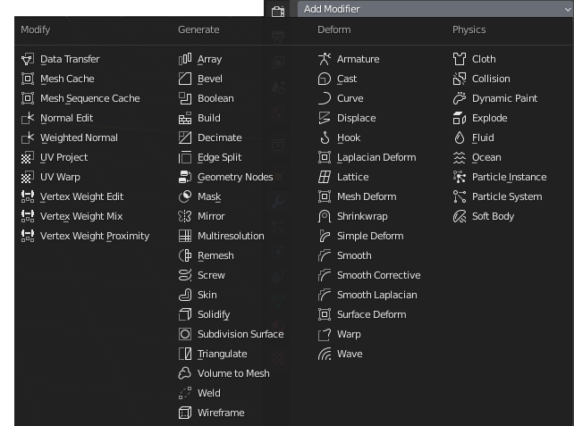

# Materiály, textury a UV mapování

## Jak efektivně mapovat textury
- plynulé rozložení mapování
- škálování podle detailů na modelu
- optimalizace

## UV Mapping
### Jak vytvořit přehlednou texturu pro UV-Mapping

Anglická verze

## Atlasy
## Rozbalení geometrie na mapu
- ostrůvky (izolované části na UV mapě)
## Optimalizace
## Otestuj nejčastěji používané funkce

:::note Poznámka

 Kromě základních funkcí existuje mnoho utilit usnadňujících UV mapování

:::
