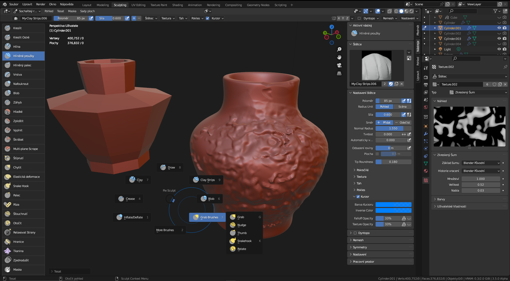
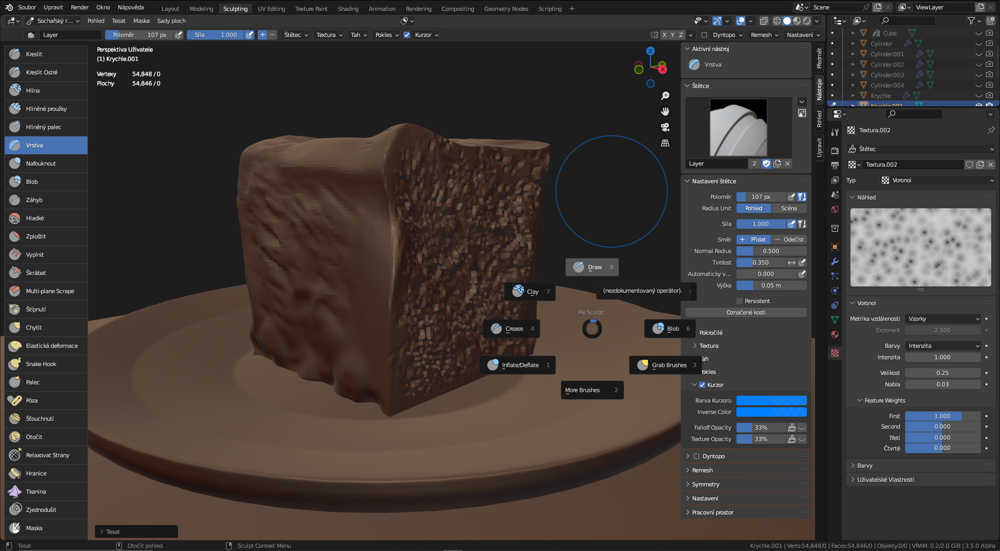
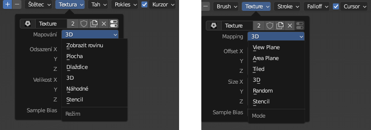
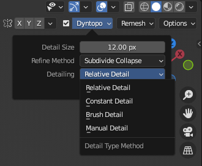
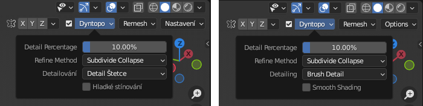
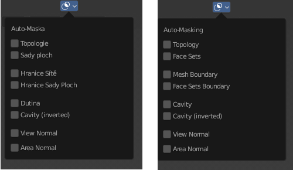

# Sculpting
Sculpting je digitální modelovací technika, připomínající plastické tvarování materiálu nebo klasické sochařské postupy. Základní polygonová síť se modeluje  pomocí štětců a nástrojů, které ubírají, přidávají nebo modifikují digitální "hmotu". 

## Digitální sochařství
Detaily digitální sochy jsou závislé na geometrickém rozlišení modelu. Základní rozlišení můžeme změnít přepočítáním na vyšší hustotu (**Remeshing**), použitím několika vrstev hustoty sítě (**Multiresolution**), nebo nastavením dynamického přidávání topologie pro štětec (**Dynamic Topology—Dyntopo**). Zvolená strategie se liší podle určení modelu.
- k modelování používáme štětce, které mohou mít různou formu, texturu i funkční parametry
- důležitá je optimalizace sítě, modely s vysokou hustotou se obtížně ovládají
- postup je podobný jako u klasického modelování (blokování a přidávání nebo ubírání materiálu)
- některé síťové filtry lze aplikovat na celý model (Mesh Filter)
- maskování a šablony umožňují selektivní úpravu částí modelu (masky lze vytvářet i automaticky podle tvaru modelu)

## Základní ovládání
Tyto zkratky platí pro většinu nástrojů — štětců:
1. Ubírání <kbd>Ctrl</kbd>, Vyhlazování <kbd>Shift</kbd>
2. Pravé tlačítko rychlá úprava nástroje, <kbd>F</kbd> interaktivní velikost štětce — Poloměr (Radius)
3. <kbd>E</kbd> pro techniku štětce, <kbd>Ctrl</kbd>+<kbd>RMB</kbd> kreslení křivky (body křivky se ovládají jako při modelování ve scéně)
4. Přepínání mezi modely ve *Sculpting* módu: <kbd>Alt</kbd>+<kbd>Q</kbd> s kurzorem na cílovém objektu

:::tip Cvičení: Nastavení pro modelování

1. V ploše Layout k základní krychli přidej modifikátor Zaoblit (Bevel) s počtem segmentů 2 a profilem 1.
2.  Přidej modifikátor Multirozlišení (Multiresolution), nastav Rozdělit (Subdivide) na 6-8 (kontroluj počet ploch ve statistice scény, pro začátek nastav maximum na ∼400 000)
3. Stínování nastav na Shade Auto Smooth
4. V ploše Sculpting zvětši zobrazení kolečkem myši a stiskni <kbd>Num ,</kbd> na vystředění
5. Stínování nastav na Plné (Solid). V nastavení MatCap vyber materiál zobrazení clay_brown.exr, nebo materiál, který dobře zobrazuje tvar objektu, který modeluješ

:::

### Koncept práce
- blokování a remeshing
- dyntopo
- struktura
- topologie
- podobnost s klasickou technikou

:::tip Rychlost v pracovní ploše Sculpting

 Při modelování vypni modifikátory ovlivňující geometrii modelu, především Subdivision.

:::

## Pracovní plocha pro sculpting

- pravý panel s nástroji přetáhni tak, aby byly vidět názvy štětců
- statistika složitosti modelu Edit ‣ Preferences ‣ Interface   ‣ Editors ‣ Status Bar
- Viewport Statistics zapneš v liště Overlays ‣ Statistics

- Edit ‣ Preferences ‣ Navigation ‣ Orbit & Pan ‣ Orbit Around Selection

:::note Poznámka

 Pracovní plochu pro vertikálni práci na konvertibilních zařízeních nebo vertikálních monitorech si ulož jako profil plochy.

:::

Zkontroluj funkčnost tabletu. Podle typu pera, nastav tlačítka, right click, middle button. Vypni Windows link. Protože nemáš skrolovací tlačítko, funkčnost ovládáš na klávesnici. Příklad nastavení u tabletu Wacom.

import Tabs from '@theme/Tabs';
import TabItem from '@theme/TabItem';

<Tabs
  groupId="jazykova-verze"
  defaultValue="czv"
  values={[
    {label: 'V české verzi', value: 'czv'},
    {label: 'V anglické verzi', value: 'env'},
  ]
}>
<TabItem value="czv">Upravit ‣ Předvolby ‣ Rozhraní ‣ Vstup</TabItem>
<TabItem value="env">Edit ‣ Preferences ‣ Interface ‣ Input</TabItem>
</Tabs>
Tady také nastavíš emulaci numerické klávesnice a v polních podmínkách ovládání pomocí touchpadu.

## Nástroje a štětce
- nejčasteji používané nástroje
- uživatelské štětce
- výběr metody tahu (*Stroke Method*) <kbd>E</kbd>
- poloměr (*Radius*) <kbd>F</kbd>, nastavení Štětec Pohled/Scéna (*Radius Unit View/Scene*)

### Vytváření parametrických štětců
- možnosti parametrických textur a šumu
-
### Vytváření štětců z textur

:::tip Import více textur štětců najednou

Blender obsahuje addon BrushSet, který importuje adresář obrázků jako textur. Nepodporuje ale všechny formáty. Pro účel importu vícero textur pro štětce použij addon **Images as Planes**. Po importu obrázků do scény se ti objeví seznam textur jako volba v texturách štětců.

:::

1. *View Plane* mapuje z úhlu pohledu
2. *Area Plane* mapuje z úhlu plochy v místě kurzoru
3. *Tiled* mapuje texturu jako navazující díly
4. *3D* mapuje také texturu jako navazující díly, ale ve 3D prostoru spíše než z pohledu kamery nabo plochy objektu — vhodné pro parametrické textury a vytváření plynulých strukturovaných povrchů
5. *Random* mapuje texturu náhodně transformovanou na plochu
6. *Stencil* mapuje texturu jako šablonu, posunovatelnou v pohledu pravým tlačítkem

### Import a export štětců
- upravené a vytořené štětce se ukládají do .blend souboru
- importovat lze pomocí Append/Brushes

### Práce s křivkami
- ukládání pracovních křivek Stroke/Paint Curve

## Symetrie

- možnosti v šipce za ikonou symetrie v horní liště a v postranním panelu Tool
- Tiling

## Dyntopo a Remeshing

- kontola počtu polygonů
- Fix Poles pro pravidelnější rozložení polygonů (*topology flow*)
- <kbd>Shift</kbd>+<kbd>R</kbd> nastavení voxelového rozlišení
- Remeshing v ploše Sculpting <kbd>Ctrl</kbd>+<kbd>R</kbd>, <kbd>Ctrl</kbd>+<kbd>Alt</kbd>+<kbd>R</kbd> pro Quadriflow (funguje pouze na původní geometrii bez modifikátorů)
- nastavení Dyntopo v ploše Sculpting <kbd>Ctrl</kbd>+<kbd>D</kbd>, nebo checkbox v menu vpravo nahoře, nebo v N panelu Tool

Nastavení pro detaily v režimu štětec

- Dyntopo má výhody pro modelování detailů (například u štětců vytvářejících geometrii, jako Snake Hook Brush), nevýhodou je destruktivní změna původní sítě a omezení určitých štětců.

## Maskování
Maskování v režimu Layout a Sculpting.

- odstranění masky <kbd>Alt</kbd>+<kbd>M</kbd> , inverze <kbd>Ctrl</kbd>+<kbd>I</kbd>

- **Auto-Masking** v Options

## Hard Surface postupy

- tutorial
- retopologie (Retopo)
- subdivize a styly modelování
- modifikátory Decimate, Weld
- Tris to Quads, Limited Dissolve, Merge by Distance

## Organické modelování

- skicování
- UV mapping a export
- úrovně detailů a omezení počtu polygonů

## Sochařství pro film a interaktivní zábavu

- konceptuální sochařství
- modelování pro animace, kostry a pomocné struktury
- tvorba loutek
