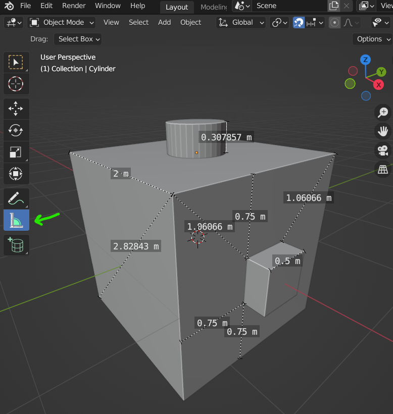
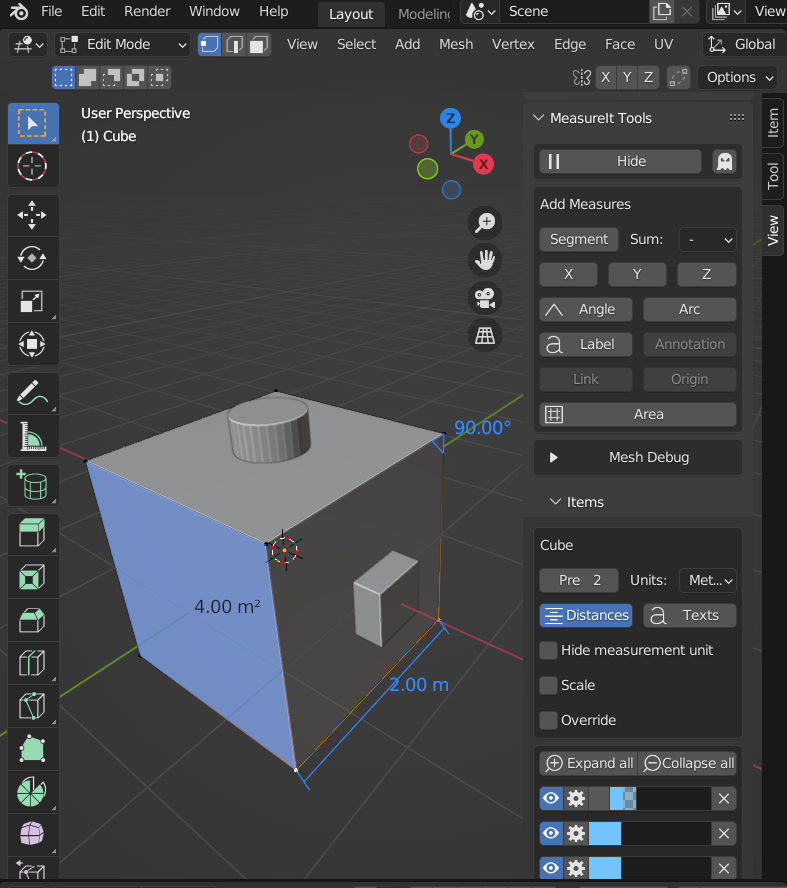

# Pro pokročilé: Architektura a design, CAD postupy v Blenderu

## Design

### CAD postupy v Blenderu

Některé CAD funkce obsahuje už základní instalace Blenderu. Možnosti se dají rozšířit pomocí Add-ons.

Nutné funkce a řešení:
- práce v měřítku
- možnost překreslování
- parametričnost
- blokování, linkování a zástupné Objekty
- export a import

### Měření

Nástroj měřidla je dostupný v objektovém menu v panelu nástrojů (viz obrázek). Doporučuji zapnout funkci Snap. Kliknutím na střed měřící linky lze měřit i úhly.

Další možností je Add-on Measureit. Je součástí instalace a je nutné ho aktivovat. Má také zajímavé funkce pro zobrazení koordinátů vertexů u vybraného komponentu (Mesh Debug), nebo výpočet plochy. Výsledné anotace lze vyrenderovat jako obrázek do souboru nebo zkompletovat s běžným renderem v kompozitoru.

## Architektura
- vizualizace
- knihovny materiálů a objektů
- parametrické zadávání

Blender podporuje BIM (Building Information Modeling) pro konstrukční dokumentace přes volně dostupný BlenderBIM Add-on (dříve IFC Exporter).

Stáhni aktuální verzi na https://blenderbim.org/download.html.

Nainstaluj plugin (stažený soubor **.zip**) do Blenderu.

import Tabs from '@theme/Tabs';
import TabItem from '@theme/TabItem';

<Tabs
  groupId="jazykova-verze"
  defaultValue="czv"
  values={[
    {label: 'V české verzi', value: 'czv'},
    {label: 'V anglické verzi', value: 'env'},
  ]
}>
<TabItem value="czv">Upravit ‣ Předvolby ‣ Rozšíření ‣ Nainstalovat</TabItem>
<TabItem value="env">Edit ‣ Preferences ‣ Add-ons ‣ Install</TabItem>
</Tabs>

Addon je ve vývoji.

:::note Poznámka

Architektura a design mají podobné požadavky na vizualizaci, liší se v měřítku a konceptu scény.

:::

## Realistický a stylizovaný render
Pro prezentaci konceptu je vhodnější stylizované ztvárnění.
Realistický styl je pro finální verze projektu.

## Prototypy a CAD/CAM
Podporované formáty pro 3D tisk.

:::info Ukázka CAD modelování v Blenderu

Překresli součástku podle měřítka. Vymodeluj a exportuj objekt (pro tisk a pro použití v realtime enginu).

:::
