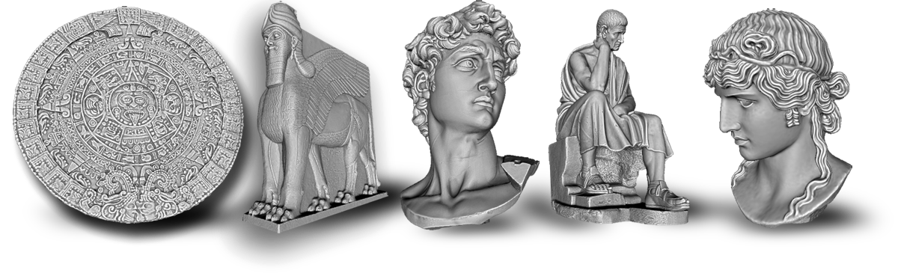

# Společné základy modelování, sochařství a designu
Sochařství a modelování jsou výtvarné obory, které se zabývají tvorbou trojrozměrných objektů.

Co je odlišuje od oborů jako je grafika, malba a grafický design? Je to nutná **funkčnost v prostoru a perspektivě**. To je společné jak pro sochařskou volnou tvorbu, tak i architekturu a design —  klasický i digitální.

Co je naopak spojuje je tvarové myšlení a práce s formou — principy čitelnosti a užitnosti jsou platné i zde. I tady uvažujeme ve zjednodušených blocích, plochách, tvarech a geometrii.

Základní principy prostorové tvorby je užitečné znát i pro aplikace v konceptuálním nebo průmyslovém designu. Modelování v tomto smyslu neznamená sochařskou techniku, ale vytváření 3D modelů pro další využití v průmyslu.

## Historie sochařství a digitální modelování

Monumentální sochy byly navrženy tak, aby vizuálně působily ze základních úhlů pohledu a perspektivy diváka.

- sochy a plastiky
- keramika
- design

### Sochařské postupy

Přidávání a odebírání materiálu. Vnitřní struktura a skelet. Omezení technologie a analogie v digitální tvorbě.

Modelování je tvarování hmoty objektu.

### Digitální techniky v sochařství

Měření, 3D scan, 3D tisk a obrábění, výroba forem. Fotogrametrie.

### Technologická omezení

Výroba, odlévání, skelety a formy.

## Digitální modelování

### Modelování pro technické obory

Výroba součástek, mechanických objektů, design.

### Vizualizace
Modelování pro architekturu a prezentace, stylizované a fotorealistické výstupy.

### Topologie pro modelování a animace

### Přesné modelování
Přímé a parametrické modelování.

Rozšířené téma v kurzu CAD a 3D design.
