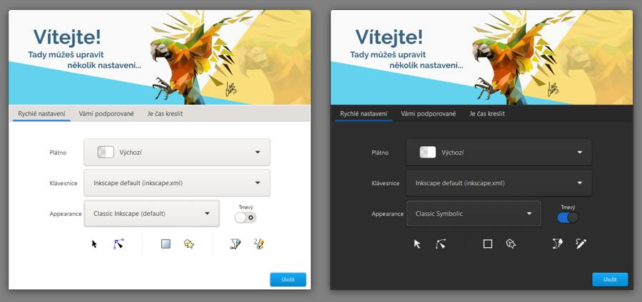
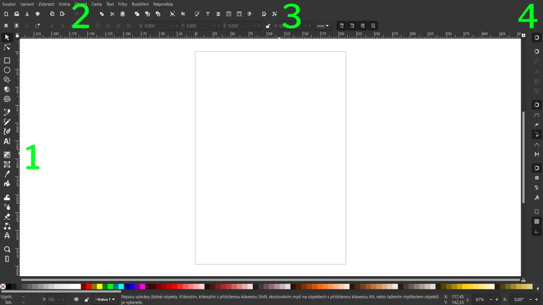
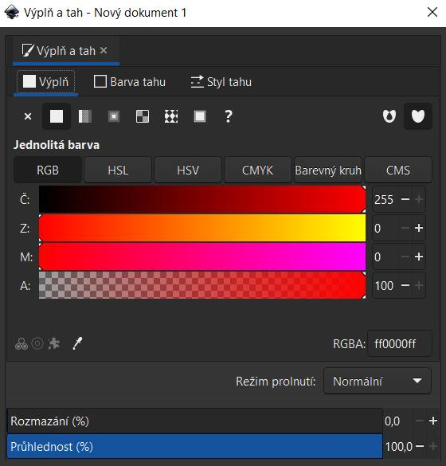
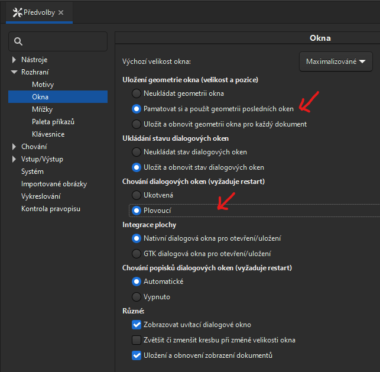

# Inkscape: Instalace, nastavení

## Stažení a instalace
Najdi aktuální verzi na https://www.inkscape.org/. Stáhni a spusť instalační soubor.

:::note Package Manager Windows 10, 11
Pokud používáš Package Manager pro Windows, použij příkaz

```
winget install inkscape
```

:::

Po instalaci spusť program Inkscape.

## První spuštění Inkscape
Po prvním spuštění Inkscape nabídne základní volby dokumentu, barevných motivů programu a ikon.



- Nastavení v kurzu jsou jednoduché symbolické ikony (Classic Symbolic) a tmavé téma programu

### Základní layout programu Inkscape
Inkscape má podobné rozložení nástrojů jako jiné grafické vektorové programy.



- Vlevo je lišta nástrojů (1). Spodní část horní lišty (2) mění obsah podle vybraných nástrojů. Menu dialogových oken (3) otevře okna, která mohou být ukotvená nebo plovoucí (viz níže). V základním nastavení se ti dialogová okna budou otvírat vpravo, jako ukotvená okna (*Tabs*). Nastavení různých typů přichytávání je v ikonovém menu vpravo (4).

:::note Úkol

Vyber nástroj Text z lišty nástrojů (1). Na horní liště (2) nastav typ písma ze seznamu. Klikni do dokumentu a napiš text. Otevři dialogové okno textu přes menu **Text ‣ Text a písmo** (*Text ‣ Text and fonts*) nebo zkratkou <kbd>Ctrl</kbd>+<kbd>Shift</kbd>+<kbd>T</kbd>. Vyber část textu, vyber ze seznamu jiný font a potvrď volbou Použít vpravo dole.

Otevři další dialogové okno přes menu **Objekt ‣ Výplň a tah** (*Object ‣ Fill and Stroke*) nebo zkratkou <kbd>Ctrl</kbd>+<kbd>Shift</kbd>+<kbd>F</kbd>. Nastav barvu výplně, tahu, a styl tahu v tabech v tomto dialogovém okně.



Klikni na nástroj výběru objektu (ikona šipky). Kliknutím mimo objekt zrušíš výběr. Vyber objekt znovu a tažením ho přesuň na jiné místo dokumentu.

Barvu objektu změníš také kliknutím na paletu s barvou v dolní liště, s označeným objektem (barvu **obrysu** změníš, když při kliknutí podržíš <kbd>Shift</kbd>). Vyzkoušej si tvorbu, obarvení a přesuny dalších textových objektů.

:::

### Nastavení jazykové verze Inkscape
Jazykovou verzi programu změníš v menu:

import Tabs from '@theme/Tabs';
import TabItem from '@theme/TabItem';

<Tabs
  groupId="jazykova-verze"
  defaultValue="czv"
  values={[
    {label: 'V české verzi', value: 'czv'},
    {label: 'V anglické verzi', value: 'env'},
  ]
}>
<TabItem value="czv">Upravit ‣ Předvolby ‣ Rozhraní ‣ Jazyk</TabItem>
<TabItem value="env">Edit ‣ Preferences ‣ Interface ‣ Language</TabItem>
</Tabs>

### Pohyb v dokumentu a nastavení rotace


- Posun v dokumentu (*Pan*) se stisknutým prostředním tlačítkem myší (nebo odpovídajícím tlačítkem na tabletovém peru). Pro posun lze použít také stisknutý <kbd>Space</kbd>, nebo <kbd>Alt</kbd>+ Pravé tlačítko myši
- Zvětšení a zmenšení pohledu (*Zoom*) klávesy <kbd>+</kbd> , <kbd>-</kbd>
- Nastavení pohledu na celý dokument <kbd>5</kbd>
- Nastavení pohledu na vybraný objekt <kbd>3</kbd>

- Rotace dokumentu s klávesou <kbd>Ctrl</kbd> + Střední tlačítko myši. Natočení plátna zrušíš v menu **Zobrazit ‣ Orientace ‣ Obnovit rotaci**(*View ‣ Orientation ‣ Reset rotation*)

:::caution Poznámka

To je téma, na které narazíš velice rychle, a proto to zmiňuji hned v úvodu. Pokud jsi zvyklý na práci v jiných grafických programech, doporučuji **zamknout rotaci** plochy v menu **Zobrazit ‣ Orientace ‣ Uzamknout rotaci**

:::

### Nastavení pro počítač v režimu tablet ve vertikální orientaci

Pokud používáš počítač s dotykovým diplejem ve vertikální orientaci, je vhodnější použít režim s **plovoucími dialogovými okny**.

Nastavení najdeš v menu Upravit ‣ Předvolby ‣ Rozhraní ‣ Okna (*Edit ‣ Options ‣ Interface ‣ Windows*)



:::note Poznámka

 Vyber si co ti více vyhovuje při konkrétním nastavení monitoru. Šířka dialogových oken jde měnit podle obsahu jenom do určité míry.

:::

## Inkscape pro úplné začátečníky


Inkscape se otevře v základním nastavení dokumentu se zavřenými dialogovými okny. Podoba se bude lišit podle nastavení rozhraní a témat.

### Otevření dokumentu ze šablony

Dokument z nastavené šablony (Template) otevřeš z menu Soubor ‣ Nový ze šablony... (*File ‣ New from Template...*). Nejčastěji používané šablony asi budou "Prázdná stránka" s nastavením standardních velikostí pro tisk v mm A4, A5 atp., a "Plocha" pro práci v pixelech.

### Nastavení vlastností dokumentu

Možnosti dokumentu nastavíš zkratkou <kbd>Ctrl</kbd>+<kbd>Shift</kbd>+<kbd>D</kbd> nebo tady:
<Tabs
  groupId="jazykova-verze"
  defaultValue="czv"
  values={[
    {label: 'V české verzi', value: 'czv'},
    {label: 'V anglické verzi', value: 'env'},
  ]
}>
<TabItem value="czv">Soubor ‣ Vlastnosti dokumentu</TabItem>
<TabItem value="env">File ‣ Document properties</TabItem>
</Tabs>

Nastavení dokumentu se ukládá do souboru.

### Přehled nástrojů
Vektorové a efektové nástroje, úprava křivek. Parametrické efekty křivek.
Co jde v Inkscape dělat.

### Text a fonty

Inkscape podporuje variabilní fonty (Variable Fonts).

### Ukládání a export do .pdf a .png
Základním formátem je .svg, ale program podporuje export do mnoha formátů včetně .pdf (**Soubor ‣ Uložit jako**, *File ‣ Save as*), do .png lze exportovat dialogovým oknem **Soubor ‣ Exportovat obrázek PNG** (*File ‣ Export Image as PNG*).

Můžeme začít.
