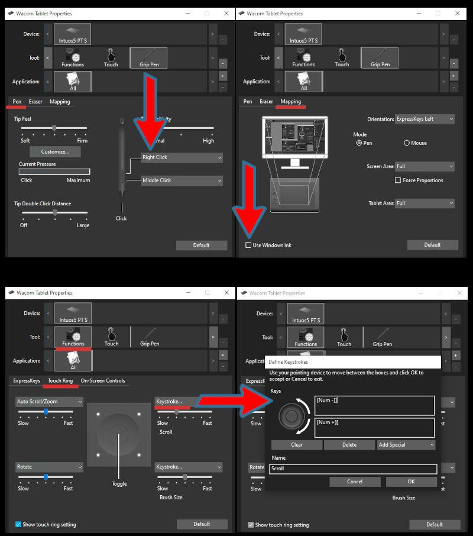
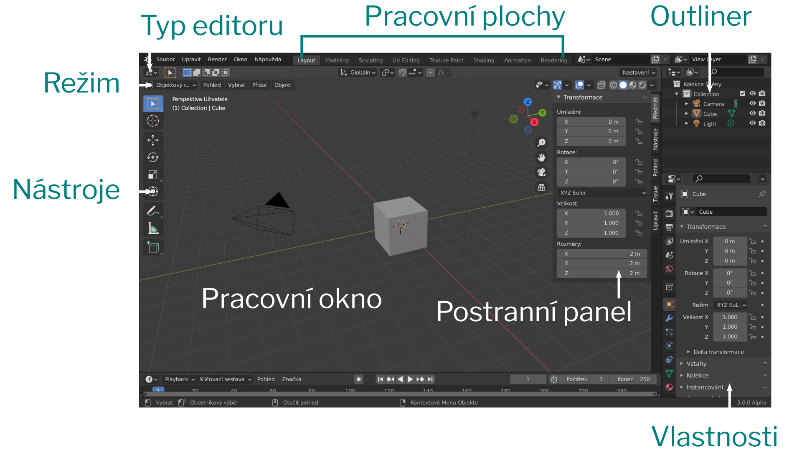
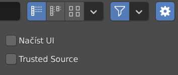

# Inkscape: Vektorové objekty
Inkscape nabízí řadu zajímavých nástrojů na vytváření a úpravu vektorových objektů. V programu lze také aplikovat bitmapové efekty a filtry.

## Rozdíl mezi bitmapovou a vektorovou grafikou
**Bitmapová grafika** obrázek definuje mřížkou bodů, pixelů. Celkové rozlišení je pak konečná suma těchto bodů. FullHD rozlišení je 1920 krát 1080 pixelů (to je zhruba 2.1 miliónu pixelů, proto se někdy používá termín dvoumegapixel, 2MP). Rozlišení bitmapové grafiky se dá zvyšovat pomocí interpolace tak, že se chybějící body doplní algoritmicky (například pomocí umělé inteligence). Snížení rozlišení je ztrátové - zmenšený obrázek má celkově méně pixelů, méně informací.

- Příklady bitmapových formátů: .png, .jpg, .tiff

**Vektorová grafika** je definovaná parametry křivek. Proto je užitečná v případech, kdy se dá očekávat použití grafiky v různých velikostech a je důležitá bezztrátovost takových změn. Vektorové formáty se také používají v technických aplikacích pro CAD, CAM a CNC (.dxf, .stp).

Vektorová grafika je zpravidla úspornější co do velikosti souboru, záleží na složitosti křivek.

- Příklady vektorových formátů: .svg, .ai, .cdr

Některé bitmapové formáty mohou obsahovat vektorové objekty (.psd), a vektorové formáty pro polygrafii mohou většinou obsahovat bitmapové objekty.

:::note Formáty v Inkscapu

Hlavní formát ukládání je vektorový formát .svg. Hlavní formáty exportu jsou .png a .pdf.

:::

## Vektorové objekty, křivky a cesty
Křivky, texty a další vektorové objekty.
Nástroje. Filozofie.
### Geometrické tvary
Geometrické tvary, jako kruh, obdélník, text apod. které mají další měnitelné parametry (například zaoblení rohů u obdélníků) se pro aplikování efektů a editaci jednotlivých bodů musí převést na křivky neboli **cesty** (*Paths*)
## Cesty
### Efekty cesty

### Transformace

## Nastavení jazykové verze
Jazykovou verzi programu změníš v menu:

import Tabs from '@theme/Tabs';
import TabItem from '@theme/TabItem';

<Tabs
  groupId="jazykova-verze"
  defaultValue="czv"
  values={[
    {label: 'V české verzi', value: 'czv'},
    {label: 'V anglické verzi', value: 'env'},
  ]
}>
<TabItem value="czv">Upravit ‣ Předvolby ‣ Rozhraní ‣ Překlad</TabItem>
<TabItem value="env">Edit ‣ Preferences ‣ Interface ‣ Translation</TabItem>
</Tabs>

## Nastavení grafického tabletu a klávesnice pro Blender
:::note Poznámka

 Pokud používáš dvoutlačítkovou myš se skrolovacím kolečkem a numerickou klávesnici, můžeš tuto sekci přeskočit.

:::

Zkontroluj funkčnost tabletu. Podle typu pera nastav tlačítka, Right Click, Middle Click. **Vypni Windows Ink.** Protože nemáš skrolovací tlačítko, funkčnost ovládáš na **numerických** klávesách <kbd>Num +</kbd> a <kbd>Num -</kbd>. Pokud jsou na tvém tabletu programovací tlačítka nebo touch ring, doporučuji si nastavit tyto shortcuty (viz obrázek). Příklad nastavení u tabletu Wacom:

Možnosti klávesnice nastavíš v Blenderu tady:
<Tabs
  groupId="jazykova-verze"
  defaultValue="czv"
  values={[
    {label: 'V české verzi', value: 'czv'},
    {label: 'V anglické verzi', value: 'env'},
  ]
}>
<TabItem value="czv">Upravit ‣ Předvolby ‣ Vstup</TabItem>
<TabItem value="env">Edit ‣ Preferences ‣ Input</TabItem>
</Tabs>

Tady také nastavíš emulaci numerické klávesnice a v polních podmínkách ovládání pomocí touchpadu.

:::warning Poznámka

 Doporučuji zrušit ALT+SHIFT a SHIFT+CTRL na přepínání klávesnic ve Windows.  Minitutorial jak na to:

 Start>Nastavení>Čas a jazyk>Jazyk>Klávesnice>Klávesové zkratky pro jazyk zadávání>Otevře se okno Jazyky a služby pro zpracování textu, zvolte Změnit kombinaci kláves>>Oba sloupce nastavit na Nepřiřazeno. Použít.

 (Anglická verze Win10: Start>Settings>Time & Language>Language>Keyboard>Input Language Hotkeys, otevře se dialogové okno Text Services and Input Languages, v něm vyberte Change Key Sequence a nastavte všechny Key Sequence na Not Assigned.)
 Aplikujte.

 **Shorcut na přepínání klávesnic <kbd>Windows</kbd> + <kbd>SPACEBAR</kbd> bude dále funkční.**

:::

## Blender pro úplné začátečníky
Po spuštění Blender otevře základní scénu v pracovní ploše Layout. Přesuň kurzor do pracovního okna a stiskni <kbd>N</kbd>. Vysune se postranní panel.

### Pracovní plochy
Okna můžeš přesouvat a měnit jejich obsah a velikost podle potřeby.

Jak vrátit pracovní plochu do původního nastavení: Nastavení plochy se ukládá do souboru. Ulož projekt. V dialogu  otevření souboru <kbd>Ctrl</kbd> + <kbd>O</kbd> otevřete Settings (ikona kolečka vpravo nahoře) a odškrtněte Načíst UI (*Load UI* v anglické verzi).

Tvůj projekt se načte se základním nastavením plochy (UI).

### Přidání a mazání pracovních ploch v menu.

Ulož si pracovní plochu a vyzkoušej si přepínání pracovních ploch.

### Přehled funkcí Blenderu
Moduly. Layout a editační mód. Nastavení materiálů a uzlový mód v sekci shader.
Co jde v Blenderu dělat.

Můžeme začít.
