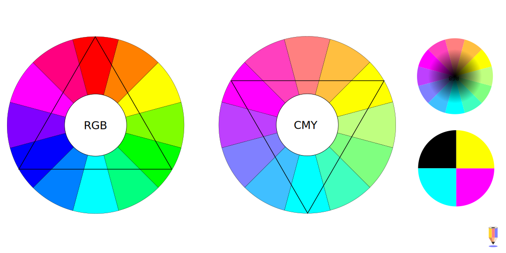
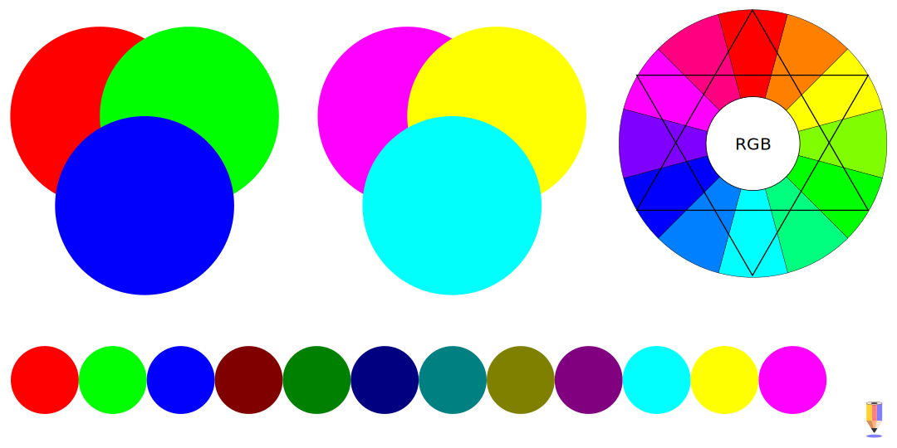
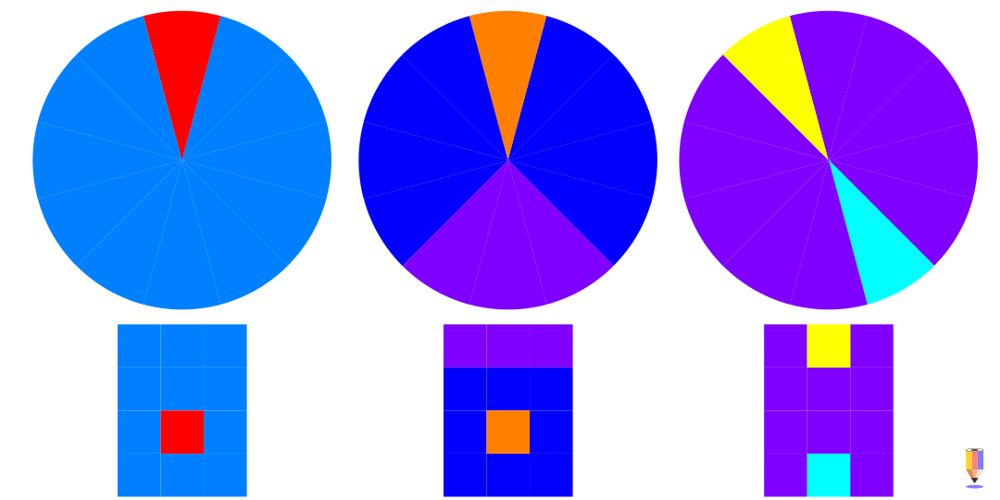
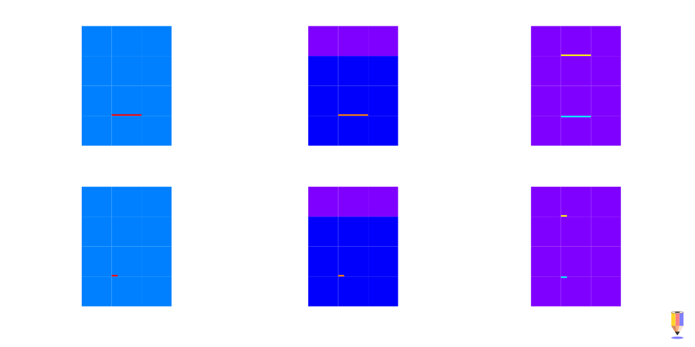
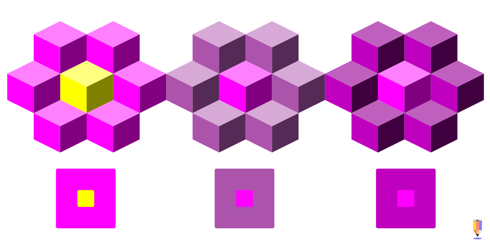
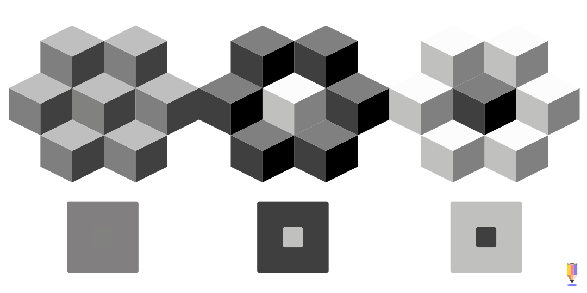
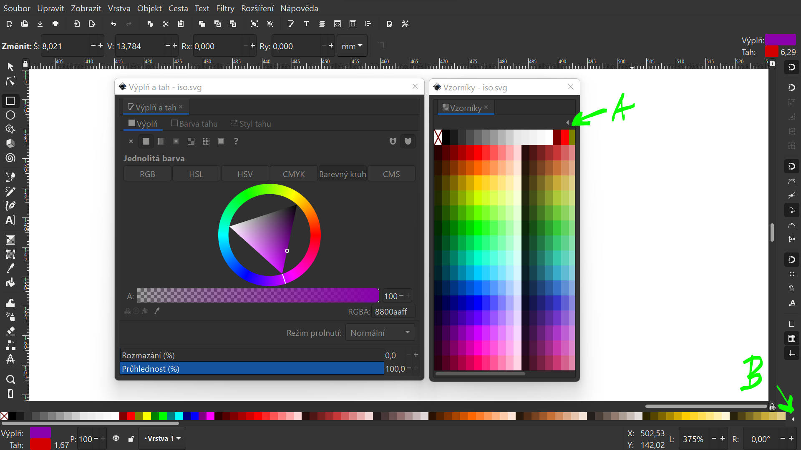
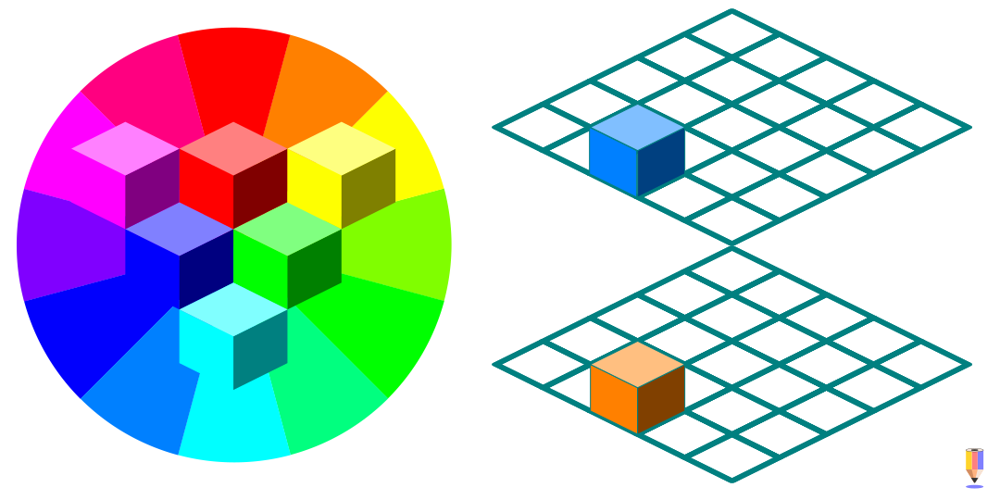

# Barvy a palety

V grafickém designu je důležité uvažovat o barvách nejenom z pohledu harmonií a účinku, ale i s ohledem na kulturní zvyklosti, psychologii barev a konkrétní aplikaci v dané oblasti. Jsou psané i nepsané kodexy toho, jaké barevné palety se používají v různých oborech — jiné barvy se používají v cukrárenském průmyslu, a jiné pro výrobce pesticidů nebo v bankovnictví.

Dalším aspektem je rozpoznatelnost a čitelnost barev a kontrastů; to je životně důležité především v komunikačních systémech (značky, informace, varování). Dobrý grafický design by měl být čitelný i pro osoby se sníženou zrakovou schopností či vadou zraku (dyschromatopsie, daltonismus).

Tyto pravidla platí jak pro design grafických prvků, uživatelských rozhraní, obalů, grafických konceptů, tak pro sazbu a typografii. Základem jsou dobře zvolené barevné kombinace a design palet, které definují tvary a formy.

## Teorie barev a grafický design
- kontrast a rozpoznatelnost barev v designu
- WCAG a postupy pro tvorbu palet
- bezpečné palety
- barvy pro ilustrace a jiné aplikace

### Barevné modely a barevné prostory

- nejčastější modely pro design a tisk
- RGBA a CMYK
- vzorníky

- RGB
### Vzorníky a palety
V praxi se požívají různé typy barevných vzorníků (swatches), které slouží k náhledu pro tisk na různé typy papírů nebo speciální materiály.

- praktické funkční vzorníky Pantone, CMYK (pro různé typy lakovaných i nelakovaných papírů)
- vzorníky barev fólií pro design RAL apod.

Vytváření palet pro design se řídí výslednou aplikací. Samotný návrh musí být graficky funkční a zároveň realizovatelný v dané technologii.

Pokud není k dispozici kalibrované zařízení, je nutné provádět zkušební nátisky (což v digitální době není obtížné).

Pro naše účely se spokojíme s omezenými možnostmi Inkscapu jako kreslicího programu a budeme používat kreslící barevné palety. Pro další polygrafické úpravy použijeme program Scribus.

### Color Management a profily
Náhled barev na monitoru nemusí odpovídat výstupu, především když se jedná o tiskový výstup (ale platí to pro jakoukoliv úpravu barev i pro fotografii nebo film). K základnímu nastavení patří správný barevný profil pro daný monitor. Existují i kalibrovaná zařízení a interface na kalibraci, které se používají v profesionálních provozech.

- monitory a kalibrace
- nastavení

### Harmonie
- tvorba rychlých harmonických sestav

## Kontrast a čitelnost
Princip práce s barevnými plochami je podobný práci s vrstvami detailů nebo perspektivními plány v malbě. Je dobré si vytvořit tři základní skupiny barev: dominantní převládající barevný tón, sekundární doplňkový tón a zvýrazňující akcentový tón. Samozřejmě, každá grafika nebude mít pouze tři barvy (uvažuj spíš ve smyslu barevných skupin), stejně tak rozlišující parametr barvy nemusí být odstín. Stejně bude působit i světelný nebo chromatický kontrast.  

Na prvním obrázku je akcent komplementární barvou k barvě dominantní (akcent tvoří 1/12 plochy). Pokud by akcent plošně převyšoval zhruba tento poměr, v závislost na intenzitě barvy by dominantní odstín vytěsnil.  Na druhém obrázku je dominantní barva doplněna sekundárním příbuzným odstínem, vytvářejícím další barevnou vrstvu.

Akcent lze vyvážit dalším prvkem, jak je vidět na třetím obrázku. V tom případě parciální barvy vzájemně oslabují potenciální účinek akcentu.

Intenzivní akcenty mohou zabírat naprosto nepatrnou část plochy grafiky a přesto mít silný účinek. Pokud akcent vytvoří nevyrovnaný barevný efekt, je možné ho komplementárně oslabit.

Akcenty usnadňují orientaci v grafice. Smyslem akcentů je zlepšit čitelnost grafiky.  

### Barevný kontrast
Barevný kontrast je kontrast mezi různými odstíny, vynikající rozdílem v chromatičnosti.

Kontrast barevného odstínu, sytosti (saturace) a světlosti (value).

### Tonální kontrast
Tonální kontrast, respektive kontrast tonality, je kontrast světelnosti (lightness) barevného tónu.
První obrázek je předchozí příklad bez barevné (HSL) saturace. Další příklady ukazují kontrast docílený změnou (HSV) světlosti.

Při práci s kontrasty v grafice je také důležité uvědomit si efekt optické iluze, vznikající vzájemným působením tvarů a barev (světlý čtvereček v tmavém poli působí, že je o něco větší než tmavý čtvereček na světlém poli). Kontrast je základní pro naše pochopení **tvarů, forem a proporcí**. Tento efekt se dá velice dobře využít v abstraktní a ornamentální tvorbě.

## Tvorba palet
Inkscape a barevné modely.

:::info Krita a vzorníky palet

Základní aktivní paleta je zobrazená ve spodní části hlavního okna. Paletu změníš ikonou šipky **(B)** a výběrem palety ze seznamu).

Pohodlné zobrazení palet je dostupné v dialogovém okně přes menu **Zobrazit ‣ Vzorníky** (*View ‣ Swatches*) <kbd>Ctrl</kbd>+<kbd>Shift</kbd>+<kbd>W</kbd>. Pro základní paletu vyber z abecedního seznamu pod ikonou šipky **(A)** paletu **Inkscape default**.

Způsob zobrazení palet nastavíš volbami na začátku seznamu — **Seznam** (*List*) a **Mřížka** (*Grid*), s volbami mřížky.
:::

Barevná paleta (*Swatch*) se dá importovat jako **.gpl** (*GIMP palette*). Soubor se umístí do ~\AppData\Roaming\inkscape\palletes (Windows) nebo  ~/.config/inkscape/palettes (Linux).

Rozšíření pro vytvoření palet z vybraných barev přímo v dokumentu Inkscapu najdeš tady https://github.com/olibia/inkscape-generate-palette/releases.

Barevné modely a barevné kolo jsou přístupné přes funkci **Výplň a tah** (*Fill and Stroke*) <kbd>Ctrl</kbd>+<kbd>Shift</kbd>+<kbd>F</kbd>.

## RGBA a export CMYK
Přestože Inkscape obsahuje barevný model CMYK, vzhledem k omezení .svg a exportu nedokáže CMYK tiskové barvy exportovat s danými hodnotami palety (i do .pdf se exportují pouze interpretace CMYK barev).

Pro tisk separací CMYK a **přímých barev** je tedy nutné barvy objektů převést v programu Scribus. Tato technika se používá především v přípravě pro sítotisk (*screen printing*) a pro speciální polygrafické práce, například při designu obalů.

:::note Export CMYKu a přímých barev

Princip exportu do programu Scribus:

- vektorovou grafiku uložíš jako .svg nebo .pdf, lze i zkopírovat vybrané objekty přes schránku
- v programu Scribus vytvoříš barevnou paletu použitých barev, nebo použiješ definované CMYK barvy ve stylech
- označené objekty přebarvíš přidělením stylů
- z programu Scribus vyexportuješ .pdf

Více o programu Scribus v lekci **Scribus a předtisková příprava**.

:::

:::info Další zdroje

Více si o teorii barev a aplikaci ve výtvarné tvorbě a designu můžeš přečíst v lekci Malujeme barvu (kurz Digitální kresba a malba) a v knize Světlo a barva.

:::
