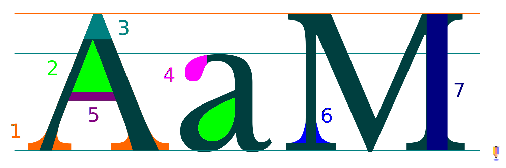

# Fonty a tvorba písma

Font je definovaná kolekce písem a znaků (glyfů), které sdílejí společný vizuální styl. Kvalitní font má propracovaný kerning, který určuje proporce toho, jak se následná písmena napojují za sebe.

:::note Co je font?
**Rodina písma** (*Typeface*) se často zjednodušeně označuje jako font. Font je ale technicky a historicky kolekce znaků (glyfů), které mohou náležet i do jedné rodiny písem — také varianty **velikosti** nebo **řezu** se považují za samostatné fonty.

:::

Klasická knižní písma mají zpravidla verzi kurzívy neboli italiky (*Italic*) a verze s nižší a vyšší váhou (*weight*), většinou označené jako Tučné (*Bold*) nebo Tenké (*Thin*). Některé sady obsahují mnoho takových variant — označovaných jako **řezy** — určených k tomu, aby se různé typy stejného písma daly spolu harmonicky použít.

Tvorbou fontů se kromě samostatných designerů zabývají takzvané písmolijny (*Foundry*), které vydávají licencovaná písma a řezy.

V kurzech budeme používat písma s **Open Fonts** licencí, které jsou volně dostupné pro jakékoliv použití v designu a typografii.

:::note Pravidla pro použití písem

- Základním pravidlem pro použití písem je být ve výběru fontů co nejůspornější!
- Každý řez se počítá jako další typ písma a typů písma v jednom dokumentu by mělo být co nejméně — **dva** nebo tři většinou stačí
- Udržuj různé velikosti i stejného písma pod kontrolou v duchu předcházejícího pravidla
- Existují výjimky, například v oblasti novin a časopisů, ale i v tomto případě jsou často typografie stránek logicky a systematicky propracované a rozdělené do segmentů
- minimální doporučená velikost písma je 5 bodů, ale nepoužívej menší písmo než **7-8 bodů**!

:::  

## Anatomie písma
Jednotlivé části písmene (glyfu) nemají sjednocenou terminologii. Přesto je rozlišení jednotlivých elementů důležité pro pochopení funkčnosti písmene v rámci celého fontu.

1. serif
2. negativní prostor (counter)
3. apex
4. terminal
5. crossbar (vynecháním nebo omezením prvků, které neruší čitelnost se často písmo stylizuje nebo modernizuje)
6. bracket
7. stem

:::note Pozitivní a negativní plochy

- **Pozitivní** prostor v designu a typografii je definovaný objekt a **negativní** prostor znamená prázdnou plochu ohraničenou objektem nebo prázdný prostor mezi jednotlivými elementy. Oba koncepty jsou  pro vyvážený design stejně důležité.

- Encyklopedická znalost částí jednotlivých glyfů není tak důležitá jako pochopení jejich funkce — a mnoho těchto komponentů slouží právě k vyvažování pozitivního a negativního prostoru, ke zlepšení **čitelnosti** a **dynamiky** písma.
:::

1. ascent
2. median
3. účaří
4. descent
5. výška majuskule (verzálky) písma
6. výška minuskule (minusky) písma (x-height podle referenční výšky písmena **x**)

## Kerning
Kerning je úprava vzájemné vzdálenosti písmen. Prakticky se jedná o částečné překrytí definovaných prostorů glyfu. Dělá se kvůli lepší čitelnosti, vyváženosti ploch a plynulosti slov. Nastavuje se při tvorbě písma vždy pro konkrétní páry, nebo upravuje manuálně.

## Skupiny fontů
Základní skupiny fontů rozdělené podle stylu designu jsou klasické, moderní, kombinované, ručně psané, historizující a dekorativní.

Glyfy vznikaly z psaného písma postupným zjednodušováním. Patky písem jsou odvozené od dynamiky ručně psaných písmen.

Kapitálky rozhodují o zařazení do skupiny patkových nebo bezpatkových písem.

### Patkové fonty

Patkové (Serifové) fonty, označované jako antikva, jsou nejběžnější typ tiskacího písma.

Egyptienka (*Slab serif*) neboli lineární **antikva** je varianta písma se zjednodušenou geometrickou patkou:

### Bezpatkové fonty

Bezpatkové (Bezserifové, *Sans Serif*) fonty, označované jako **grotesk**, se s spolu s patkovou antikvou často požívají pro sazbu delších textů a knih.

V moderním grafickém designu se často používají kombinovaná písma, které mají prvky jak patkového, tak bezpatkového písma.

### Další rozdělení podle určení nebo designu
Speciální fonty mohou mít různé formy a jsou určené pro akcenty nebo zvláštní použití. Zpravidla nejsou vhodné pro bloky textu a odstavcový text.
- Akcidenční (*Display Type*) fonty jsou určené pro velké formáty a krátké texty a mají výrazný design — jsou zkrátka pro zvláštní příležitosti
- Skripty (*Handwriting, Script*) jsou fonty v podobě ručně psaných písem

Kombinace a párování fontů tak, aby výsledek působil esteticky je jeden z hlavních úkolů designera při práci s fonty. Dobrý začátek je udržovat minimalizmus v použití fontů, používat fonty z jedné rodiny a využívat kontrastů váhy a velikosti fontů.

## Typy formátů

Nejčastěji se budeš setkávat s formáty fontů TrueType **.ttf**, případně OpenType **.otf**.

- **Statické fonty** jsou pevně definované v souboru pomocí vektorů nebo bitmap.
- **Variabilní fonty** (*Variable Fonts*) umožňují vytváření přechodových stylů řezů písem, které nejsou jako statické fonty dostupné. Podporuje je  Scribus i **Inkscape**.

:::note Úpravy variabilních fontů v Inkscapu

Vybráním variabilního fontu se objeví v nastavení Písmo <kbd>Shift</kbd>+<kbd>Ctrl</kbd>+<kbd>T</kbd> možnost** Weight** (váha písma). Nastavením hodnoty vytvoříš variantu písma, která se objeví v dolní části seznamu řezů pro tento font.

:::

Fonty mohou existovat v různých jazykových verzích, nebo být navržené s mezinárodní kolekcí znaků.

:::warning České znaky

Zdaleka ne všechny fonty mají mezinárodní kódování znaků a jsou lokalizované. Pokud budeš tvořit návrhy v češtině, vždy zkontroluj jestli je písmo **plně** lokalizované (některá písma jsou lokalizovaná pouze částečně, takže některé znaky mohou chybět)!

:::

import Tabs from '@theme/Tabs';
import TabItem from '@theme/TabItem';

<Tabs
  groupId="jazykova-verze"
  defaultValue="czv"
  values={[
    {label: 'V české verzi', value: 'czv'},
    {label: 'V anglické verzi', value: 'env'},
  ]
}>
<TabItem value="czv">Upravit ‣ Předvolby ‣ Rozhraní ‣ Překlad</TabItem>
<TabItem value="env">Edit ‣ Preferences ‣ Interface ‣ Translation</TabItem>
</Tabs>

## Tvorba vlastních fontů

Pokud se rozhodneš navrhovat písmo klasického typu (latinky odvozené od Římanů), budeš potřebovat hlubší znalost konstrukce písma než je předmětem tohoto kurzu (pomůže také studium kaligrafie).

Akcidenční typy fontů si ale naopak vytvoříš poměrně snadno.

:::note Poznámka

 Přestože je design vlastních fontů velice časově náročný. zejména pokud tvoříš kompletní sadu, základní principy se ti v praxi hodí pro tvorbu speciálních řad. Také speciální značky ve vlastním fontu ti mohou ušetřit hodně práce.

:::

### Design
Konstrukce fontu vychází z designových zásad, které jsou společné pro všechny glyfy. Základem návrhu je řešení elementu glyfu nebo sady glyfů, které vytvoří jádro písmové sady.

- Náčrt fontové sady.
- vytvoř si mapu znaků, ve skicáři nebo v počítači
- můžeš pracovat podle vzoru nebo podle vlastní inspirace
- naskenuj mapu znaků, pokud jsi netvořil v kreslícím programu

### Vektorizace

Převedení fontu na formát a nastavení ligatur, znaků a kerningu

- mapu znaků otevři v Inkscapu
- jednotlivé znaky překresli, a vyčisti přebytečné uzlové body a křivky
- jednotlivé glyfy přesuň do vrstev
- použij rozšíření
- vyexportuj
- kerning nastavíš v programu FontFoundry

<Tabs
  groupId="jazykova-verze"
  defaultValue="czv"
  values={[
    {label: 'V české verzi', value: 'czv'},
    {label: 'V anglické verzi', value: 'env'},
  ]
}>
<TabItem value="czv">Upravit ‣ Předvolby ‣ Vstup</TabItem>
<TabItem value="env">Edit ‣ Preferences ‣ Input</TabItem>
</Tabs>

### Instalace

Fonty se instalují ve Windows z menu pravého tlačítka, nebo kliknutím na soubor s fontem a zvolením tlačítka Nainstalovat. V Linuxu stačí fonty zkopírovat do adresáře ~.fonts.
