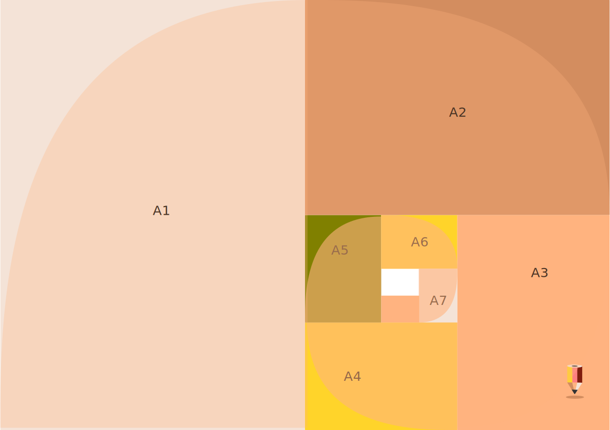

# Tiskoviny a techniky tisku
Tvorba efektivního designu vyžaduje základní přehled o technikách, kterými se tvůj návrh nebo tisková příprava bude realizovat.

Grafické a výtvarné techniky se vyvinuly v tiskové technologie. Mechanizace tisku z plochy, výšky a hloubky umožnila vznik polygrafického průmyslu.

Tato lekce obsahuje stručné shrnutí tiskových technologií, se kterými se můžeš v praxi setkat.

## Typy tiskovin
### Formáty

- tabulka nejběžnějších formátů ISO řady A

|    | Rozměr (mm) |    | Rozměr (mm) |    | Rozměr (mm) |
|----|-------------|----|-------------|----|-------------|
| A0 | 841 × 1189  | A3 | 297 × 420   | A6 | 105 × 148   |
| A1 | 594 × 841   | A4 | 210 × 297   | *A7* | 74 × 105    |
| A2 | 420 × 594   | A5 | 148 × 210   | *A8* | 52 × 74     |

- tisk na formát

nastavení spadávek.

:::note cvičení

Nastavení pravítek v Inkscapu

<kbd>Shift</kbd>+<kbd>Ctrl</kbd>+<kbd>T</kbd> možnost **Weight** (váha písma).

:::

### Merkantilní tiskoviny
- reklamní a prezentační použití

### Obaly

### Noviny, knihy, časopisy

## Techniky tisku
Tisk z plochy a z výšky.
### Ofsetové a digitální tisky
- přesahy a ohyby
### Sítotisk (*Screenprint*)
- separace barev
- Scribus a export do .pdf
### Přímé barvy
- speciální vzorové barvy

### Tvorba maket
- makety pro tiskoviny a modely obalů

## Elektronické dokumenty
Přestože technicky nepatří mezi tiskařské techniky, tisk do dokumentu je dnes rozšířená forma distribuce tiskovin. Nejčastěji se setkáš s dokumenty typu **.pdf**, které mohou mít i interaktivní prvky.

Návrh designu elektronických dokumentů, jako jsou e-mailové přílohy, prezentace a design pro sociální sítě jsou stejně časté úkoly grafického designera jako přípravy a návrhy pro klasický tisk.
