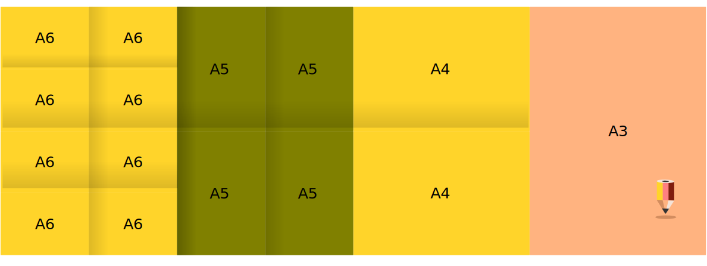

# Tiskoviny a techniky tisku
Tvorba efektivního designu vyžaduje základní přehled o technikách, kterými se tvůj návrh nebo tisková příprava bude realizovat.

Grafické a výtvarné techniky se vyvinuly v tiskové technologie. Mechanizace tisku z plochy, výšky a hloubky umožnila vznik polygrafického průmyslu.

Tato lekce obsahuje stručné shrnutí tiskových technologií, se kterými se můžeš v praxi setkat.

## Typy tiskovin
### Formáty

- tabulka nejběžnějších formátů ISO řady A

|    | Rozměr (mm) |    | Rozměr (mm) |    | Rozměr (mm) |
|----|-------------|----|-------------|----|-------------|
| A0 | 841 × 1189  | A3 | 297 × 420   | A6 | 105 × 148   |
| A1 | 594 × 841   | A4 | 210 × 297   | *A7* | 74 × 105    |
| A2 | 420 × 594   | A5 | 148 × 210   | *A8* | 52 × 74     |

S těmito formáty se budeš setkávat nejčastěji, v tiskárenském průmyslu se použivají z praktických důvodů např. formáty A+ a B (kvůli přesahům) a C na tisk obálek. Formáty se nařezávají z paletového papíru, takže formát tiskoviny může mít libovolné proporce.  

- tisk na formát

- nastavení přesahů spadávek.

:::note cvičení
Nastavení formátu dokumentu v Inkscapu: <kbd>Shift</kbd>+<kbd>Ctrl</kbd>+<kbd>D</kbd>

Nastavení pravítek a mřížek v Inkscapu.

:::

### Výběr materiálů, technik tisku a povrchové úpravy
- typy papírů
- typy laků
- ražby
- výseky
- atypické materiály
### Merkantilní tiskoviny
- reklamní a prezentační použití

### Obaly
- potisky obalů
- design tvaru obalů
- výsekové formy

### Noviny, knihy, časopisy
- standardní formáty
## Techniky tisku
Grafické techniky - tisk z plochy, hloubky a z výšky.
### Ofsetové a digitální tisky
- přesahy a ohyby
### Sítotisk (*Screenprint*)
- separace barev
- Scribus a export do .pdf
### Přímé barvy
- speciální vzorové barvy
- tisk do souboru a kontrola separovaných plátů
### Tvorba maket
- makety pro tiskoviny a modely obalů
- náhledy tiskových stran

:::note Inkscape: Export do pdf
Jak nastavit stránku pro tiskový náhled:
- objekty, které mají být tištěny do krajů stránky, musí stránku přesahovat o 5mm
- **Soubor ‣ Uložit jako** (*File ‣ Save as*), vyber **Portable Document Format (.pdf)**
- při exportu do .pdf nastav spadávky
- vyexportuj stránku jako .pdf
#### Poznámky pro přípravu

- trasformace objektů <kbd>Ctrl</kbd>+<kbd>Shift</kbd>+<kbd>M</kbd>  
- vodítka kolem formátu stránky zobrazíš ve Vlastnostech dokumentu (Document Properties) <kbd>Ctrl</kbd>+<kbd>Shift</kbd>+<kbd>D</kbd>: vyber **Vodítka ‣ Zobrazovat vodítka kolem stránky** 
- pro náhled tiskové strany si vytvoř ořezové značky, nebo použij program Scribus
:::
## Elektronické dokumenty
Přestože technicky nepatří mezi tiskařské techniky, tisk do dokumentu je dnes rozšířená forma distribuce tiskovin. Nejčastěji se setkáš s dokumenty typu **.pdf**, které mohou mít i interaktivní prvky.

Návrh designu elektronických dokumentů, jako jsou e-mailové přílohy, vizitky, prezentace a design pro sociální sítě jsou stejně časté úkoly grafického designera jako přípravy a návrhy pro klasický tisk.
