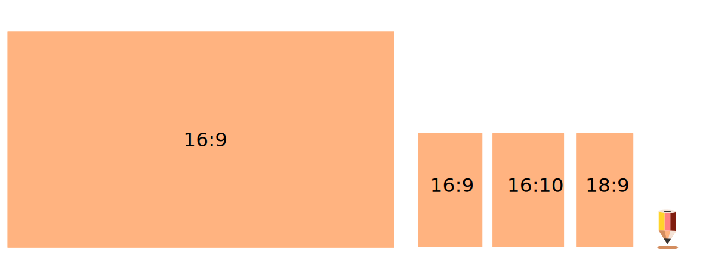

# Interaktivní design
Návrhy pro interaktivní média vyžadují plánování pro různé režimy zobrazení, a formát zobrazení navíc nemusí být pevně určen (což může vytvářet potíže například u proporcí). Nicméně platí stejné konceptuální zásady designu jako u tiskovin a existují i ustálené formáty.

|        |             |                       |      |
|--------|-------------|-----------------------|------|
| FHD    | 1920 x 1080 |                       | 16:9 |
| 2K     | 2048 × 1080 |                       |      |
| QHD    | 2560 x 1440 |                       | 16:9 |
| UHD    | 3840 x 2160 | Broadcasting Standard | 16:9 |
| 4K     | 4096 x 2160 | Digital Cinema        |      |
| 8K UHD | 7680 × 4320 |                       | 16:9 |
|        |             |                       |      |

Výrobci někdy zaměňují formáty (hlavně UHD a 4K) nebo uvádějí na trh atypické formáty pod různými názvy.

Mobilní trh jsou obrovský distribuční kanál digitálního interaktivního obsahu, a existuje mnoho dalších formátů zobrazení: 18:9, 19:9, 19:10 ad.

## Webové stránky
- stránky, portfolia, obchody, prezentace, informační a dokumentační projekty
- internetové profily a portfolia
- sociální sítě

### Wireframes
- mockup a wireframe
- digitální makety

### Grafické prvky
- aktivní a pasívní
- call to action
### Programování a design
- konec rámcového designu?
- univerzální design
- rovnováha mezi velikostí fontu a šířkou sloupce textu
- návrh společného stylu pro tiskoviny i web

:::note Úkol

 Wireframe v Inkscapu.

:::

## Uživatelská rozhraní
Uživatelská rozhraní pro interaktivní aplikace  (GUI). Konzistence grafických prvků.
### Metodika
Pravidla návrhů UI.
### Struktury
Testování UI.

:::note DIGITÁLNÍ TYPOGRAFIE

Rozdílem oproti designu pro tiskoviny je především variabilita rozměrů digitálního média. Při návrzích je nutné kontrolovat výstup aplikací na cílová zařízení.

:::
### Ikony
Ikony jsou miniaturní hieroglyfy.

:::note Poznámka

 Návrh grafického rozhraní.

:::

## Motion Design

Součástí grafického designu může být animace textu nebo grafiky. Pro takové akční prvky se používá termín Motion Design. Je to samostatný obor vyžadující zkušenosti s animací (často spojenou se zvukem) a to jak 2D, tak 3D.

:::note Úkol

 Animované logo v .svg formátu

:::

:::note Úkol

 Návrh sady ikon.

:::
