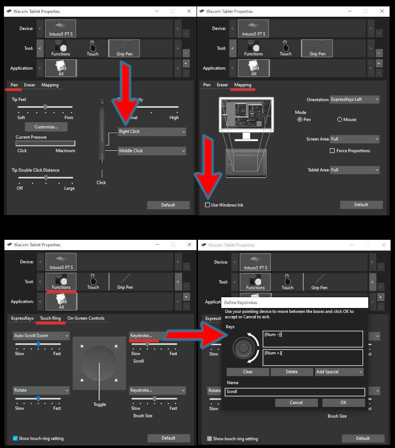

# Interaktivní design
Fonty vyhovují standardu.

## Webové stránky
### Wireframes
### Grafické prvky
### Programování a design

## Uživatelská rozhraní
### Metodika
Zpravidla obsažené v souboru. Definované vektorem nebo bitmapou.
### Struktury
Obsahují více řezů v jednom ttf souboru. Podpora Scribus, **Inkscape**. Pokud je aplikace podporuje, umožňují vytváření přechodových stylů řezů písem, které nejsou jako statické fonty dostupné.
SEZNAM

:::note Úpravy variabilních fontů

Vybráním variabilního fontu se objeví v nastavení Písmo <kbd>Shift</kbd>+<kbd>Ctrl</kbd>+<kbd>T</kbd> možnost** Weight** (váha písma). Nastavením hodnoty vytvoříš variantu písma, která se objeví v dolní části seznamu řezů pro tento font.

:::

## Interaktivní aplikace
Kerning a další v kapitole o sazbě.

import Tabs from '@theme/Tabs';
import TabItem from '@theme/TabItem';

<Tabs
  groupId="jazykova-verze"
  defaultValue="czv"
  values={[
    {label: 'V české verzi', value: 'czv'},
    {label: 'V anglické verzi', value: 'env'},
  ]
}>
<TabItem value="czv">Upravit ‣ Předvolby ‣ Rozhraní ‣ Překlad</TabItem>
<TabItem value="env">Edit ‣ Preferences ‣ Interface ‣ Translation</TabItem>
</Tabs>

:::note Poznámka

 Přestože je design vlastních fontů velice časově náročný. obvzvlvlášť pokud tvoříš kompletní sadu, základní principy se ti v praxi hodí pro tvorbu speciálních řad. Také speciální značky ve vlastním fontu ti mohou ušetřit hodně práce.

:::

## Motion Design

Animace.

klávesách <kbd>Num +</kbd> a <kbd>Num -</kbd>. Pokud jsou na tvém tabletu programovací tlačítka nebo touch ring, doporučuji si nastavit tyto shortcuty (viz obrázek). Příklad nastavení u tabletu Wacom:

Můžeš začít.
