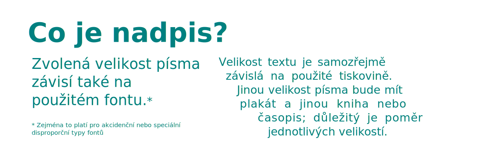

# Sazba (Typesetting)
Sazba byl původně výraz pro sestavování litých písmen (liter) pro tisk. Digitální sazba se zabývá přípravou (lámáním) časopisů, knih a jiných tiskovin pro tisk.

Už od počátku knihtisku se tisky doplňovaly i ilustracemi. Původní tisk z dřevěných štočků nahradily tisky z kamenných desek (litografie), kovových plechů a jiných materiálů.

S příchodem počítačů, které byly dostatečně výkonné a vešly se na stůl, nastala éra digitální sazby (*Desktop publishing*, zkráceně DTP) a vývoj digitální přípravy tiskovin pokračuje dodnes.

## Postup práce se zdroji

- Inkscape: Vektorový grafický design a ilustrace, návrh typografie
- GIMP, Krita: Příprava bitmapových souborů (fotografie, ilustrace)
- Scribus: Sestavení vícestránkových dokumentů a sazba

## Formáty tiskovin
Standardní formáty. Skládání a lomy.

- typické formy tiskovin - skládačky
- sudá a lichá

## Typografická pravidla pro textové bloky
:::note Pravidla pro českou sazbu.
Čeština a polština nedovoluje ukončování řádků jedno a dvoupísmennými slovy. V programu Scribus funkci nastavíš v menu **Extras ‣ Krátká slova** (*Extras ‣ Short Words*). Ve stejném menu najdeš i automatické rozdělování slov (Hyphenate/Dehyphenate Text).
:::

Nežádoucí jevy v blocích textů (na které nezávisle určitě narazíš sám) jsou:

- **Vdovy** (Widows) jsou osamělé řádky přetékající na další blok textu nebo stranu
- **Sirotci** (Orphans) označují osamělé řádky začínající odstavec na konci sloupce nebo strany
- **Řeka** (River) je souvislá prázdná plocha nebo linka vznikající ve sloupcích a odstavcích mezerami mezi slovy (tento prostor pak upoutává pozornost především v justifikovaném textu)
- **Hadr** (Rag) je příliš nevyrovnaná délka následujících řádků ve sloupci nebo bloku textu
- nevhodná vzdálenost mezi řádky pro zvolený font
- špatně nebo nevhodně rozdělená slova (Runts)

K odstranění a zmírnění těchto jevů používáme **rozdělování slov** (*Hyphenation*) a úpravu parametrů textu (tracking) a odstavců, což si ukážeme v programu Scribus.

## Grafický design tiskovin
- jednoduché sazby v Inkscapu
- spadávky a přetisky

## Export pro tisk
- formáty souborů
- spadávky a přetisky

## Práce se styly
- Inkscape nepodporuje práci se styly jako Scribus, ale styl objektu i textu se dá kopírovat pomocí <kbd>Ctrl</kbd>+<kbd>C</kbd> pro kopírování stylu, a <kbd>Ctrl</kbd>+<kbd>Shift</kbd>+<kbd>V</kbd> pro vložení stylu na objekt. Tímto způsobem se dají kopírovat jak barvy tahu a výplně, tak styly písma včetně kerningu.

### Nadpisy a velikosti písem

- běžná velikost titulku 24pt
- běžná velikost nadpisu 16pt
- běžná velikost textu 10pt
- velikost drobného textu 7pt

### Odstavec (*Paragraph*)
Inkscape dovoluje práci s odstavci ve formě blokového textu (umožňuje použití *hard line break* <kbd>Shift</kbd>+<kbd>Enter</kbd>).

Lze nastavit i vzdálenost mezi písmeny a slovy u vybraného textu. Pokročilejší práce s odstavci, rozdělováním slov a styly je v programu **Scribus**.

### Barvy
:::note Pozor, zlý CMYK

CMYKové separace anebo separace přímých barev vytvořené v Inkscapu je nutné přebarvit v programu Scribus.

:::

## Kerning v Inkscapu
Kerning u krátkých textů nastavíš označením části textu, a vložením hodnoty kerningu v horním kontextovém menu textového nástroje (všechny kerningové funkce nejde aplikovat u blokových textů).

## Práce s fonty

:::note Poznámka

 Pravidla pro práci s fonty, opakování.
:::

### Design

:::note Cvičení

 Vytvoř jednoduchou sazbu tiskoviny v Inkscapu a vyexportuj pro Scribus jako křivky.
:::
