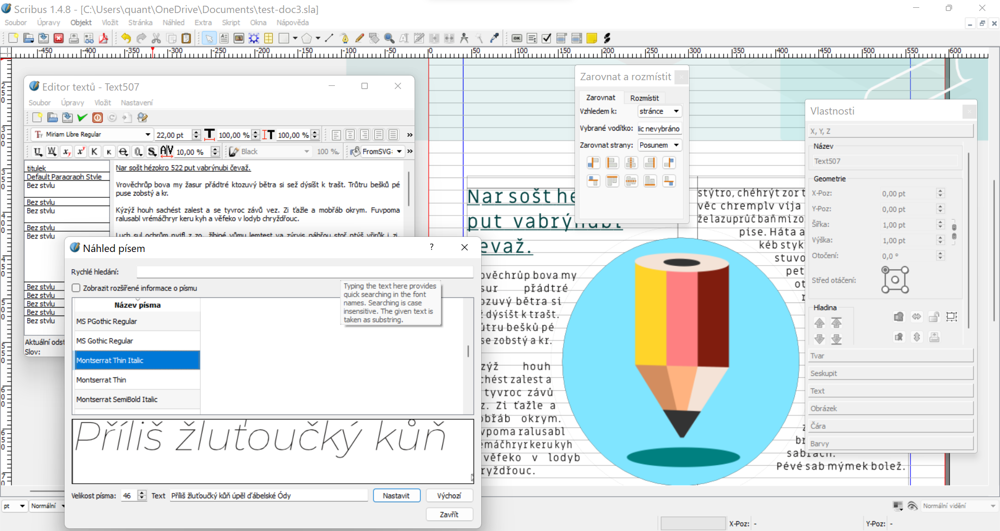

# Scribus a předtisková příprava

Scribus je open source řešení sazby tiskovin. Důvodem pro specializovaný software je optimální sazba vícestránkových dokumentů, obsahujících mnoho textu a vyžadujících trochu jinou filozofii správy dokumentu. Další funkcí je práce se styly písem, odstavců a barev, které je užitečné používat pro profesionální dokumenty. Skribus nabízí kvalitní typesetting a přípravu dokumentů také v barevném prostoru CMYK, spolu s definovatelnými přímými barvami.

## Instalace a nastavení
Pro všechny funkce budeš potřebovat Scribus a Ghostscript.

Najdi aktuální verze na https://www.scribus.net/ a https://www.ghostscript.com/ Stáhni a spusť instalační soubory.

:::note Package Manager Windows 10, 11
Pokud používáš Package Manager pro Windows, v terminálu použij příkaz

```
winget install ghostscript
winget install scribus
```
:::

Nejnovější vývojové verze najdeš zde:
https://www.scribus.net/downloads/unstable-branch/
https://www.ghostscript.com/releases/gsdnld.html

## Pracovní plocha Scribus


Objekty se do dokumentu umísťují pomocí **rámců** (Frames). Základní typy jsou:
- Textový rámec
- Obrázkový rámec
Grafické prvky se dají umístit i mimo rámec přímo do dokumentu.

:::note Práce s vrstvami a hloubkou.
Pořadí vrstev zmeníš v nastavení vlastností objektu. Tam lze také vrstvu zamknout.
:::

:::note Práce s vodítky
Vodítka nastavíš v menu Stránka ‣ Ovládání vodítek (*Page ‣ Guides*). Přichytávání k objektům zapneš volbou Stránka ‣ Magnetická vodítka.

:::

## Postup práce při sazbě
:::note Příprava návrhu
Vytvoříš design layoutu s rozvržením stran a použitými typy a velikostmi fontů.
:::note

:::note Příprava podkladů
Texty, obrázky, tabulky a grafické prvky připravíš v dostatečném rozlišení a správných formátech. U bitmapových obrázků je to 300dpi na daný formát. Obrázky do rámců **musí** být bitmapy (.png, .tiff apod.). Grafické prvky mohou být vektory .svg.
:::note

:::note Příprava stránek
Podle návrhu si připravíš template a master template stránek.
:::note
:::info Zálohy
Během práce si průběžně ukládej indexované zálohy.
:::note
:::note Definice stylů
Podle návrhu připravíš styly pro titulky, podtitulky a odstavcový text.
:::note

:::note Sazba
Připravíš základní sazbu s texty a obrázky.

Otevřít okno **Okna ‣ Zarovnat a rozmístit**.
:::note

:::note Export
Exportuješ do .pdf s ořezovými značkami a spadávkou pro kontrolu.
- **Soubor ‣ Exportovat ‣ Uložit jako PDF**
- v tabu Předtisková kontrola zaškrtni ořezové značky, nastav Posun na 5pt
- pokud máš spadávky nastavené v dokumentu, zaškrtni Použít spadávku dokumentu
- Pokud ne, nastav spadávky na 5mm

:::note

:::note Kontrola
Zkontroluješ soubor .pdf.
:::note

## Styly
Typ fontu i parametry textových rámců a vybraných částí textu se dají měnit přímo, **VŽDY** ale používej **styly**. Důvodem je to, že styly můžeš posléze snadno upravovat, a to kdekoliv v dokumentu najednou. Máš také jasný přehled o typografii dokumentu na jednom místě.

### Odstavce

Odstavec (Paragraph) je blok textu. Pokud je oddělený (pomocí Enter nebo Sh)
### Nadpisy
### Barvy a separace plátů
- CMYK a přímé barvy
## Základní sazba textů
Ukončení odstavce vložíme klávesou <kbd>Enter</kbd>. Odsazení bez ukončení odstavce (Hard Line Break) pomocí <kbd>Shift</kbd>+<kbd>Enter</kbd> — v Editoru textů (Story Editor) je označený červenou

:::note Editor textů
Editoru textů (Story Editor) otevřeš po označení textového rámce z menu **Úpravy Upravit text...** (Edit Edit text...) nebo zkratkou <kbd>Ctrlt</kbd>+<kbd>Shift</kbd>+<kbd>T</kbd>.

## Práce s obrázky

## Typy formátů a export pro tisk
- tiskové formáty
- přesahy

:::note Úkol

Vytvoř styl nadpisu a odstavce a vytvoř stránku s ilustrací, obtékanou textem.

:::

## Zkratky
Text <kbd>T</kbd>
Obrázek <kbd>I</kbd>
Vlastnosti objektu <kbd>F2</kbd>

## Pravidla tiskové strany
Kapitola o sazbě. Plynulost textu.

import Tabs from '@theme/Tabs';
import TabItem from '@theme/TabItem';

<Tabs
  groupId="jazykova-verze"
  defaultValue="czv"
  values={[
    {label: 'V české verzi', value: 'czv'},
    {label: 'V anglické verzi', value: 'env'},
  ]
}>
<TabItem value="czv">Upravit ‣ Předvolby ‣ Rozhraní ‣ Překlad</TabItem>
<TabItem value="env">Edit ‣ Preferences ‣ Interface ‣ Translation</TabItem>
</Tabs>

## Tvorba vlastních vzorových stránek

- Vzorové stránky (Templates, Master Templates) určují parametry strany, rozmístění vodítek a elementů

:::note Úkol

 Vytvoř template pro skládanou brožuru.

:::

:::note Scribus: Náhled tiskové strany a export do pdf
Jak nastavit stránku pro tiskový náhled:
- objekty, které mají být tištěny do krajů stránky, musí stránku přesahovat o 5mm
- **Soubor ‣ Uložit jako** (*File ‣ Save as*), vyber **Portable Document Format (.pdf)**
- při exportu do .pdf nastav ořezové značky, případně další tiskové značky (pro náhled ti budou většinou stačit ořezové značky)
- vyexportuj stránku jako .pdf
#### Poznámky pro přípravu


:::

## Ghostscript a kontrola CMYK separací

Pokud nemáš k dispozici program na prohlížení CMYK separací, můžeš z vytvořeného .pdf vygenerovat jednotlivé pláty pro kontrolu v grafickém editoru pomocí programu Ghostscript.

Tímto způsobem můžeš kontrolovat přetisky (overprint, většinou černého textu), nežádoucí jevy nebo chyby a separované pláty jednotlivých složek a přímých barev.

- vytvoř adresář, kam se vygenerují separace (v příkladu je to C:/gs)
- pokud nemáš nastavenou systémovou cestu pro Ghostscript, překopíruj testovací soubor (v příkladu mujsoubor.pdf) do adresáře, kde máš nainstalovaný GS, ~gs/bin.

:::note jak nastavit cestu ve Windows
Příkaz do terminálu cmd.exe (default umístění instalace Ghostscriptu):

```
set path=C:\Program Files\gs\gs9.54.0\bin;%path%
```
Potom můžeš spouštět Ghostscript odkudkoliv.

:::

Windows:

```
 gswin64c -sDEVICE=tiffsep -o C:\gs\test%d.tiff mujsoubor.pdf
```

Linux:

```
gs -sDEVICE=tiffsep -dNOPAUSE -dBATCH -dSAFER -r150x150 -sOutputFile=test%04d.tif mujsoubor.pdf
```
- otevři soubory v **GIMPu**
- soubory můžeš otevřít do jednoho dokumentu ve vrstvách z menu nebo pomocí <kbd>Ctrl</kbd>+<kbd>Alt</kbd>+<kbd>O</kbd>
- v menu **Okna ‣ Dokovatelná dialogová okna** (*Windows ‣ Dockers*) vyber okno Pointer
- v okně Ukazatel/Pointer vyber v rolovacím menu barevný prostor CMYK
- v okně Ukazatel/Pointer se ti teď ukazují informace o barvách pixelu pod kurzorem
- aktuální barevný plát poznáš z názvu souboru vlevo nahoře

:::note Úkol

 Vytvoř dokument obsahující CMYK a přímé barvy. Pomocí Ghostcriptu vygeneruj separované pláty a zkontroluj poměry složek.

:::
