# Základy grafického designu

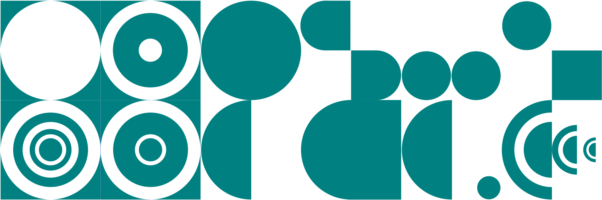

## Co je grafický design?
Grafický design (někdy označovaný jako užitná grafika) je stejně jako průmyslový design kreativní obor, který se nachází v oblasti mezi uměním, vědou a průmyslem. Spojuje hlediska estetiky a užitnosti, cílem je vývoj praktického výrobku — tiskoviny, obalu, layoutu, grafického rozhraní nebo vizuálního konceptu.

V grafickém designu je velký důraz na čitelnost výsledku, srozumitelnost pro co nejširší okruh lidí, kteří budou výsledný výrobek užívat. Grafický design využívá stylizaci, emblematiku a symboliku pro co nejsrozumitelnější předávání informací.

V tomto oboru se estetická hlediska podřizují výsledné technologii a aplikaci. Důležité je to ve všech oblastech grafického designu — ať se jedná o přípravu knihy, logotypu nebo konceptuálního stylu.

Tato pravidla ovlivňují nejen výběr barev — barvy a kontrasty v grafickém designu musí být například čitelné i pro lidi s vadou zraku — ale i forem.

Tato lekce je stručné shrnutí základních principů funkčního grafického designu.  

## Tvary a formy
- **Čitelnost:**
Srozumitelnost a čitelnost se týká nejenom textu, ale i barev, tvarů a forem.
- **Užitnost:**
Volba písma i grafických prvků musí být v souladu s plánovaným použitím díla. Velikost písma musí být přizpůsobená čitelnosti.
- **Estetika:**
Stylizace musí doplňovat obsah.
## Barvy

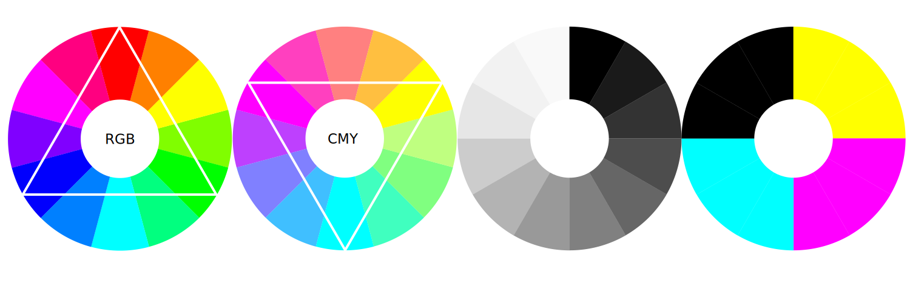

RGB model se skládá z barevných složek světla a označuje se za subtraktivní, protože hodnoty barev od sebe odčítá: překrytím všech tří složek vznikne bílá.  CMY(K) model je založený na pigmentových barevných složkách v tisku a je aditivní - směsí a přidáním všech složek teoreticky vznikne "černá" (černá barva se ale v praxi používá jako jednosložková, nebo jako směs C75M65Y65K90).

:::note Poznámka
HSL a HSV jsou zjednodušené  transformační modely RGB.
V praxi se snadno používají, i když tyto  nezohledňují skutečné barevné vnímání ani gamut.
:::

Barevných složek v tisku může být mnohem víc, v případě použití přímých barev (i některé digitální tiskové technologie používají více než čtyři pigmenty). V historii se tiskly litografické plakáty i s více než deseti barevnými pláty.

Zjednodušeně se dá říci, že pro interaktivní aplikace a použití na webu budeš používat RGB model a pro tisk na separačních tiskárnách CMYK a přímé barvy. Barvy jsou v paletách a vzornících definované poměrem složek a případně hexadecimálním kódem.

:::note Poznámka
Definovaná barva má kromě složek také určenou průhlednost (tzv. alfa). V RGBA hexadecimálním kódu 408080ff je právě **ff** na konci průhlednost barvy.

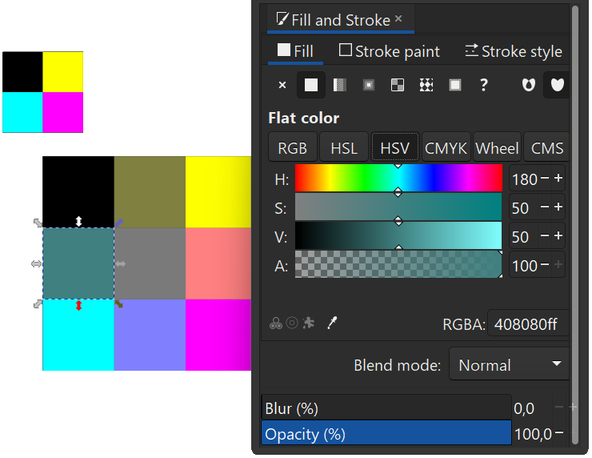

:::

Zobrazení barev určuje kvalita a barevný profil monitoru. Existují kalibrovatelné monitory i kalibrační zařízení. V běžných podmínkách pouze zjisti, jestli používáš správný barevný profil v systému a softwaru.

### Harmonie

Harmonizaci barev se budeme více věnovat v **lekci o barvách**. Je důležité vědět, že podobně jako jsou zkonstruované proporční modely, jsou také harmonické modely určené k tomu, aby zjednodušovaly grafickou práci a pomáhaly vizuální vyváženosti výsledku. Barevné a tonální kontrasty také vytvářejí čitelnost grafiky. Tyto modely vycházejí i z estetického a psychologického působení barev.

:::note Barvy
Primární barvy jsou základní složky barevného modelu, které se nedají namíchat z jiných barev. V případě RGB to tedy budou červená, zelená a modrá. Komplementární nebo opozitní barvy jsou barvy na opačné straně barevného kola, barvy s největším barevným kontrastem.

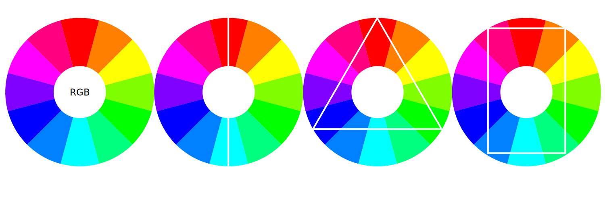

Triády jsou tři barvy rozmístěné rovnoměrně v barevném kole, tetráda je skupina čtyř barev.
Barvy v praxi mohou být tlumené nebo upravené světlostí nebo saturací. Jednotlivé skupiny se mohou kombinovat, případně do nich přidávat příbuzné barevné odstíny.
:::

## Proporce
Systém funguje podle daných pravidel. Grafická práce se pohybuje v oblasti harmonických matematických modelů, protože i samotné médium je tak navržené (materiály jsou připravené ve standardních formátech).

### Harmonické modely a zlatý řez
#### Zlatý řez
**Zlatý řez** (*Golden Ratio*, sectio aurea, &#934;/&#981;  [fí]) je matematická konstanta, považovaná za harmonický proporční poměr (1: ~1.618).

Podobně jako u tvarů a barev, i proporční rozdělení je věčné hledání harmonické rovnováhy.  

Racionální a soběpodobné modely určující proporce tvoří základ pro stavbu designu. Užívané modely vycházejí z poznatků matematiky a přírodních věd, ale také mnohdy vycházejí z tradice a kulturního zázemí.
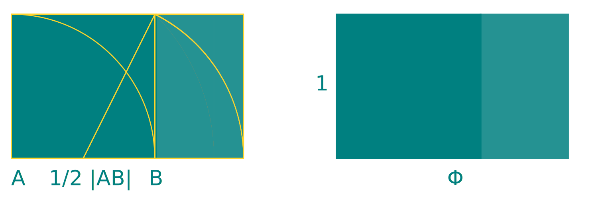
Proporčních modelů, používaných v architektuře, umění a designu, je celá řada.

#### Lichtenbergovův poměr, ISO 216
Strany standardních formátů ISO DIN 216 (běžná čtvrtka nebo kancelářský papír A4) jsou v **Lichtenbergově poměru** 1: ~1.4142 ( 1: √2), pojmenovaném po německém experimentálním fyzikovi G. C. Lichtenbergovi.

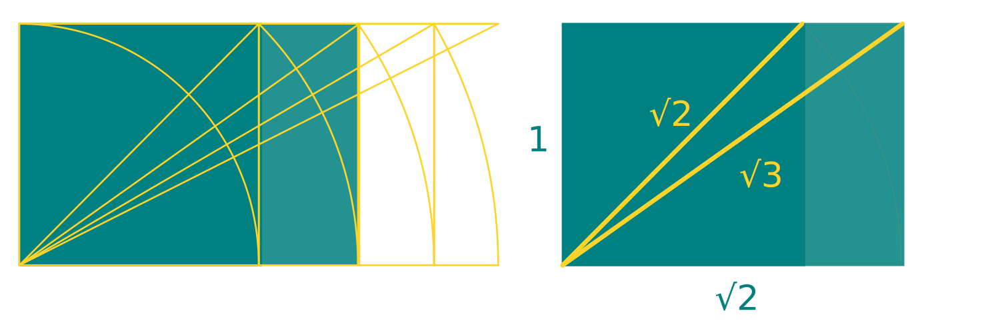

:::note Poznámka
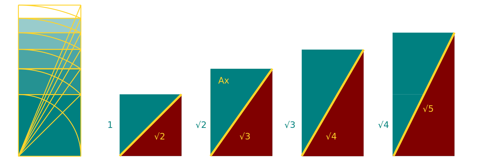
Proporční systémy jsou navrhovány tak, aby byly praktické a umožňovaly přirozené geometrické harmonie.
:::

#### Stříbrný řez
**Stříbrný řez** (*Silver Ratio, Silver Mean*) je vlastně varianta Lichtenbergova poměru (1: 1+√2)

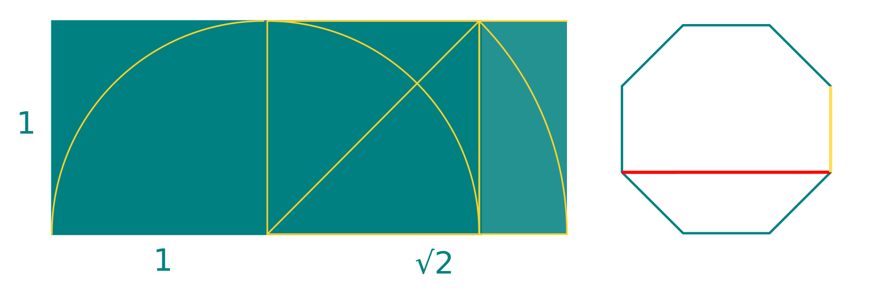

- kodexy a kánony
- tvary papírů

#### Geometrické harmonie
Samozřejmě lze vytvářet i celočíselné (*Integer*) posloupnosti a rastry a také se často používají pro geometrické harmonické poměry a grafické prvky (rastry mohou být ze čtverců, kosočtverců, obdélníků, trojůhelníků, nebo je můžeš kombinovat do komplexních struktur).

:::note Poznámka
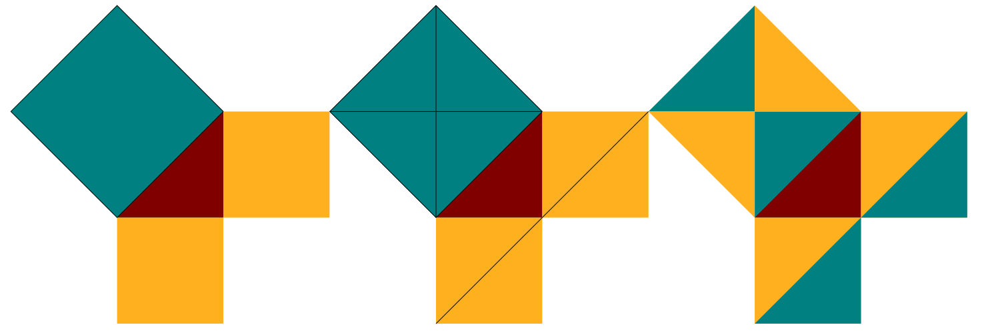
Geometrické vztahy mezi objekty nemusí být na první pohled patrné. Na obrázku je vizuálně ztvárněná Pythagorova věta.
:::

Formáty mohou být atypické. Možností proporčních systémů je mnoho. Ve skutečnosti se kánony zlatého řezu v historii nepoužívaly příliš často. Geometrické modely vznikaly na základě konkrétní aplikace, výtvarné školy a kulturního zázemí.

Rozměry tiskovin vycházely i ze zavedených jednotek (palec) i z praktičnosti (text nebyl nikdy tištěný do krajů a musel mít racionální velikost). Formáty také určovala výroba tiskovin a rozvoj polygrafického průmyslu.

:::note Poznámka

 Zlatý řez, stříbrný řez, Lichtenbergův poměr, geometrické poměry a jejich kombinace ti pomohou udržet styl a proporce u jednoduchých i komplexních layoutů. Vhodnou strategii zvolíš i s ohledem na formát média. Důležité je ale udržet vzájemnou konzistenci a kombinovatelnost, zejména u sérií a vícestránkových dokumentů.

:::

### Rastrové kompozice

Harmonické systémy efektivně využiješ při proporcionálním rozdělení plochy. Rastrové systémy se používají při sazbě tiskovin s mnoha komponenty (noviny, časopisy) i při designu interaktivních aplikací.

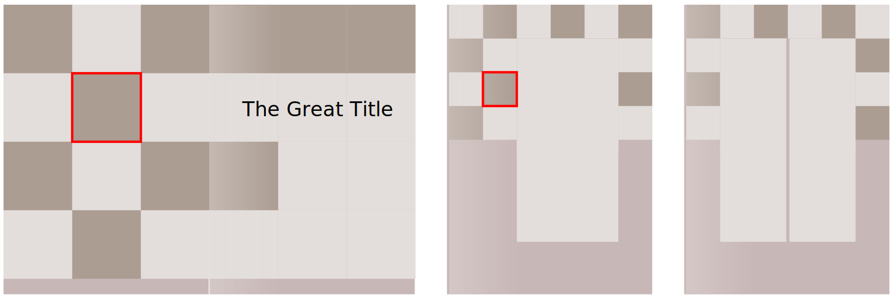

### Rastry, rámce, mřížky (*Grids*)
Vytvářejí rámce layoutu a pomáhají vytvářet konzistenci celkového návrhu. Umožňují varianty a kombinaci elementů.

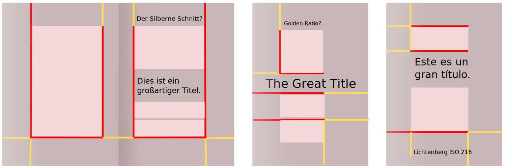

Rozvržení layoutu je dobrý základ, ale určení rozmístění pro harmonický design není nezávislé na obsahu jednotlivých buněk. Také formát, materiál a aplikace ovlivňují design.    

:::note Poznámka
Běžné formáty papírů jsou ISO (mezinárodní standard, např. A4, A+, B4) a ANSI (US a Jižní Amerika). ANSI formáty nemají v různých formátech stejný poměr stran.

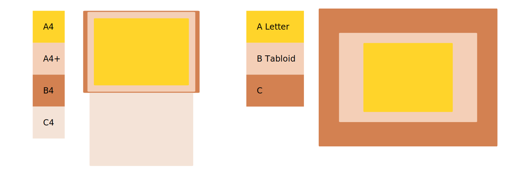

:::

## Komplexní grafický design a vizuální komunikace

:::note Poznámka

 Postupy tvorby grafického designu si ukážeme na příkladech z typografie, sazby (Typesttingu), ilustrace a konceptuální grafiky.

:::

Komplexní grafický design se zabývá řešením vizuální komunikace. Jednotlivé fáze zahrnují práci s grafickými elementy. Jsou to základní a doplňující grafické prvky, typografie, barevné palety a definice proporcí — zkrátka výtvarný jazyk, určený k předávání vizuálních informací.

Grafický design kombinuje výtvarné umění, literaturu a technické průmyslové obory.

### Emblematika a piktogramy
Vizuální komunikace pracuje se symboly, emblémy (spojení symbolů do významových struktur), kontrasty a harmoniemi.

Symbolika, emblematika a piktogramy jsou základem tvorby logotypů, grafických značek, ikon i komplexního designu tiskovin, obalů nebo interaktivních aplikací.

### Písma, loga a grafické prvky

Design písma využívá základní proporce a kontrasty v grafických objektech.

Stejné vizuální principy pozitivního a negativního prostoru, ochranného prostoru, dynamiky a plynulosti linií používáme při designu grafických značek (log) i dalších komponentů grafického stylu.

### Konceptuální design a ilustrace
Konceptuální design stejně jako ilustrace definují jednotný styl. Konzistence stylu je důležitá pro sérii ilustrací, i pro jednotný vizuální styl komunikace firmy nebo projektu.

## Aplikace grafického designu
Základy grafického designu, jako jsou barevné harmonie, kontrasty, teorie tvarů a forem a typografie využiješ ve všech oblastech grafického designu i ilustrace.

Elementy grafické práce:

- Konceptuální design
- Grafické návrhy
- Tvorba písem a ilustrací
- Design grafů a tabulek
- Práce s grafikou a písmem
- Práce s fotografiemi a ilustracemi
- Příprava pro realizaci
- Tvorba nebo příprava maket
- Grafický design aplikací a komponentů
- Design uživatelských rozhraní

Grafický design se uplatňuje ve všech oblastech průmyslu, od tvorby knih, časopisů, plakátů a jiných tiskovin, přes návrhy obalů a etiket, až po marketingové a reklamní materiály.

V případě grafických návrhů rozhraní pro aplikace může funkční grafický design přesahovat do oblasti multimediálního designu (motion design), kterému se budeme více věnovat v kurzu animace.
