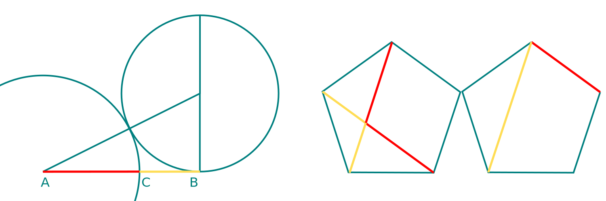

# Základy grafického designu

## Co je grafický design?
Grafický design (někdy označovaný jako užitná grafika) je stejně jako průmyslový design kreativní obor, který se nachází v oblasti mezi uměním, vědou a průmyslem. Spojuje hlediska estetiky a užitnosti, cílem je vývoj praktického výrobku — tiskoviny, obalu, layoutu, grafického rozhraní nebo vizuálního konceptu.

V grafickém designu je velký důraz na čitelnost výsledku, srozumitelnost pro co nejširší okruh lidí, kteří budou výsledný výrobek užívat. Grafický design využívá stylizaci, emblematiku a symboliku pro co nejsrozumitelnější předávání informací.

V tomto oboru se estetická hlediska podřizují výsledné technologii a aplikaci. Důležité je to ve všech oblastech grafického designu — ať se jedná o přípravu knihy, logotypu nebo konceptuálního stylu.

Tato pravidla ovlivňují nejen výběr barev — barvy a kontrasty v grafickém designu musí být například čitelné i pro lidi s vadou zraku — ale i forem.

Tato lekce je stručné shrnutí základních principů funkčního grafického designu.  

## Tvary a formy
- **Čitelnost:**
Srozumitelnost a čitelnost se týká nejenom textu, ale i barev, tvarů a forem.
- **Užitnost:**
Volba písma i grafických prvků musí být v souladu s plánovaným použitím díla. Velikost písma musí být přizpůsobená čitelnosti.
- **Estetika:**
Stylizace musí doplňovat obsah.

## Proporce
Systém funguje podle daných pravidel. Grafická práce se pohybuje v oblasti harmonických matematických modelů, protože i samotné médium je tak navržené (materiály jsou připravené ve standardních formátech).

### Harmonické modely a zlatý řez
Zlatý řez (*Golden Ratio*, sectio aurea, &#934;/&#981;  [fí]) je matematická konstanta, považovaná za harmonický proporční poměr (1: ~1.618).

Harmonie tvarů a barev.

Poměry stran standardních formátů ISO DIN A4  jsou v Lichtenbergově poměru 1: ~1.4142.

- kodexy a kánony
- tvary papírů

Formáty mohou být atypické.

### Rastrové kompozice

Harmonické systémy efektivně využiješ při proporcionálním rozdělení plochy.

### Mřížky (*Grids*)
Vytvářejí rámce layoutu a pomáhají vytvářet konzistenci celkového návrhu. Umožňují varianty a kombinaci elementů.

:::note cvičení

Nastavení pravítek v Inkscapu

<kbd>Shift</kbd>+<kbd>Ctrl</kbd>+<kbd>T</kbd> možnost** Weight** (váha písma).

:::

## Komplexní grafický design

:::note Poznámka

 Postupy tvorby grafického designu si ukážeme na příkladech z typografie, sazby (Typesttingu), ilustrace a konceptuální grafiky.

:::

Jednotlivé fáze zahrnují práci s grafickými elementy.

### Emblematika a piktogramy
od písma, monogramu po Logotypy. Branding a CI.

### Písma, loga a grafické prvky
Elementy grafické práce. Práce s fotografiemi a příprava pro realizaci. Práce s grafikou a písmem
Základní proporce a kontrasty v písmu a grafických objektech. Písmo (Kerning), monogramy.
### Konceptuální design a ilustrace
Konceptuální design stejně jako ilustrace definují jednotný styl.
## Aplikace grafického designu
Základy grafického designu, jako jsou barevné harmonie, kontrasty, teorie tvarů a forem a typografie využiješ ve všech oblastech grafického designu i ilustrace. 
