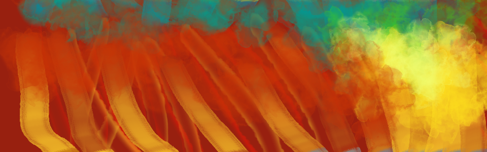

# Co v lekcích najdeš

- Vektorová grafika a Inkscape
- Scribus: Typesetting a sazba tiskovin
- Gimp a úprava grafiky
- Písma a tvorba fontů
- Užitná grafika, symboly a emblematika

- Proporce tiskovin
- Pravidla typografie
- Gimp a úprava grafiky
- Barevné modely RGB, CMYK a přímé barvy

## Struktura
- Inkscape: Instalace, nastavení
- Inkscape: Vektorové objekty
- Palety a teorie barev
- Základy grafického designu
- Inkscape: nástroje a plynulé Křivky
- Fonty a tvorba písma
- Tiskoviny
- Interaktivní design
- Emblematika a piktogramy
- Logotypy
- Ilustrace
- Propojení s ostatnímy programy - Pipeline

- Lekce 1-6 Inkscape
- Lekce 6-7 Scribus
- Lekce 8 Úprava bitmap: Krita, Gimp, Darktable, Shotwell

## Software v kurzu

Hlavní: Inkscape, Scribus  
Utility: Gimp, G'MIC, FontForge, Ghostscript  
Zdroje:
