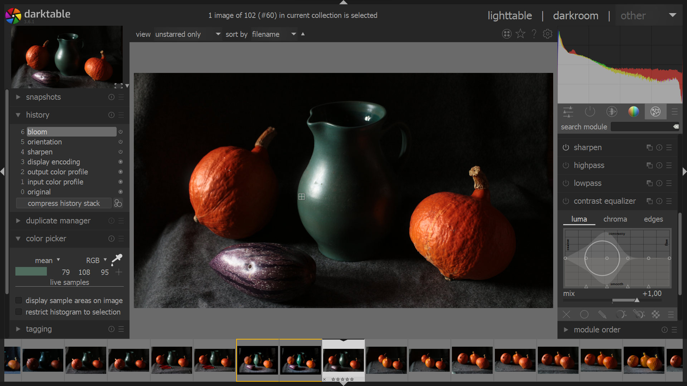

# Darktable a GIMP


## Instalace a nastavení Darktable
Najdi aktuální verzi na https://www.darktable.org/. Stáhni a spusť soubor.  Pokud používáš Package Manager pro Windows, nejnovější stabilní verzi nainstaluješ příkazem

```
winget install darktable
```
Jazykovou verzi nastavíš v preferencích (ikona ozubeného kola na horním menu na stranách lightable nebo darkroom).

## Instalace a nastavení GIMP
Najdi aktuální verzi na https://www.gimp.org/. Stáhni a spusť soubor.  Pokud používáš Package Manager pro Windows, nejnovější stabilní verzi nainstaluješ příkazem

```
winget install gimp
```
Jazykovou verzi nastavíš v menu **Upravit ‣ Předvolby ‣ Rozhraní ‣ Jazyk** (*Edit ‣ Preferences ‣ Interface ‣ Language*)
