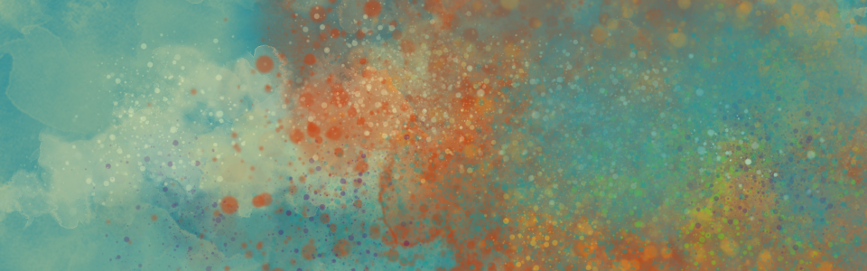

# Fotografie a retuše
## Co v kurzu najdeš

- Digitální fotografie
- Kompozice a fotografické vyprávění
- Úprava fotografií, RAW formát
- Retuše v programu Gimp
- RAW formáty v Darktable
- Management fotografií

- Lekce 1 Technika a optika
- Lekce 2 Kompozice a vyprávění
- Lekce 3 Osvětlení
- Lekce 4 Digitální fotolaboratoř
- Lekce 6 Retuše
- Lekce 7 Management fotografií

## Software v kurzu

Hlavní: Gimp, Darktable, Shotwell  
Utility: XnView MP  
Zdroje:
