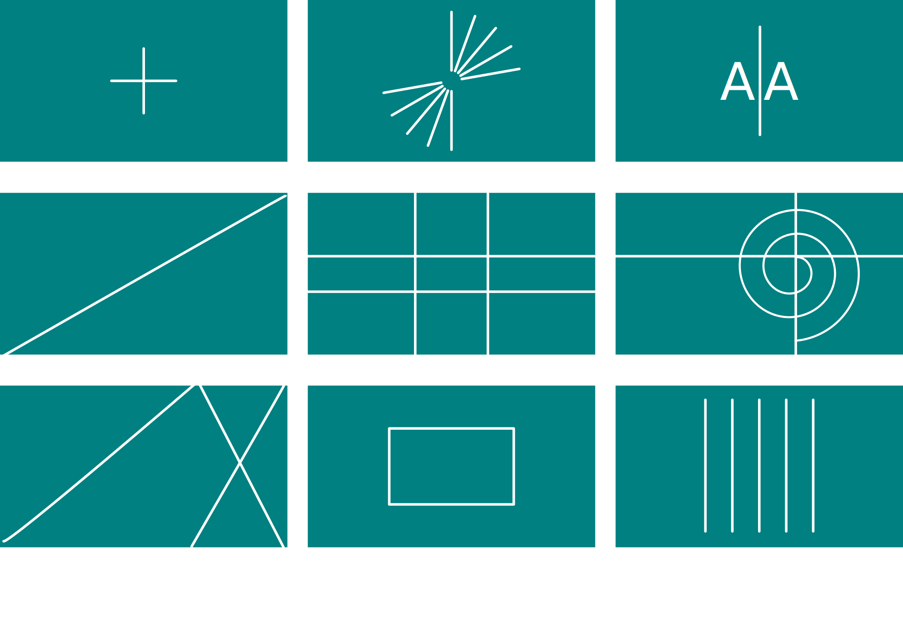
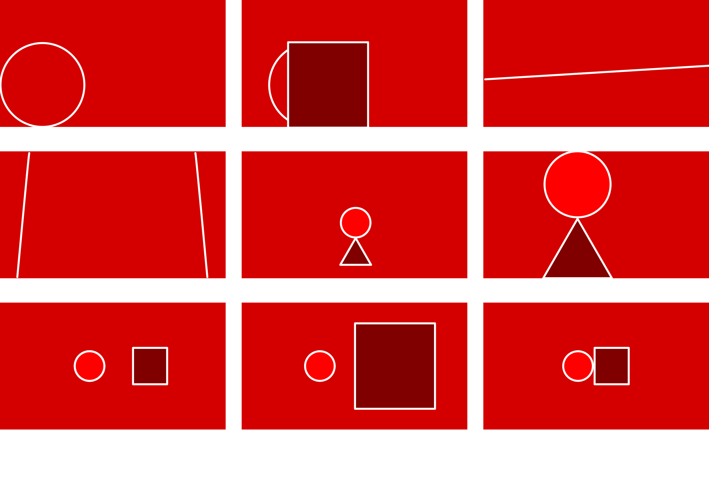
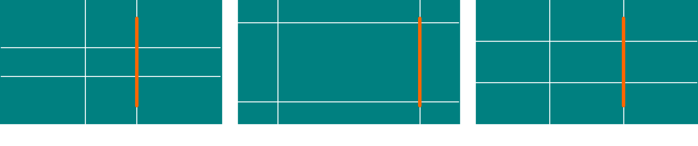

# Kompozice scény

Kompozice scény určuje styl vizuálního vyprávění. Správná kompozice fotografie musí být čitelná a mít jasně určenou dynamiku.

Základy kompozičních principů je nutné znát jak pro pořizování, tak pro úpravu snímků. Kompoziční pravidla jsou paleta nástrojů, které ti usnadní tvorbu a vytvoří prostor pro lepší kreativní rozhodnutí.

## Základní kompozice
Tvorba kompozice začíná už výběrem tématu a určením subjektu. Hlavní (primární) subjekt je centrem zájmu, a vedlejší (sekundární) subjekt vyvažuje a doplňuje kompozici. Takovým vedlejším motivem může být i pozadí scény. U složitějších kompozicí platí stejný princip pro skupiny subjektů.  

- téma a motiv souvisí s primárním subjektem
- sekundárních subjektů může být více
- jednotlivé kompoziční prvky lze kombinovat, hlavní kompoziční myšlenka musí být jasná
- práce s prostorovými plány
- kompoziční plán a rámování

1. centrální
2. radiální: využívá sbíhající se linie
3. symetrická: symetrie mohou být jakkoliv orientované
4. diagonální
5. proporcionální: využívá harmonické poměrové systémy, jako je zlatý řez nebo pravidelné rozdělení (často třetinové)
6. kruhová nebo spirální
7. geometrická: nejčastěji trojůhelníková kompozice
8. kompozice rámu
9. kompozice opakování a vzorů

Většina digitálních zařízení je vybavená kompoziční mřížkou pro rychlou kontrolu základních kompozičních modelů.
- mřížky
- vedení oka pro čitelnost scény

Fotografie pracuje s výtvarnými koncepty malby, grafiky i sochařského umění. Přirozeným motivem fotografie je také ztvárnění času a pohybu.

Jednotlivé prvky techniky kompozice jsou:

- Tvary a kontury
- Kontrasty tonality
- Harmonie a barevné kontrasty
- Akcentování barev
- Geometrické rozvržení a proporce
- Dynamika pohybu

## Chyby kompozice

1. křivky nebo linie kolidují s okrajem snímku
2. nečitelné překrytí subjektů
3. horizont není paralelní s okrajem snímku
4. vertikály nebo horizontály nejsou paralelní s okrajem snímku
5. špatné vyplnění snímku
6. hlavní subjekt příliš blízko okrajům snímku, špatný ořez
7. není jasný primární subjekt
8. sekundární subjekt nebo pozadí je výraznější než primární subjekt
9. křivky nebo linie subjektů kolidují

- malé odchylky jsou rušivé, velké mohou být součástí kompozičního záměru (například náklon kamery pro větší dynamiku)
- hlavní podstatnou chybou je absence subjektu a tématu ve scéně

## Proporce a mytologie zlatého řezu

Pro vyrovnanou kompozici je dobré znát různé proporční modely. Proporce jsou vzájemné poměry jednotlivých prvků scény. Také práce na ořezu snímku a volba finálního formátu se řídí proporčními pravidly.

- Zlatý řez, stříbrný řez, a geometrický třetinový poměr

Zlatý řez je poměr dvou délek, kterým je možné se řídit pro tvorbu kompozice. Zabudované překryvné mřížky kamer jsou ale často ve třetinovém poměru.
Ideální harmonický proporční poměr ale závisí na mnoha faktorech.

Kompoziční efekt také ovlivňují proporce snímků. Toto jsou nejčastější poměry formátů:

Na vnímání proporcí má také vliv vyváženost tvarů, barev a kontrastu. Záměrné disproporce mohou být součástí uměleckého stylu nebo motivem fotografie.

## Témata
Kompoziční rozhodnutí také ovlivňuje volba tématu.

Zajímavou a často používanou metodou je kombinace kompozičních přístupů — fotografie architektury jako zátiší nebo abstrakce, předmětu jako portrétu apod.

- kompozice pro krajinu
- portrét
- skupinu
- předmět
- zátiší
- architektura
- abstrakce

Tyto principy platí i pro technickou fotografii, kde je hlavní důraz na srozumitelnost snímku.

## Tipy pro kreativní kompozici
- orientace formátu
- horizontální, vertikální, diagonální a imaginární linie
- pozadí hlavního motivu jako vyvažující prvek, sekundární motiv a kontext
- kreativní využití hloubky ostrosti pomůže čitelnosti snímku
- volba apertury pro vykreslení tvarů
- volba ohniskové vzdálenosti (a objektivu) pro přiblížení anebo přehlednost, zapojení diváka do kontextu situace nebo speciální prostorové efekty u širokoúhlých objektivů
- umístění subjektu a proporční geometrické harmonické modely
- geometrické tvary a dynamická symbolika (kruh, čtverec, trojůhelník, spirály)
- využití perspektivy a perspektivních linií pro dynamiku a vedení oka diváka
- vyvažování ploch a umístění objektů v kompozici
- opakování a vzory jako součást kompozice
 - pozitivní a negativní prostor, rámování klidnou plochou
 - low-key a high-key (tonalita převažujícího stínu a světla)
 - omezená dynamika tónů, podexpozice a přeexpozice (doporučuji provádět až v editačním programu během úpravy snímků)
 - využití delší doby expozice a efekty rozmazání pohyblivých objektů nebo pozadí (*Panning*, kamera sleduje objekt a pozadí je rozmazané)
 - ořezávání záběru (doporučuji provádět až v editačním programu) a odstranění zbytečných nebo rušivých prvků

## Aranžování
Pro přípravu scény si vytvoř blokovou skicu. Jako jednotlivé objekty použij geometrická tělesa, která nejblíže vystihují jejich tvar.

Podobně uvažuj i při fotografii v plenéru, i při fotografii zátiší nebo skupin.

- blokování je zjednušená reprezentace objektů ve scéně a jejich vzájemné pozice
- maketa a náčrt kompozice
