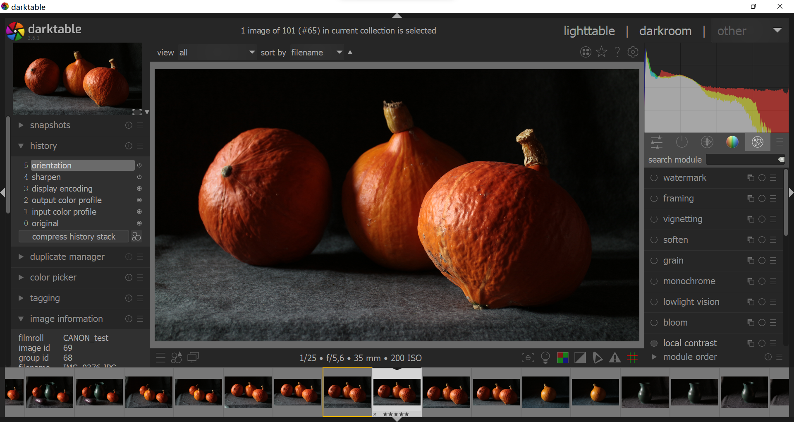
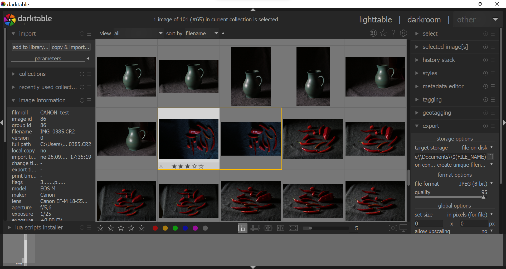
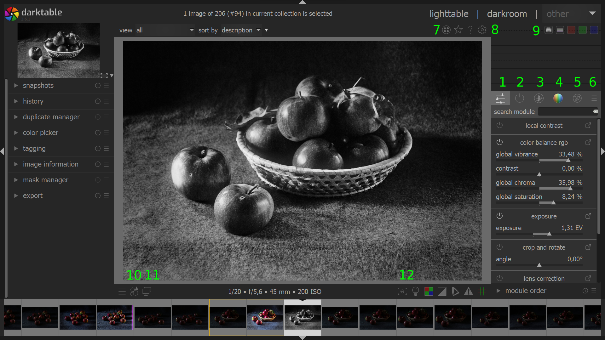
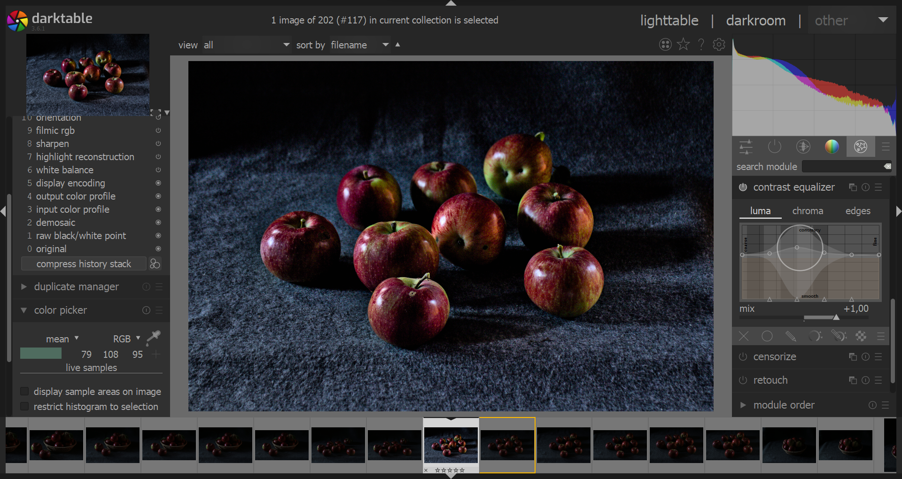
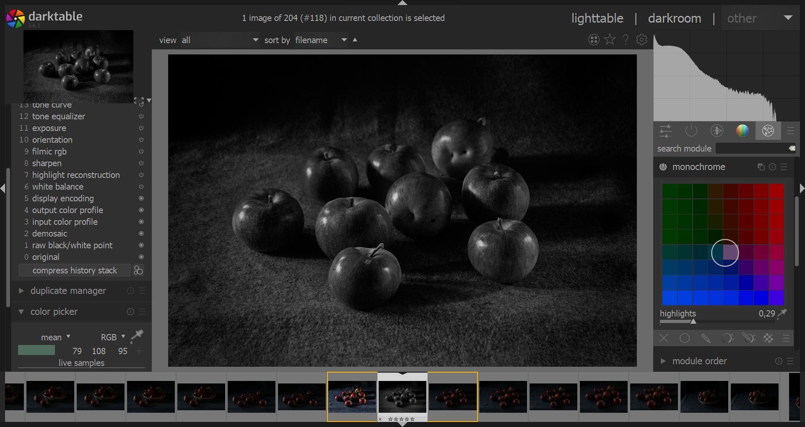
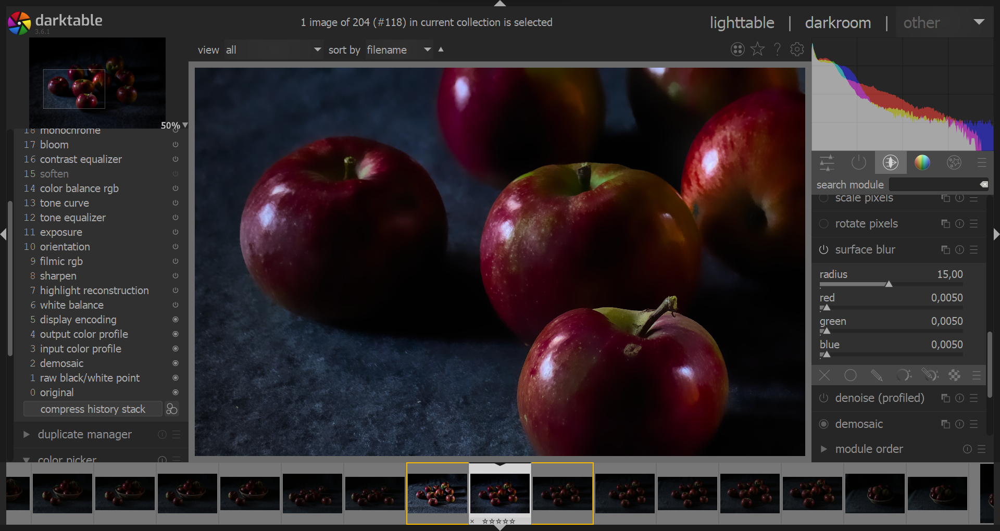
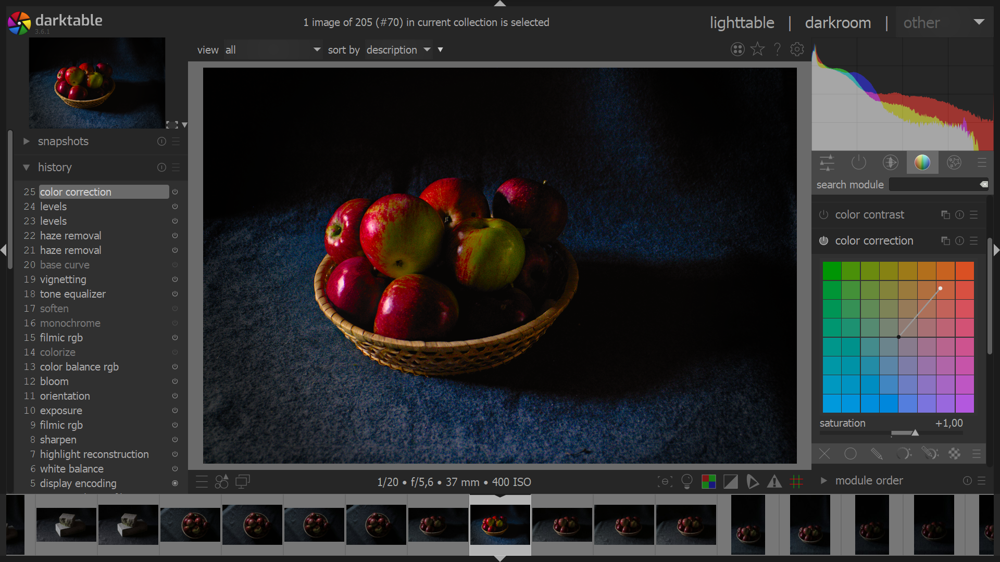
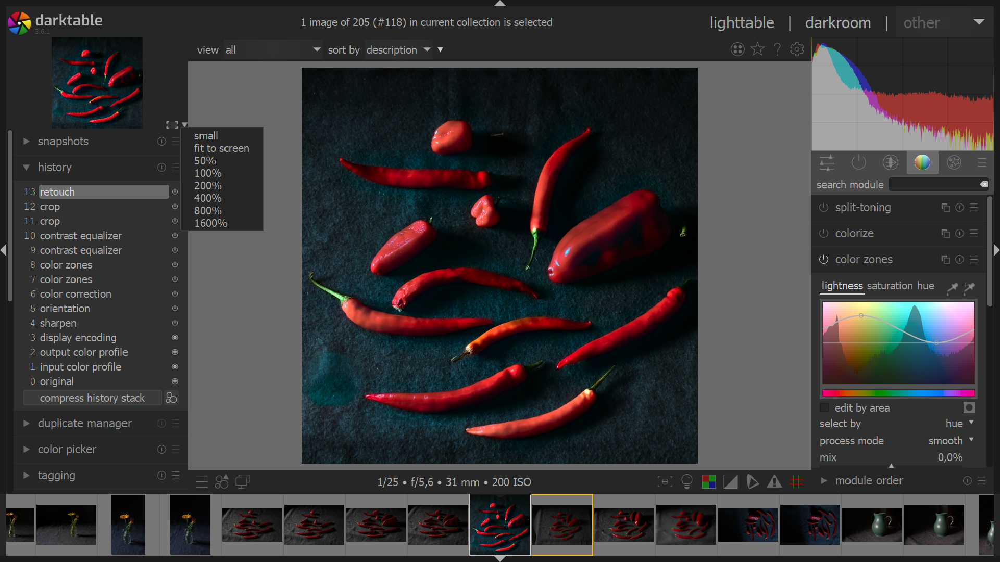

# Digitální fotokomora

## Darktable

Program má dva hlavní režimy, *lighttable* pro správu kolekcí fotografií a *darkroom* pro úpravu a retuše fotografií. Umožňuje zpracování mnoha běžných i RAW formátů od různých výrobců fotoaparátů a kamer.

:::note Kolekce v Darktable
V režimu lightable vyber *import ‣ add to library*. Adresář se zobrazí v tabu *collections*. V případě přidání nebo odebrání fotografií mimo Darktable v systému, importuj adresář znovu.
:::

## Černobílá fotografie
- kolorovat podle vzoru
- tonalita
- kontrast a barva v černobílé

## Barvy ve fotografii
- barevné transformace, CLUT
- chroma, saturace, vibrance, kontrast

## RAW
Obrázkový formát RAW obsahuje minimálně zpracovaný obrázek, sejmutý senzorem digitálního fotoaparátu nebo kamery. Výhodou je možnost zpracovat snímek v grafickém editoru, což umožňuje konzistentnější výsledky zejména v případě sérií fotografií. Formát je také minimálně komprimovaný a bez ořezu.

Snímání do RAW umožňuje nedestruktivní zpracování variant fotografie.

Přípony formátu RAW se liší v různých zařízeních (jsou založené na formátu TIFF). Digitální fotoaparáty také zpravidla umožňují snímat v režimu RAW, který zároveň ukládá náhledový .jpg.

Formáty mohou být například:
- .cr2 (Canon)
- .raw, .rw2 (Panasonic)
- .nef (Nikon)
- .arw (Sony)
- .3rf, .fff (Hasselblad)

## Úpravy
:::note Úpravy v Darktable
Změny jsou nedestruktivní. Na fotografii se úpravy modulů aplikují při exportu z režimu *lighttable* (menu vpravo) nebo *darkroom* (z menu vlevo). Pokud chceš vytvořit varianty, obrázek snadno zkopíruješ pomocí <kbd>Ctrl</kbd>+<kbd>D</kbd>.
:::
### Režim Darkroom
Aplikované moduly jsou zobrazeny v menu *history*. Celý řetězec změn lze uložit jako styl ikonou vpravo pod seznamem změn (*create new style*).

- (1-5) základní oddíly modulů, (6) nastavení zobrazení modulů
- (7) zobrazení skupin obrázků (soubory lze seskupovat <kbd>Ctrl</kbd>+<kbd>G</kbd>) a rušit skupiny <kbd>Ctrl</kbd>+<kbd>Shift</kbd>+<kbd>G</kbd>)
- (8) nastavení  (*preference*)
- (9) histogram, zobrazení informací o barevných kanálech
- (10) styly
- (11) zobrazení do dalšího okna na další monitor
- (12) zobrazení gamutů (focus peaking, color assessment ISO12646, raw overexposed warning, clipping warning, soft proof overlay, gamut check)

## Moduly

- Contrast equalizer

- Monochrome

- Surface Blur

- Color Correction

- Color Zones

## Zkratky
Zkratky lze nastavit v preferencích v odkazu *shortcuts*.
- skrýt okraje <kbd>B</kbd>
- skrýt spodní panel <kbd>Ctrl</kbd>+<kbd>F</kbd>
- prohlídka na celou obrazovku se stisknutým <kbd>W</kbd>, nebo <kbd>Tab</kbd>
- Fullscreen <kbd>F11</kbd>
- Ukončit <kbd>Ctrl</kbd>+<kbd>Q</kbd>
