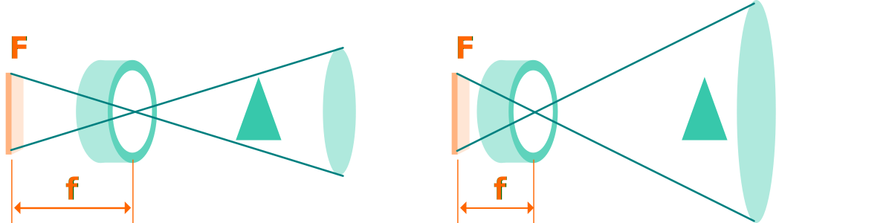

# Stručný úvod do fotografie

Základní pojmy důležité pro digitální fotografii. Informace v této lekci mají za cíl seznámení s koncepty fotografie bez ohledu na specifické technické vybavení.

## Expozice
Digitální kamery mají zabudovaný expozimetr a automatické měření expozice. Ovládání manuálního nastavení je zásadní pro kreativní fotografii.

Při manuálním nastavení expozice se vyvažují tři nastavitelné hodnoty: rychlost závěrky (S), apertura (A), a citlivost (ISO). Digitální kamery mají kombinovaná nastavení, dopočítávající hodnoty podle priorit — priorita času (S), priorita závěrky (A), kombinované (P) — vzhledem k expozičním tabulkám fotoaparátu.

- Vyšší ISO hodnoty citlivosti senzoru způsobují šum, zvláště ve tmavých plochách.
- Nižší rychlost závěrky způsobuje u rychlých objektů pohybové rozmazání (*Motion Blur, MB*).
- Změna apertury ovlivňuje hloubku ostrosti (*Depth of Field, DOF*).

Světelnost také ovlivňuje změna ohniskové vzdálenosti objektivu a další optické elementy, jako předsádky a filtry.

### Expoziční čas (S)
Rychlost závěrky (*Shutter Speed*) určuje u fotoaparátů expoziční čas. Udává se ve v sekundách a ve zlomcích sekundy. 2'' jsou dvě sekundy, 1/25 je čtvrtina, 1/100 setina sekundy, kdy se snímek exponuje. Na ovládacích prvcích kamer se označuje písmenem **(S)**.

### Clona (A)
*Clonové číslo* neboli apertura (*F-stop, Aperture*) je poměr ohniskové vzdálenosti a průměru otvoru otevřené clony objektivu.  Výraz apertura ve fotografii zjednodušeně označuje otvor ve cloně, v případě objektivů světelnost. Čím vyšší clonové číslo *f*, tím menší apertura a nižší světelnost. Objektivy umožňují nastavení clony manuálně nebo elektronicky.

Čím nižší clonové číslo, tím vyšší světelnost objektivu. Světelnost se u objektivů s variabilní ohniskovou vzdáleností uvádí v rozsahu clonových čísel, např. ƒ/5.6-16.

:::note f-stop
"Full Stop" sekvence (každé následující číslo označuje polovinu množství světla, dopadajícího na senzor): ƒ/1 – ƒ/1.4 – ƒ/2 – ƒ/2.8 – ƒ/4 – ƒ/5.6 – ƒ/8 – ƒ/11 – ƒ/8 – ƒ/16 – ƒ/22 – ƒ/32.
:::

Typ clony v kameře a počet lamel určuje tvar světelných zdrojů, viditelný na fotografii při delší expozici.

Na ovládacích prvcích kamer se apertura označuje písmenem **(A)**.

### ISO
Odvozené od citlivosti filmu ("rychlost filmu"), v digitální fotografii označuje nastavenou světelnou citlivost senzoru. Vyšší ISO zpravidla způsobuje vyšší obrazový šum ve fotografii. ISO se uvádí v sekvenci úrovní ISO100, ISO200, ISO400 ISO800 apod.

## Optika a objektivy
Optické členy, digitální foto a bezzrcadlové fotoaparáty, mobilní fotoaparáty.
- Optické členy.
- Objektivy (*Camera lenses, Photographic Objectives*).
- Světelnost.

### Hloubka ostrosti

Hloubka ostrosti je důležitá pro výtvarné vyjádření fotografie. Umožňuje oddělovat jednotlivé plány scény, případně detail a pozadí nebo popředí. Správné použití hloubky ostrosti se i podvědomě spojuje s profesionální kinematografií a fotografií.

- ω je úhlová reprezentace systémového rozlišení
- hloubka ostrosti ovlivňuje optické rozlišení a kontrast
- hloubku ostrosti a její efekt ovlivňují i optické členy objektivu
- nezapomeň, že u objektivů se změnou ohniskové vzdálenosti měníš i clonové číslo

V celkových pohledech je mělká hloubka ostrosti většinou nežádoucí.

### Ohnisková vzdálenost
Čím kratší ohnisková vzdálenost, tím širší úhel záběru. Bod ohniska **(F)** je senzor kamery, **(f)** je ohnisková vzdálenost.

Ohnisková vzdálenost (*Focal Length*) se udává v milimetrech (u objektivu s **pevnou ohniskovou vzdáleností**, *Prime Lens*), nebo jako rozsah v milimetrech, například 18-35mm (tzv. *Zoom Lens*).

Variabilní ohnisková vzdálenost je vhodná pro:
- kreativní blokování
- flexibilní práce s hloubkou ostrosti
- svobodnější kompoziční rozhodnutí

Objektivy s pevným ohniskem, jako jsou objektivy s vysokou světelností nebo objektivy mobilních zařízení jsou vhodné i pro dokumentační fotografie, protože fotografa nutí pracovat blízko subjektu a to se projevuje na energii fotografie.

- jako **širokoúhlé** se označují objektivy s ohniskovou vzdáleností 24-35mm
- jako **rybí oko** (*Fisheye*) se označují objektivy s ohniskovou vzdáleností nižší než 24mm
- **teleobjektivy** (*Telephoto, Long Lens*) mají naopak ohniskovou vzdálenost 85mm a více (zpravidla v rozmezí 150-300mm pro běžné výrobky, v extrému až 1700mm).
- **makroobjektivy** můžou mít různou ohniskovou vzdálenost, jejich výhodou je možnost zaostření na velmi krátké vzdálenosti, a disponují maximálním zvětšením (*Reproduction Ratio*) v poměru 1:1.

### Čočky a aberace
U teleobjektivů a makroobjektivů, které se často používají při efektu mělké hloubky ostrosti, je důležitý tvar a struktura rozostření světelných zdrojů (*Bokeh Effect*). Efekt vzniká **sférickou aberací** čoček (anamorfické filmové čočky vytvářejí eliptický "bokeh" efekt).

**Chromatická aberace** je barevný posun, znatelný na snímcích blízko okrajů čočky. Efekt je způsobený tím, že se rozdílné vlnové délky světla lámou nestejnoměrně. Výrazná chromatická aberace objektivu (*Color Fringing*) je nežádoucí.

*Purple Fringing*, nebo *Blooming* se projevuje na kontrastních přesvětlených hranicích na snímku, a je způsobený senzorem, i když připomíná chromatickou aberaci objektivu.  

## Digitální fotografie
Funkci světelně citlivých zrn filmu v digitální fotografii zastávají elementy CMOS senzoru. Rozlišení senzoru ovlivňuje kvalitu a rozlišení fotografie.
- běžné poměry stran digitální fotografie jsou 1:1, 4:5, 4:3, 3:2 a 16:9
- plnoformátový senzor (Full-frame Sensor) je senzor odpovídající rozměrem políčku 35mm kinofilmu (36×24mm)
- Micro Four Thirds (2x crop) typy jako alternativa k plnoformátovým SLR
- senzory mají různou hustotu
### Vybavení
Zrcadlovky, digitální závěrky, mobilní fotoaparáty. Těla a objektivy. Předsádky a filtry. Studiové vybavení, světla, odrazové a rozptylové plochy.
### Barevná teplota a vyvážení bílé
Barevnou teplotu ovlivňuje osvětlení scény a odražené světlo prostředí. K vyrovnání barevné teploty slouží funkce vyvážení bílé (*White Balance, WB*)
### Bracketing
To je metoda automatického snímání více snímků následně za sebou, s různým nastavení expozice, kompenzace nebo vyvážení bílé.

Bracketing je vhodný použít pro scény s velkým kontrastem a následná úprava v editačním programu umožňuje vytvořit kombinovaný snímek s dobrým vykreslením.

### HDR
Některá digitální zařízení umožňují snímání s **vyšším dynamickým rozsahem** (*High Dynamic Range, HDR*). Znamená to větší tonální rozsah — rozsah světlých a tmavých tónu. Dovoluje rozsáhlé úpravy expozice i po sejmutí snímku.

### RAW
RAW jsou datové soubory sezoru z digitálního zařízení, s minimálními softwarovými úpravami. Práce s RAW soubory umožňuje větší volnost při úpravách fotografií.
