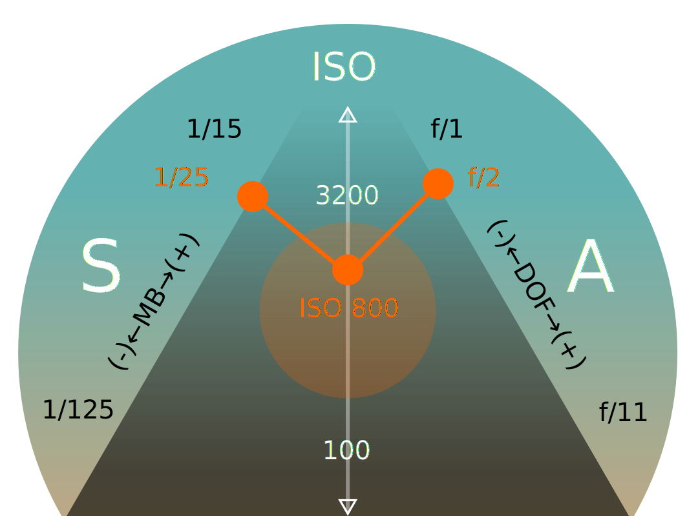

# Stručný úvod do fotografie

Základní pojmy důležité pro digitální fotografii. Optické členy. Objektivy (*Camera lenses, Photographic Objectives*). Světelnost. Informace v této lekci mají za cíl seznámení s koncepty fotografie bez ohledu na technické vybavení.

## Expozice
Digitální kamery mají zabudovaný expozimetr a automatické měření expozice. Ovládání manuálního nastavení je zásadní pro kreativní fotografii.

Při manuálním nastavení expozice se vyvažují tři nastavitelné hodnoty: rychlost závěrky (S), apertura (A), a citlivost (ISO). Digitální kamery mají kombinovaná nastavení, dopočítávající hodnoty podle priorit — priorita času (S), priorita závěrky (A), kombinované (P) — vzhledem k expozičním tabulkám fotoaparátu.

- Vyšší ISO hodnoty citlivosti senzoru způsobují šum, zvláště ve tmavých plochách.
- Nižší rychlost závěrky způsobuje u rychlých objektů pohybové rozmazání (*Motion Blur, MB*).
- Změna apertury ovlivňuje hloubku ostrosti (*Depth of Field, DOF*).

Světelnost také ovlivňuje změna ohniskové vzdálenosti objektivu a další optické elementy, jako předsádky a filtry.

### Expoziční čas
Rychlost závěrky (*Shutter Speed*) určuje u fotoaparátů expoziční čas. Udává se ve v sekundách a ve zlomcích sekundy. 2'' jsou dvě sekundy, 1/25 je čtvrtina, 1/100 setina sekundy, kdy se snímek exponuje.

### Clona
*Clonové číslo* neboli apertura (*F-stop, Aperture*) je poměr ohniskové vzdálenosti a průměru otvoru otevřené clony objektivu.  Výraz apertura ve fotografii zjednodušeně označuje otvor ve cloně. Čím vyšší clonové číslo *f*, tím menší apertura. Objektivy umožňují nastavení clony manuálně nebo elektronicky.

Čím nižší clonové číslo, tím vyšší světelnost objektivu. Světelnost se u objektivů s variabilní ohniskovou vzdáleností uvádí v rozsahu clonových čísel, např. ƒ/5.6-16.

:::note f-stop
"Full Stop" sekvence (každé následující číslo označuje polovinu množství světla, dopadajícího na senzor): ƒ/1 – ƒ/1.4 – ƒ/2 – ƒ/2.8 – ƒ/4 – ƒ/5.6 – ƒ/8 – ƒ/11 – ƒ/8 – ƒ/16 – ƒ/22 – ƒ/32.
:::

Typ clony v kameře a počet lamel určuje tvar světelných zdrojů, viditelný na fotografii při delší expozici.

### ISO
Odvozené od citlivosti filmu ("rychlost filmu"), v digitální fotografii označuje nastavenou světelnou citlivost senzoru. Vyšší ISO zpravidla způsobuje vyšší obrazový šum ve fotografii. ISO se uvádí v sekvenci úrovní ISO100, ISO200, ISO400 ISO800 apod.

## Optika
Optické členy, digitální foto a bezzrcadlové fotoaparáty, mobilní fotoaparáty.
- ilustrace
### Hloubka ostrosti

Hloubka ostrosti je důležitá pro výtvarné vyjádření fotografie. Umožňuje oddělovat jednotlivé plány scény, případně detail a pozadí nebo popředí. Správné použití hloubky ostrosti se i podvědomě spojuje s profesionální kinematografií a fotografií.

- ω je úhlová reprezentace systémového rozlišení
- hloubka ostrosti ovlivňuje optické rozlišení a kontrast
- hloubku ostrosti a její efekt ovlivňují i optické členy objektivu
- nezapomeň, že u objektivů se změnou ohniskové vzdálenosti měníš i clonové číslo

V celkových pohledech je mělká hloubka ostrosti většinou nežádoucí.

### Ohnisková vzdálenost
- kreativní blokování
- práce s hloubkou ostrosti

### Čočky a aberace
U teleobjektivů a makroobjektivů, které se často používají při efektu mělké hloubky ostrosti, je důležitý tvar a struktura rozostření světelných zdrojů (*Bokeh Effect*). Efekt vzniká sférickou aberací čoček (anamorfické filmové čočky vytvářejí eliptický "bokeh" efekt).

## Digitální fotografie
Funkci světelně citlivých zrn filmu v digitální fotografii zastávají elementy CMOS senzoru. Rozlišení senzoru ovlivňuje kvalitu a rozlišení fotografie.
- plnoformátové
- senzory
### Vybavení
Zrcadlovky, digitální závěrky, mobilní fotoaparáty. Těla a objektivy. Předsádky a filtry. Studiové vybavení, světla, odrazové a rozptylové plochy.
### Barevná teplota a vyvážení bílé
Barevnou teplotu ovlivňuje osvětlení scény a odražené světlo prostředí. K vyrovnání barevné teploty slouží funkce vyvážení bílé (*White Balance, WB*)
### Bracketing
To je metoda automatického snímání více snímků následně za sebou, s různým nastavení expozice, kompenzace nebo vyvážení bílé.

Bracketing je vhodný použít pro scény s velkým kontrastem a následná úprava v editačním programu umožňuje vytvořit kombinovaný snímek s dobrým vykreslením.
### HDR
- vyšší dynamický rozsah
### RAW
- vyvolávání datových souborů
